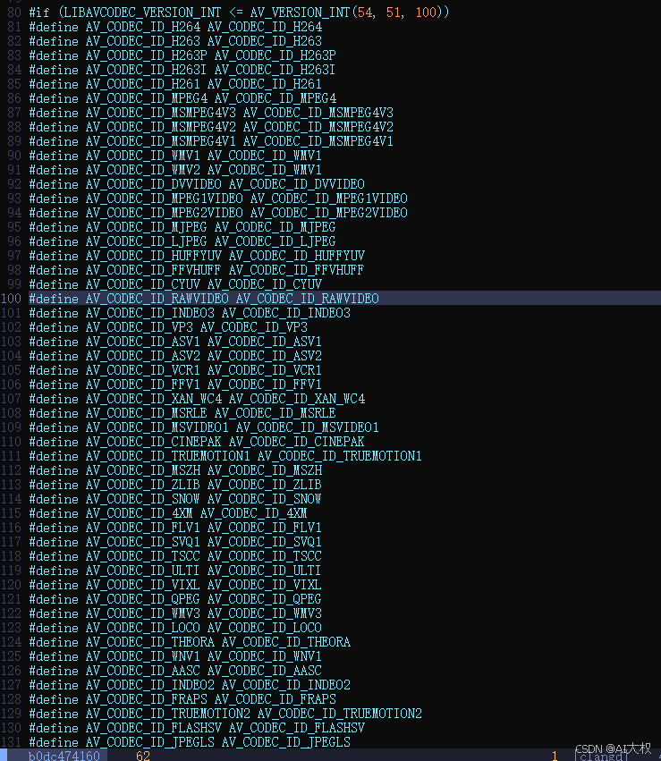

## Linux(Ubuntu24.04)源码编译安装OpenCV4.6.0
 
 本次安装是在WSL2的Ubuntu24.04环境下进行。
### 1、下载OpenCV 4.6.0 源码
下载opencv：
```bash
git clone https://github.com/opencv/opencv.git
cd opencv
git checkout 4.6.0
```
下载opencv_contrib：
```bash
git clone https://github.com/opencv/opencv_contrib.git
cd opencv_contrib
git checkout 4.6.0
```

### 2、安装依赖
安装构建OpenCV所需的各种工具和库。
```bash
sudo apt update && sudo apt upgrade -y
sudo apt install -y build-essential cmake git pkg-config libgtk-3-dev libavcodec-dev libavformat-dev libswscale-dev libv4l-dev libxvidcore-dev libx264-dev libjpeg-dev libpng-dev libtiff-dev gfortran openexr libatlas-base-dev python3-dev python3-numpy libtbb2 libtbb-dev libdc1394-22-dev
```
有可能会提示找不到有些包，例如libdc1394-22-dev，这些问题可能是由于仓库列表中没有这些软件包或者可能包的名称变了，改为libdc1394-dev
```bash
E: Package 'libtbb2' has no installation candidate
E: Unable to locate package libdc1394-22-dev
```

### 3、编译安装
```bash
# 进入opencv目录并创建build文件夹
cd opencv
mkdir build && cd build

# 编译
cmake -D OPENCV_GENERATE_PKGCONFIG=ON \
  -D OPENCV_EXTRA_MODULES_PATH=../../opencv_contrib/modules \
  -D WITH_GSTREAMER=ON \
  -D WITH_LIBV4L=ON \
  -D BUILD_opencv_python2=ON \
  -D BUILD_opencv_python3=ON \
  -D BUILD_TESTS=OFF \
  -D BUILD_PERF_TESTS=OFF \
  -D BUILD_EXAMPLES=OFF \
  -D CMAKE_BUILD_TYPE=RELEASE \
  -D PYTHON3_PACKAGES_PATH=/usr/lib/python3/dist-packages \
  -D CMAKE_INSTALL_PREFIX=/usr/local ..

make -j16

# 安装
make install
```
### 4、编译过程中遇到的问题
#### 4.1 找不到`mpi.h`
**问题描述：** 这个错误提示表明在编译过程中找不到`mpi.h`头文件，这意味着缺少MPI（Message Passing Interface）相关的库和开发文件。通常，这种情况可以通过安装相应的MPI实现（如OpenMPI或MPICH）及其开发文件来解决。
```bash
/usr/include/hdf5/openmpi/H5public.h:67:10: fatal error: mpi.h: No such file or directory
   67 | #include <mpi.h>
```
**解决方法：**
首先查找查找mpi.h在哪里，如果没有安装，则先安装。
```bash
$ find /usr -name mpi.h
/usr/lib/x86_64-linux-gnu/openmpi/include/mpi.h
/usr/lib/x86_64-linux-gnu/fortran/gfortran-mod-15/openmpi/mpi.h

# 如果没有则安装该库
$ sudo apt install libopenmpi-dev
```
找到路径后，配置临时环境变量：
```bash
export CPLUS_INCLUDE_PATH=/usr/lib/x86_64-linux-gnu/openmpi/include:$CPLUS_INCLUDE_PATH
export C_INCLUDE_PATH=/usr/lib/x86_64-linux-gnu/openmpi/include:\$C_INCLUDE_PATH
```
#### 4.2 找不到`openjpeg.h`
**问题描述：** 这个错误提示表明编译器找不到 `openjpeg.h` 头文件，这意味着缺少 OpenJPEG 库及其开发文件，OpenJPEG 是一个用于处理 JPEG 2000 图像格式的开源库。
```bash
fatal error: openjpeg.h: No such file or directory
   13 | #include <openjpeg.h>
```

**解决方法：** 
首先查找查找openjpeg.h在哪里，如果没有安装，则先安装。
```bash
$ find /usr -name openjpeg.h
/usr/include/openjpeg-2.5/openjpeg.h

# 如果没有则安装该库
sudo apt install libopenjp2-7-dev
```
找到路径后，配置临时环境变量：
```bash
export CPLUS_INCLUDE_PATH=/usr/include/openjpeg-2.5:\$CPLUS_INCLUDE_PATH
export C_INCLUDE_PATH=/usr/include/openjpeg-2.5:\$C_INCLUDE_PATH
```
#### 4.3 `ffmpeg`宏定义问题
**问题描述：** 这个错误提示表明代码中使用了旧版本的 FFmpeg API，其中 CODEC_ID_H264 已被弃用，并且在较新版本的 FFmpeg 中应使用 AV_CODEC_ID_H264。这种情况通常出现在代码库没有及时更新以适应 FFmpeg 的 API 变化时。
```bash
/mnt/d/wsl_workspace/opencv/opencv/modules/videoio/src/ffmpeg_codecs.hpp:81:26: error: ‘CODEC_ID_H264’ was not declared in this scope; did you mean ‘AV_CODEC_ID_H264’?
   81 | #define AV_CODEC_ID_H264 CODEC_ID_H264
```
**解决方法：**
可以修改opencv/modules/videoio/src/ffmpeg_codecs.hpp中相关的宏定义，将`#define AV_CODEC_ID_H264 CODEC_ID_H264`改为`#define AV_CODEC_ID_H264 AV_CODEC_ID_H264`，其它宏同理，都加上`AV_`。
   ```cpp
 #ifndef FFMPEG_CODECS_HPP
#define FFMPEG_CODECS_HPP

// Remove the old macro definition and use the new one directly
//#define AV_CODEC_ID_H264 CODEC_ID_H264
#define AV_CODEC_ID_H264 AV_CODEC_ID_H264

#endif // FFMPEG_CODECS_HPP
   ```


#### 4.4 其它问题
通常就是一些OpenCV的依赖包问题，例如找不到包、版本不匹配等等，逐步调试编译即可。
关于配置OpenCV的环境变量，参考[Linux(Ubuntu24.04)源码编译安装OpenCV4.6.0.md](./【OpenCV】在Liunx中配置OpenCV环境变量.md)


