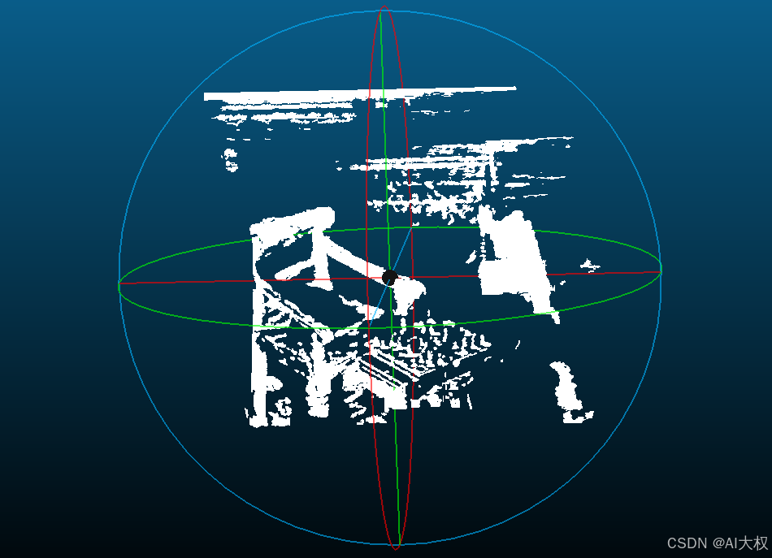

# OpenCL实现深度图生成点云功能

## 1、基本介绍
**PyOpenCL** 是一个用于在Python中访问和使用OpenCL（Open Computing Language）的库。OpenCL是一种开放标准，旨在使程序能够在不同的平台上高效运行，包括CPU、GPU、FPGA和其他类型的加速器。通过PyOpenCL，开发者可以在Python中编写并执行OpenCL代码，从而利用这些硬件加速计算任务。

### 1.1 主要特点

1. **跨平台支持**：PyOpenCL可以运行在多种操作系统上，包括Windows、Linux和macOS，并且能够与各种硬件设备（如NVIDIA、AMD、Intel等厂商的GPU）进行交互。

2. **高性能计算**：通过将计算密集型任务从CPU转移到GPU或其他加速器，PyOpenCL可以帮助显著提高应用程序的性能。

3. **易用性**：尽管OpenCL本身是基于C语言的API，PyOpenCL提供了更高级别的接口，使得在Python中编写和管理OpenCL代码变得更加简单和直观。

4. **集成Python生态系统**：PyOpenCL可以与NumPy等其他Python科学计算库无缝集成，方便数据处理和分析。

### 1.2 基本概念

- **上下文（Context）**：定义了OpenCL程序运行的环境，包括设备、命令队列等。
- **命令队列（Command Queue）**：用于调度和执行内核（Kernel）。
- **内核（Kernel）**：在设备上执行的函数，通常是用OpenCL C语言编写的。
- **内存对象（Memory Objects）**：包括缓冲区（Buffer）和图像（Image），用于在主机和设备之间传输数据。
- **采样器（Sampler）**：用于定义如何读取图像数据。

### 1.3 使用示例

以下是一个简单的PyOpenCL示例，展示了如何创建一个上下文、编译内核并在GPU上执行它：

```python
import pyopencl as cl
import numpy as np

# 创建一个上下文和命令队列
ctx = cl.create_some_context()
queue = cl.CommandQueue(ctx)

# 准备一些数据
a = np.random.rand(50000).astype(np.float32)
b = np.random.rand(50000).astype(np.float32)
c = np.empty_like(a)

# 创建缓冲区对象
mf = cl.mem_flags
a_buf = cl.Buffer(ctx, mf.READ_ONLY | mf.COPY_HOST_PTR, hostbuf=a)
b_buf = cl.Buffer(ctx, mf.READ_ONLY | mf.COPY_HOST_PTR, hostbuf=b)
c_buf = cl.Buffer(ctx, mf.WRITE_ONLY, c.nbytes)

# 编写OpenCL内核代码
prg = cl.Program(ctx, """
__kernel void sum(__global const float *a, __global const float *b, __global float *c) {
    int gid = get_global_id(0);
    c[gid] = a[gid] + b[gid];
}
""").build()

# 执行内核
prg.sum(queue, a.shape, None, a_buf, b_buf, c_buf)

# 将结果从设备复制回主机
cl.enqueue_copy(queue, c, c_buf)

print(c)  # 输出结果
```

### 1.4 安装PyOpenCL

可以通过pip安装PyOpenCL：

```sh
pip install pyopencl
```

注意：安装PyOpenCL可能需要依赖于系统上的OpenCL SDK以及相应的驱动程序。确保你的系统已经正确配置了这些依赖项。

### 1.5 应用场景

- **科学计算**：如矩阵运算、数值模拟等。
- **图像处理**：如滤波、边缘检测、图像缩放等。
- **机器学习**：加速训练和推理过程。
- **游戏开发**：实时渲染和物理模拟。

通过PyOpenCL，开发者可以充分利用现代硬件的并行计算能力，提升应用的性能和效率。
## 2、代码实现

### 2.1 `kernel.cl`
创建`kernel.cl`，并写入代码深度图转点云功能核函数:
```cpp
__kernel void generate_point_cloud(__global const float* depth_map,
                                   int width, int height,
                                   float focal_length_px, float cx, float cy,
                                   __global float* point_cloud) {
    int u = get_global_id(0);
    int v = get_global_id(1);

    if (u >= width || v >= height) return;

    int idx = v * width + u;
    float z = depth_map[idx];

    if (z > 0) {
        float x = (u - cx) * z / focal_length_px;
        float y = (v - cy) * z / focal_length_px;
        
        int pc_idx = idx * 3;
        point_cloud[pc_idx] = x;
        point_cloud[pc_idx + 1] = y;
        point_cloud[pc_idx + 2] = z;
    }
}
```

### 2.2 `generate_point_cloud_opencl`函数
python代码`generate_point_cloud_opencl`函数：
```python
import pyopencl as cl
import numpy as np
# depth_map:深度图
# focal_length_px:像素焦距
# cx,cy:主点坐标
def generate_point_cloud_opencl(depth_map, focal_length_px, cx, cy):
    # 初始化 OpenCL 环境
    platforms = cl.get_platforms()
    platform = platforms[0]
    devices = platform.get_devices(cl.device_type.GPU)
    device = devices[0]

    context = cl.Context([device])
    queue = cl.CommandQueue(context)

    # 加载 OpenCL 内核源码
    with open("kernel.cl", "r") as f:
        kernel_src = f.read()

    program = cl.Program(context, kernel_src).build()
    kernel = cl.Kernel(program, "generate_point_cloud")

    # 创建内存对象
    mf = cl.mem_flags
    depth_map_buf = cl.Buffer(context, mf.READ_ONLY | mf.COPY_HOST_PTR, hostbuf=depth_map)
    point_cloud_buf = cl.Buffer(context, mf.WRITE_ONLY, size=depth_map.size * 3 * np.float32().nbytes)

    # 设置内核参数
    kernel.set_arg(0, depth_map_buf)
    kernel.set_arg(1, np.int32(depth_map.shape[1]))
    kernel.set_arg(2, np.int32(depth_map.shape[0]))
    kernel.set_arg(3, np.float32(focal_length_px))
    kernel.set_arg(4, np.float32(cx))
    kernel.set_arg(5, np.float32(cy))
    kernel.set_arg(6, point_cloud_buf)

    # 执行内核
    global_work_size = (depth_map.shape[1], depth_map.shape[0])
    local_work_size = None  # 使用默认的工作组大小
    cl.enqueue_nd_range_kernel(queue, kernel, global_work_size, local_work_size)
    queue.finish()

    # 获取结果
    point_cloud = np.empty((depth_map.size * 3,), dtype=np.float32)
    cl.enqueue_copy(queue, point_cloud, point_cloud_buf)

    # 转换为更易读的格式
    point_cloud = point_cloud.reshape(-1, 3)
    point_cloud = point_cloud[~np.all(point_cloud == 0, axis=1)]  # 去除无效点

    return point_cloud
```




