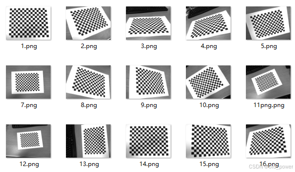

# OpenCV相机标定：通过棋盘格计算相机内参矩阵和畸变系数

## 1、环境准备
```python
pip install numpy opencv-python glob2 pyyaml
```
上面是 Python 中常用的库：

- **numpy**:
   - **功能**: 用于科学计算，提供高效的数组操作和数学函数。
   - **用途**: 处理多维数组、矩阵运算、线性代数、傅里叶变换等。

- **opencv-python**:
   - **功能**: 用于计算机视觉和图像处理。
   - **用途**: 图像和视频处理、对象检测、特征提取、摄像头输入等。

- **glob2**:
   - **功能**: 用于文件路径匹配。
   - **用途**: 查找符合特定模式的文件路径，常用于批量处理文件。

- **pyyaml**:
   - **功能**: 用于解析和生成 YAML 文件。
   - **用途**: 读取和写入 YAML 配置文件，适合存储和传输结构化数据。

## 2、准备棋盘格

> https://calib.io/pages/camera-calibration-pattern-generator
 - 下图刚好是一张A4纸大小，14x18的格子，将棋盘格另存为PDF：

 - 使用需要标定的相机进行拍照，多拍一些不同角度的，例如下面这样：

## 3、标定代码
#### 3.1`Python`代码实现如下：

```python
import numpy as np
import cv2
import glob
import yaml

# ==================== 可修改参数 ====================
# 棋盘格尺寸 (行数, 列数) - 指的是棋盘格的方格数量
CHESSBOARD_SQUARES = (18, 14)

# 角点检测精度参数
CRITERIA = (cv2.TERM_CRITERIA_EPS + cv2.TERM_CRITERIA_MAX_ITER, 30, 0.001)

# 图片文件类型
IMAGE_FORMAT = 'access/image/*.png'

# 校准结果保存文件名
OUTPUT_FILE = "access/calibration_matrix.yaml"

# ================================================

def main():
    # 计算内部角点的数量
    chessboard_size = (CHESSBOARD_SQUARES[0] - 1, CHESSBOARD_SQUARES[1] - 1)

    # 准备对象点，例如 (0,0,0), (1,0,0), ..., (16,12,0)
    objp = np.zeros((chessboard_size[0] * chessboard_size[1], 3), np.float32)
    objp[:, :2] = np.mgrid[0:chessboard_size[0], 0:chessboard_size[1]].T.reshape(-1, 2)

    # 用于存储所有图片的对象点和图像点
    objpoints = []  # 3D 点在真实世界空间
    imgpoints = []  # 2D 点在图像平面

    # 获取所有符合格式的图片路径
    images = glob.glob(IMAGE_FORMAT)

    found = 0  # 记录找到的有效图片数量

    for fname in images:
        img = cv2.imread(fname)
        if img is None:
            print(f"无法读取图片: {fname}")
            continue

        gray = cv2.cvtColor(img, cv2.COLOR_BGR2GRAY)

        # 查找棋盘角点
        ret, corners = cv2.findChessboardCorners(gray, chessboard_size, None)

        if ret:
            objpoints.append(objp)

            # 提高角点检测精度
            corners2 = cv2.cornerSubPix(gray, corners, (11, 11), (-1, -1), CRITERIA)
            imgpoints.append(corners2)

            # 在图片上绘制角点
            img = cv2.drawChessboardCorners(img, chessboard_size, corners2, ret)
            found += 1

            # 显示检测结果
            cv2.imshow('Chessboard Corners', img)
            cv2.waitKey(500)

            # 如果需要保存带有角点的图片，可以取消以下注释
            # output_image_name = f'calibresult_{found}.png'
            # cv2.imwrite(output_image_name, img)
        else:
            print(f"未找到棋盘角点: {fname}")

    cv2.destroyAllWindows()

    print(f"用于校准的图片数量: {found}")

    if found < 1:
        print("没有找到足够的图片进行校准。")
        return

    # 进行相机校准
    ret, mtx, dist, rvecs, tvecs = cv2.calibrateCamera(objpoints, imgpoints, gray.shape[::-1], None, None)

    if not ret:
        print("相机校准失败。")
        return

    # 将相机矩阵和畸变系数保存到字典中
    calibration_data = {
        'camera_matrix': mtx.tolist(),
        'dist_coeff': dist.tolist(),
        'rvecs': [r.tolist() for r in rvecs],
        'tvecs': [t.tolist() for t in tvecs]
    }

    # 将校准数据写入YAML文件
    with open(OUTPUT_FILE, "w") as f:
        yaml.dump(calibration_data, f)

    print(f"校准完成，结果已保存到 {OUTPUT_FILE}")

if __name__ == "__main__":
    # 设置窗口的固定大小
    window_name = 'Chessboard Corners'
    fixed_window_size = (1000, 700)
     
     # 创建一个空白的图像，大小为固定窗口大小
    blank_image = np.zeros(fixed_window_size, np.uint8)
    cv2.namedWindow(window_name, cv2.WINDOW_NORMAL)
    cv2.resizeWindow(window_name, fixed_window_size[0], fixed_window_size[1])
    main()
```
#### 3.2 标定过程

```bash
python calibration_matrix.py 
用于校准的图片数量: 15
校准完成，结果已保存到 access/calibration_matrix1.yaml
```

 - `calibration_matrix.yaml`中保存相机内参`camera_matrix`和畸变系数`dist_coeff`
 

## 4、去畸变
 - 该函数返回一张去畸变后的图像：

```python
def dedistortion(img,cut:bool):
    # 加载校准参数
    with open("access/calibration_matrix.yaml") as f:
        data = yaml.safe_load(f)

    camera_matrix = np.array(data['camera_matrix'])
    dist_coeff = np.array(data['dist_coeff'])

    # 读取需要去畸变的图像
    # img = cv2.imread('1.png')
    h, w = img.shape[:2]

    # 获取最佳新相机矩阵
    new_camera_mtx, roi = cv2.getOptimalNewCameraMatrix(camera_matrix, dist_coeff, (w, h), 1, (w, h))

    # 去畸变
    undistorted_img = cv2.undistort(img, camera_matrix, dist_coeff, None, new_camera_mtx)
    # print(undistorted_img.shape)
    if(cut):
        # 裁剪图像（可选）
        x, y, w, h = roi
        undistorted_img = undistorted_img[y:y+h, x:x+w]
        # print(undistorted_img.shape)

    return undistorted_img
```


