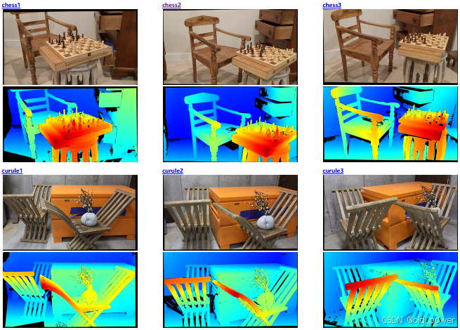
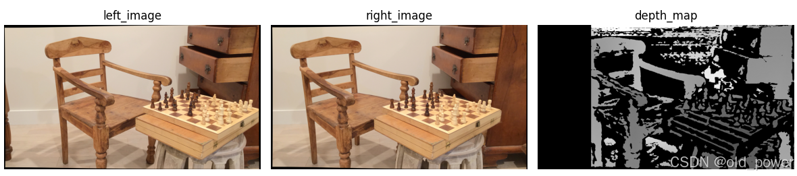
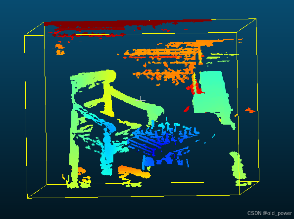
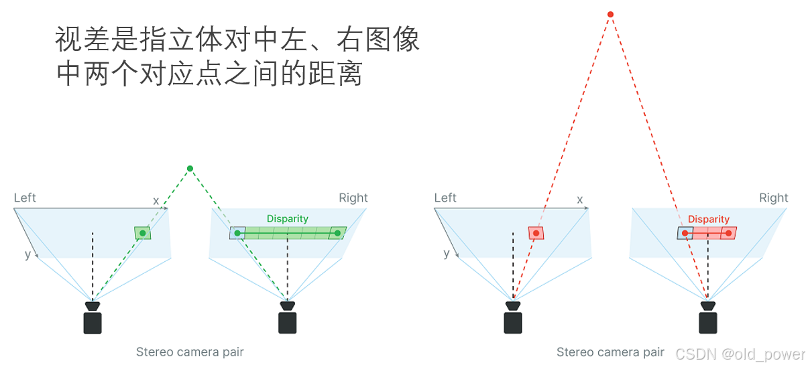

# 【OpenCV】双目相机计算深度图和点云

**双目相机计算深度图的基本原理是通过两台相机从不同角度拍摄同一场景，然后利用视差来计算物体的距离。本文的Python实现示例，使用OpenCV库来处理图像和计算深度图。**
## 1、数据集介绍
[`Mobile stereo datasets`](https://vision.middlebury.edu/stereo/data/scenes2021/)由Pan Guanghan、Sun Tiansheng、Toby Weed和Daniel Scharstein在2019-2021年期间创建的，使用了Roger Dai、Kyle Meredith、Tommaso Monaco、Nick Mosier和Daniel Scharstein在2017-2018年期间开发的结构化光采集系统。该系统采用安装在UR5机械臂上的移动设备（苹果iPod touch 6G）；地基真差是使用[5]中描述的结构化照明管道的一个子集来计算的。这些数据集包括11个场景，在许多不同的照明条件和曝光（包括闪光灯和移动设备的“火炬”照明）下，从1-3个不同的观看方向拍摄。




**数据集基本描述：**
```
Dataset description
Each dataset consists of 2 views taken under several different illuminations and exposures. The files are organized as follows:
SCENE{1,2,3}/                  -- scene imaged from 1-3 viewing directions
  ambient/                     -- directory of all input views under ambient lighting
    {F,L,T}{0,1,...}/          -- different lighting conditions (F=flash, L=lighting, T=torch)
      im0e{0,1,2,...}.png      -- left view under different exposures
      im1e{0,1,2,...}.png      -- right view under different exposures
  calib.txt                    -- calibration information
  im{0,1}.png                  -- default left and right view (typically ambient/L0/im{0,1}e2.png)
  disp{0,1}.pfm                -- left and right GT disparities
Zip files containing the above files can be downloaded here. "all.zip" contains all 24 scenes (image pair, disparities, calibration file), but not the ambient subdirectories. The latter are available in separate zip files.

Calibration file format
Here is a sample calib.txt file:
cam0=[1758.23 0 953.34; 0 1758.23 552.29; 0 0 1]
cam1=[1758.23 0 953.34; 0 1758.23 552.29; 0 0 1]
doffs=0
baseline=111.53
width=1920
height=1080
ndisp=290
isint=0
vmin=75
vmax=262
Explanation:

cam0,1:        camera matrices for the rectified views, in the form [f 0 cx; 0 f cy; 0 0 1], where
  f:           focal length in pixels
  cx, cy:      principal point

doffs:         x-difference of principal points, doffs = cx1 - cx0 (here always == 0)

baseline:      camera baseline in mm

width, height: image size

ndisp:         a conservative bound on the number of disparity levels;
               the stereo algorithm MAY utilize this bound and search from d = 0 .. ndisp-1

vmin, vmax:    a tight bound on minimum and maximum disparities, used for color visualization;
               the stereo algorithm MAY NOT utilize this information
To convert from the floating-point disparity value d [pixels] in the .pfm file to depth Z [mm] the following equation can be used:
Z = baseline * f / (d + doffs)
Note that the image viewer "sv" and mesh viewer "plyv" provided by our software cvkit can read the calib.txt files and provide this conversion automatically when viewing .pfm disparity maps as 3D meshes.
```
---
  - 如果使用自己的双目相机，则需要知道相机两个摄像头的内参矩阵`cam0,1`、基线`baseline `
 
---


## 2、Python代码
代码使用的双目图像数据是`chess2`
```python
import cv2
import numpy as np
import time
import matplotlib.pyplot as plt

def load_images(left_path, right_path):
    left_image = cv2.imread(left_path, 0)
    right_image = cv2.imread(right_path, 0)
    return left_image, right_image

#
def compute_disparity_map(left_image, right_image, cam0, cam1, doffs, ndisp, vmin, vmax, block_size=15):
    stereo = cv2.StereoSGBM_create(
        minDisparity=vmin,  # 视差从0开始
        numDisparities=ndisp,  # 视差范围数量，必须是16的倍数
        blockSize=block_size,  # 匹配块的大小，奇数
        P1=8 * 3 * block_size ** 2,  # 平滑惩罚项（第一级）
        P2=32 * 3 * block_size ** 2,  # 平滑惩罚项（第二级），通常是P1的4倍
        disp12MaxDiff=1,  # 左右视差检查的最大允许差异
        uniquenessRatio=10,  # 唯一性比率阈值
        speckleWindowSize=100,  # 斑点滤波器窗口大小
        speckleRange=32  # 斑点滤波器最大容许差异
    )
    disparity_map = stereo.compute(left_image, right_image).astype(np.float32) / 16.0
    return disparity_map

# 转成深度图
def convert_disparity_to_depth(disparity_map, focal_length_px, baseline_mm):
    # 避免除以零的情况
    depth_map = (focal_length_px * baseline_mm) / disparity_map
    depth_map[disparity_map == 0] = 0  # 设置无效区域的深度为0
    return depth_map

# 过滤最远平面
def filter_far_plane(depth_map, max_distance=1500):  
    depth_map[depth_map > max_distance] = 0
    return depth_map

#生成普通点云
def generate_point_cloud(depth_map, cam0, cx, cy):
    fx = cam0[0, 0]
    fy = cam0[1, 1]

    height, width = depth_map.shape

    # 创建网格
    u, v = np.meshgrid(np.arange(width), np.arange(height))

    # 计算 x, y, z 坐标
    z = depth_map
    x = (u - cx) * z / fx
    y = (v - cy) * z / fy

    # 将坐标堆叠成点云数组
    point_cloud = np.stack((x, y, z), axis=-1)

    # 过滤掉无效点（深度值为 0 的点）
    valid_mask = z > 0
    point_cloud = point_cloud[valid_mask]

    return point_cloud

#生成彩色点云
def generate_colored_point_cloud(depth_map, cam0, cx, cy):  
    fx = cam0[0, 0]
    fy = cam0[1, 1]

    height, width = depth_map.shape

    # 创建网格
    u, v = np.meshgrid(np.arange(width), np.arange(height))

    # 计算x, y, z坐标
    x = (u - cx) * depth_map / fx
    y = (v - cy) * depth_map / fy
    z = depth_map

    # 将坐标堆叠成点云数组
    point_cloud = np.stack((x, y, z), axis=-1)

    # 归一化深度值
    valid_mask = depth_map > 0
    normalized_depth = np.zeros_like(depth_map)
    if valid_mask.any():
        normalized_depth[valid_mask] = (depth_map[valid_mask] - np.min(depth_map[valid_mask])) / (np.max(depth_map[valid_mask]) - np.min(depth_map[valid_mask]))

    # 使用jet colormap生成颜色
    colors = plt.cm.jet(normalized_depth)[:, :, :3]  # 获取RGB颜色，忽略alpha通道

    # 将颜色值从 [0, 1] 转换为 [0, 255] 并转换为 uint8 类型
    colors = (colors * 255).astype(np.uint8)

    return point_cloud, colors

def save_point_cloud_to_txt(point_cloud, file_path):
    point_cloud = np.hstack([point_cloud.reshape(-1, 3)])
    np.savetxt(file_path, point_cloud, fmt='%f %f %f', header='x y z', comments='')

def save_point_cloud_to_txt_rgb(point_cloud, colors, file_path):
    points_with_colors = np.hstack([point_cloud.reshape(-1, 3), colors.reshape(-1, 3)])
    np.savetxt(file_path, points_with_colors, fmt='%f %f %f %f %f %f', header='x y z r g b', comments='')
    print(f"Colored point cloud saved to {file_path}")

if __name__ == "__main__":
    left_image_path = 'Stereo/data/chess2/ambient/L0/im0e3.png'  # 替换为你的左眼图像路径
    right_image_path = 'Stereo/data/chess2/ambient/L0/im1e3.png'  # 替换为你的右眼图像路径

    left_image, right_image = load_images(left_image_path, right_image_path)

    # 双目相机参数
    cam0 = np.array([[1758.23, 0, 872.36], [0, 1758.23, 552.32], [0, 0, 1]])
    cam1 = np.array([[1758.23, 0, 872.36], [0, 1758.23, 552.32], [0, 0, 1]])
    doffs = 0
    baseline_mm = 124.86
    width = 1920
    height = 1080
    ndisp = 310
    isint = 0
    vmin=90
    vmax=280

    # 计算像素焦距
    fx = cam0[0, 0]
    fy = cam0[1, 1]
    cx = cam0[0, 2]
    cy = cam1[1, 2]


    start_time = time.time()

    disparity_map = compute_disparity_map(left_image, right_image, cam0, cam1, doffs, ndisp, vmin, vmax)
    depth_map = convert_disparity_to_depth(disparity_map, fx, baseline_mm)
    depth_map = filter_far_plane(depth_map, max_distance=depth_map.max()-1)  # 过滤最远的平面
    # point_cloud = generate_point_cloud(depth_map, cam0, cx, cy)
    point_cloud, colors = generate_colored_point_cloud(depth_map, cam0, cx, cy)

    end_time = time.time()
    elapsed_time = end_time - start_time
    print(f"Elapsed Time = {elapsed_time:.4f} seconds")

    #cv2.imshow('depth',depth_map)
    #cv2.waitKey(0)
    #cv2.imwrite('D:/dataset/depth.jpg',depth_map)

    # 创建 1 行 3 列的子图布局
    plt.figure(figsize=(12, 4))
    # 显示第左图
    plt.subplot(1, 3, 1)
    plt.imshow(cv2.imread(left_image_path)[:, :, ::-1] ) # 反转通道顺序
    plt.title('left_image')
    plt.axis('off')
    # 显示右图
    plt.subplot(1, 3, 2)
    plt.imshow(cv2.imread(right_image_path)[:, :, ::-1] ) # 反转通道顺序
    plt.title('right_image')
    plt.axis('off')
    # 显示深度图
    plt.subplot(1, 3, 3)
    plt.imshow(depth_map, cmap='gray')
    plt.title('depth_map')
    plt.axis('off')
    # 调整子图间距
    plt.tight_layout()
    # 显示图像
    plt.show()

    # 保存最后一次迭代的点云到TXT文件
    output_file_path = 'point_cloud.txt'
    save_point_cloud_to_txt(point_cloud, output_file_path)
    #save_point_cloud_to_txt_rgb(point_cloud, colors, output_file_path)
    print(f"Point cloud saved to {output_file_path}")
```


## 3、运行结果
### 3.1 处理耗时
```bash
Elapsed Time = 1.3469 seconds
Point cloud saved to point_cloud.txt
```
### 3.2 左图、右图和计算的深度图

### 3.3 保存的点云文件`point_cloud.txt`


## 4、代码说明
函数 `compute_disparity_map` 的功能是**计算双目立体视觉中的视差图（Disparity Map）**。视差图是双目立体视觉中的关键输出，它表示左右图像中对应像素点的水平位移（视差），可以用来计算深度信息。



### 具体功能：
1. **输入**：
   - `left_image` 和 `right_image`：双目相机的左右图像。
   - `cam0` 和 `cam1`：左右相机的内参矩阵（虽然函数中未直接使用，但通常在后续深度计算中会用到）。
   - `doffs`：左右相机光心的水平偏移（通常用于校正后的图像）。
   - `ndisp`：视差范围的数量（必须是 16 的倍数）。
   - `vmin` 和 `vmax`：视差的最小值和最大值。
   - `block_size`：匹配块的大小（奇数）。

2. **输出**：
   - `disparity_map`：视差图，表示每个像素点的视差值。

3. **核心逻辑**：
   - 使用 OpenCV 的 `cv2.StereoSGBM_create` 创建一个半全局块匹配（Semi-Global Block Matching, SGBM）立体匹配器。
   - 调用 `stereo.compute` 计算左右图像的视差图。
   - 将视差图的值除以 16（OpenCV 的 SGBM 算法返回的视差图是 16 倍的实际值）。

### 参数详解：
- **`minDisparity=vmin`**：视差的最小值，通常为 0。
- **`numDisparities=ndisp`**：视差范围的数量，必须是 16 的倍数。例如，如果 `ndisp=64`，则视差范围为 `[vmin, vmin + 64]`。
- **`blockSize=block_size`**：匹配块的大小，必须是奇数。较大的块可以提高鲁棒性，但会降低细节。
- **`P1` 和 `P2`**：平滑惩罚项，用于控制视差图的平滑程度。`P2` 通常是 `P1` 的 4 倍。
- **`disp12MaxDiff=1`**：左右视差检查的最大允许差异，用于过滤不匹配的点。
- **`uniquenessRatio=10`**：唯一性比率阈值，用于过滤非唯一的匹配点。
- **`speckleWindowSize=100`**：斑点滤波器窗口大小，用于去除小的噪声区域。
- **`speckleRange=32`**：斑点滤波器的最大容许差异。

### 视差图的用途：
视差图可以用于计算深度图（Depth Map），公式为：
$$
\text{Depth} = \frac{f \cdot B}{\text{Disparity}}
$$
其中：
- $f$ 是相机的焦距（通常从相机内参矩阵中获取）。
- $B$ 是基线长度（左右相机光心之间的距离）。
- $\text{Disparity}$ 是视差值。

### 函数使用示例代码：
```python
import cv2
import numpy as np

# 假设 left_image 和 right_image 是左右图像
left_image = cv2.imread('left.png', cv2.IMREAD_GRAYSCALE)
right_image = cv2.imread('right.png', cv2.IMREAD_GRAYSCALE)

# 相机内参和参数
cam0 = np.array([[1000, 0, 320], [0, 1000, 240], [0, 0, 1]])  # 左相机内参
cam1 = np.array([[1000, 0, 320], [0, 1000, 240], [0, 0, 1]])  # 右相机内参
doffs = 0  # 光心偏移
ndisp = 64  # 视差范围
vmin = 0  # 最小视差
vmax = 64  # 最大视差

# 计算视差图
disparity_map = compute_disparity_map(left_image, right_image, cam0, cam1, doffs, ndisp, vmin, vmax)

# 显示视差图
cv2.imshow('Disparity Map', disparity_map / ndisp)  # 归一化显示
cv2.waitKey(0)
cv2.destroyAllWindows()
```

### 注意事项：
1. **图像输入**：左右图像需要是校正后的图像（即极线对齐）。
2. **视差范围**：`ndisp` 的选择需要根据场景的深度范围调整。
3. **性能**：SGBM 算法的计算复杂度较高，对于高分辨率图像可能需要较长时间。

如果有其他问题，欢迎评论！😊


