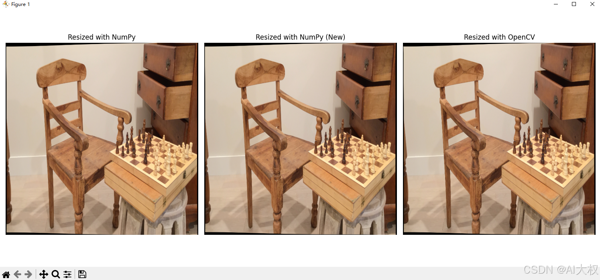

# 图像缩放的双线性插值实现方式

## 1、双线性插值概念
双线性插值是一种用于在二维网格上进行插值的方法，适用于图像处理、计算机图形学等领域。它通过利用四个邻近点的已知值，估算出任意点的值。双线性插值在两个方向（通常是水平和垂直）上分别进行线性插值，因此得名“双线性”。双线性插值是一种常用的图像缩放方法，它通过在四个最近邻像素之间进行线性插值来计算新的像素值。以下是双线性插值的详细步骤和公式。

**双线性插值的步骤**

假设我们有一个源图像 `I(x, y)`，目标是将其缩放到一个新的尺寸 `(new_width, new_height)`。对于目标图像中的每一个像素 `(xx, yy)`，我们需要找到其在源图像中的对应位置，并使用双线性插值计算该像素的值。

1. **确定源图像中的坐标**：
   - 计算目标图像中每个像素 `(xx, yy)` 对应的源图像坐标 `(x, y)`。
   - 使用缩放比例 `xRatio = (src_width - 1) / (new_width - 1)` 和 `yRatio = (src_height - 1) / (new_height - 1)` 来计算源图像坐标。
   - `x = floor(xx * xRatio)` 和 `y = floor(yy * yRatio)` 得到最接近的左上角像素坐标。
   - `x_l` 和 `y_l` 分别是 `x` 和 `y` 的整数部分，`x_h = min(x_l + 1, src_width - 1)` 和 `y_h = min(y_l + 1, src_height - 1)` 是右下角的像素坐标。

2. **计算权重**：
   - 计算小数部分 `dx = xx * xRatio - x_l` 和 `dy = yy * yRatio - y_l`。
   - 这些小数部分将用于线性插值。

3. **双线性插值公式**：
   - 使用四个最近邻像素的值 `I(x_l, y_l)`、`I(x_h, y_l)`、`I(x_l, y_h)` 和 `I(x_h, y_h)` 进行插值。
   - 首先在水平方向上进行线性插值：
     $$
     a = I(x_l, y_l) \cdot (1 - dx) + I(x_h, y_l) \cdot dx
	$$$$
     b = I(x_l, y_h) \cdot (1 - dx) + I(x_h, y_h) \cdot dx
    $$
   - 然后在垂直方向上进行线性插值：
    $$
     I'(xx, yy) = a \cdot (1 - dy) + b \cdot dy
     $$

## 2、双线性插值实现代码（NumPy，CV2）

### 2.1 Python代码
提供了3种实现方式：`for-loop`、`NumPy广播机制`、`CV2库函数`：

```python
import numpy as np
from PIL import Image
import matplotlib.pyplot as plt
import time
import cv2

#方式1：for-loop
def bilinear_resize(img, new_shape):
    img = np.array(img)
    height, width, depth = img.shape
    new_height, new_width = new_shape
    result = np.zeros((new_height, new_width, depth))

    x_ratio = float(width - 1) / new_width
    y_ratio = float(height - 1) / new_height

    for i in range(new_height):
        for j in range(new_width):
            x_l, y_l = int(j * x_ratio), int(i * y_ratio)
            x_h, y_h = min(x_l + 1, width - 1), min(y_l + 1, height - 1)

            x_weight = (j * x_ratio) - x_l
            y_weight = (i * y_ratio) - y_l

            a = img[y_l, x_l] * (1 - x_weight) + img[y_l, x_h] * x_weight
            b = img[y_h, x_l] * (1 - x_weight) + img[y_h, x_h] * x_weight

            result[i, j] = a * (1 - y_weight) + b * y_weight
    
    return Image.fromarray(np.uint8(result))

#方式2：NumPy广播机制
def bilinear_resize_numpy(img, new_shape):
    img = np.array(img)
    height, width, depth = img.shape
    new_height, new_width = new_shape
    
    # 计算缩放比例
    x_ratio = float(width - 1) / (new_width - 1) if new_width > 1 else 0
    y_ratio = float(height - 1) / (new_height - 1) if new_height > 1 else 0
    
    # 创建网格坐标
    x_grid = np.linspace(0, width - 1, new_width)
    y_grid = np.linspace(0, height - 1, new_height)
    
    # 获取每个新像素点在原图中的位置
    x_l = np.floor(x_grid).astype(int)
    y_l = np.floor(y_grid).astype(int)
    x_h = np.minimum(x_l + 1, width - 1)
    y_h = np.minimum(y_l + 1, height - 1)
    
    # 计算权重
    x_weight = x_grid[:, None] - x_l[:, None]
    y_weight = y_grid[:, None] - y_l[:, None]

    # 使用numpy索引获取四个邻近像素的值
    a = img[y_l[:, None], x_l].reshape(new_height, new_width, depth)
    b = img[y_l[:, None], x_h].reshape(new_height, new_width, depth)
    c = img[y_h[:, None], x_l].reshape(new_height, new_width, depth)
    d = img[y_h[:, None], x_h].reshape(new_height, new_width, depth)

    # 调整权重形状以匹配图像数据
    x_weight = x_weight[:, :, None]
    y_weight = y_weight[:, :, None]

    # 进行双线性插值
    ab = a * (1 - x_weight.transpose((1, 0, 2))) + b * x_weight.transpose((1, 0, 2))
    cd = c * (1 - x_weight.transpose((1, 0, 2))) + d * x_weight.transpose((1, 0, 2))
    result = ab * (1 - y_weight) + cd * y_weight
    
    return Image.fromarray(np.uint8(result))

#方式3：CV2库函数
def bilinear_resize_cv2(img, new_shape):
    # 将PIL图像转换为numpy数组
    img_array = np.array(img)
    
    # 计算新的尺寸
    new_height, new_width = new_shape
    
    # 使用cv2.resize进行双线性插值
    start_time = time.time()
    resized_img = cv2.resize(img_array, (new_width, new_height), interpolation=cv2.INTER_LINEAR)
    processing_time = time.time() - start_time
    
    print(f"OpenCV processing time: {processing_time:.4f} seconds")
    
    # 将numpy数组转换回PIL图像并返回
    return Image.fromarray(resized_img)

if __name__ == "__main__":
    # 加载图像
    img_path = 'image.jpg'
    original_img = Image.open(img_path)

    # 设置新的尺寸
    # new_shape = (original_img.size[0] // 2, original_img.size[1] // 2)
    new_shape = (640,640)

    # 使用for循环遍历处理并计时
    start_time = time.time()
    resized_img_for_loop= bilinear_resize(original_img, new_shape)
    numpy_time = time.time() - start_time
    print(f"for-loop  processing time: {numpy_time:.4f} seconds")

    # 使用NumPy广播机制处理并计时
    start_time = time.time()
    resized_img_numpy= bilinear_resize_numpy(original_img, new_shape)
    numpy_time = time.time() - start_time
    print(f"NumPy processing time: {numpy_time:.4f} seconds")

    # 使用OpenCV处理并计时
    resized_img_cv2 = bilinear_resize_cv2(original_img, new_shape)

    # 显示结果（可选）
    # 创建一个包含三个子图的图形，并设置布局
    fig, axes = plt.subplots(1, 3, figsize=(15, 5))
    # 显示第一张图像
    axes[0].imshow(resized_img_for_loop)
    axes[0].set_title("Resized with NumPy")
    axes[0].axis('off')
    # 显示第二张图像
    axes[1].imshow(resized_img_numpy)
    axes[1].set_title("Resized with NumPy (New)")
    axes[1].axis('off')
    # 显示第三张图像
    axes[2].imshow(resized_img_cv2)
    axes[2].set_title("Resized with OpenCV")
    axes[2].axis('off')
    
    # 调整布局以防止重叠
    plt.tight_layout()
    # 显示图像
    plt.show()
```

### 2.2 运行结果
运行结果耗时对比：

```bash
for-loop processing time: 3.0354 seconds
NumPy processing time: 0.0666 seconds
OpenCV processing time: 0.0035 seconds
```

可以看出OpenCV处理速度最快。

---
 - 另外本想尝试支持`OpenCL`的`pyopencl`的加速处理，但是报了点错就没有放代码。
---
