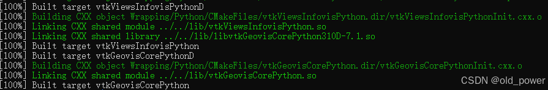

## Linux(Ubuntu24.04)源码编译安装VTK7.1.1记录

VTK（Visualization Toolkit）是一个开源的3D可视化开发工具包，用于开发可视化和图形处理应用程序。VTK提供了一系列的算法和工具，用于创建、渲染和处理复杂的3D图形和数据。VTK由C++编写，并提供了Python、Java和Tcl等语言的接口。它可以在Windows、Linux和macOS等操作系统上运行。

本次安装是在`WSL2`的`Ubuntu24.04`环境下进行.

### 1、获取v7.1.1版本的VTK源码
拉取源码时直接指定 -b v7.1.1：
```bash
git clone -b v7.1.1 https://github.com/Kitware/VTK
```

使用git describe --tags --exact-match HEAD确认当前HEAD指向v7.1.1（tag），如果不是，使用git checkout -b v7.1.1切换：
```bash
git describe --tags --exact-match HEAD
v7.1.1
```

### 2、编译安装
进入VTK目录，创建build文件夹并进入，执行cmake和make，编译成功后install：
```bash
cd VTK #进入目录
mkdir build && cd build
cmake .. -DCMAKE_BUILD_TYPE=Release -DVTK_WRAP_PYTHON=ON -DBUILD_SHARED_LIBS=ON
make -j$(nproc)  # 使用多线程加速编译
sudo make install
```

### 3、配置动态链接库
添加 VTK 的库路径到系统中：
```bash
echo "/usr/local/lib" | sudo tee -a /etc/ld.so.conf.d/vtk.conf
sudo ldconfig
```

### 4、编译过程遇到的问题
#### 4.1 问题1
如果遇到PythonCore相关的问题，可能是由于conda的python虚拟环境引起的，屏蔽掉conda即可。可将~/.bashrc的conda相关的环境设置都注释掉后，执行source ~/.bashrc，重启或者重新打开一个新的命令框，此时使用的是系统自带的python环境。

#### 4.2 问题2
>CMake Error at Rendering/OpenGL2/CMakeLists.txt:202 (message): X11_Xt_LIB could not be found. Required for VTK X lib.

这个错误消息表明在 CMake 过程中，系统无法找到 X11_Xt_LIB 库，而这个库是 VTK 中处理 X 窗口系统相关功能所必需的。要解决这个问题，需要安装 X11 和 Xt 库:
```bash
sudo apt-get install libx11-dev libxt-dev
```

#### 4.2 问题3
```bash
VTK/Wrapping/PythonCore/vtkPythonArgs.cxx:105:25: error: invalid conversion from ‘const char*’ to ‘char*’ [-fpermissive] 105 | a = PyUnicode_AsUTF8(o);

                                                             | ~~~~~~~~~~~~~~~~^~~ | | | const char* 
```

这是字符转换问题，不能将const char*转成char*，修改vtkPythonArgs.cxx的105行，将a = PyUnicode_AsUTF8(o);改为a = const_cast<char*>(PyUnicode_AsUTF8(o));


```cpp
a = const_cast<char*>(PyUnicode_AsUTF8(o));
```

#### 4.4 编译成功 


