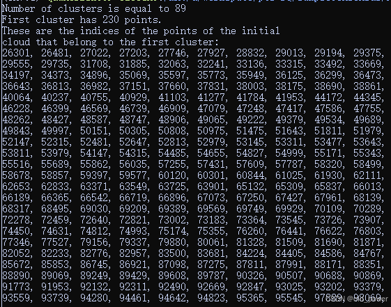
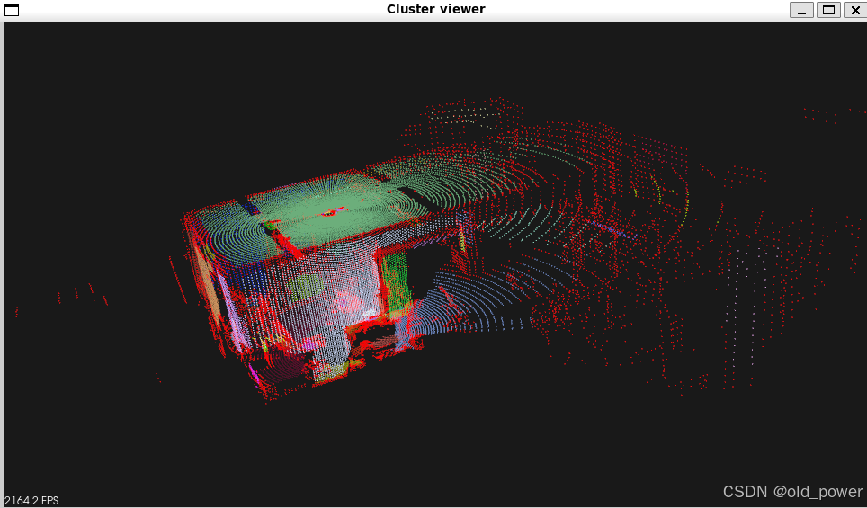

## 1、简介
### 区域生长分割（Region Growing Segmentation）

**定义**：
区域生长分割是一种基于相似性准则的图像分割方法，通过从种子点开始，逐步合并邻近像素或点，形成具有相似属性的区域。

**步骤**：
1. **选择种子点**：手动或自动选择初始种子点。
2. **定义相似性准则**：如颜色、强度、法线等。
3. **区域生长**：从种子点出发，合并符合相似性准则的邻近像素或点。
4. **终止条件**：当没有更多符合准则的像素或点时，停止生长。

**主要应用场景**：
1. **医学图像分割**：用于分割器官、肿瘤等。
2. **遥感图像分析**：用于土地分类、植被检测等。
3. **三维点云处理**：用于物体识别、场景理解等。
4. **计算机视觉**：用于目标检测、图像分割等。

**总结**：
区域生长分割是一种有效的图像和点云分割方法，广泛应用于医学、遥感和计算机视觉等领域。PCL提供了便捷的实现工具。

## 2、代码实现
###  2.1 region_growing_segmentation.cpp
```cpp
#include <iostream>
#include <vector>
#include <pcl/point_types.h>
#include <pcl/io/pcd_io.h>
#include <pcl/search/search.h>
#include <pcl/search/kdtree.h>
#include <pcl/features/normal_3d.h>
#include <pcl/visualization/cloud_viewer.h>
#include <pcl/filters/filter_indices.h> // for pcl::removeNaNFromPointCloud
#include <pcl/segmentation/region_growing.h>

int main ()
{
  pcl::PointCloud<pcl::PointXYZ>::Ptr cloud (new pcl::PointCloud<pcl::PointXYZ>);
  if ( pcl::io::loadPCDFile <pcl::PointXYZ> ("yourpcd.pcd", *cloud) == -1)
  {
    std::cout << "Cloud reading failed." << std::endl;
    return (-1);
  }

  pcl::search::Search<pcl::PointXYZ>::Ptr tree (new pcl::search::KdTree<pcl::PointXYZ>);
  pcl::PointCloud <pcl::Normal>::Ptr normals (new pcl::PointCloud <pcl::Normal>);
  pcl::NormalEstimation<pcl::PointXYZ, pcl::Normal> normal_estimator;
  normal_estimator.setSearchMethod (tree);
  normal_estimator.setInputCloud (cloud);
  normal_estimator.setKSearch (50);
  normal_estimator.compute (*normals);

  pcl::IndicesPtr indices (new std::vector <int>);
  pcl::removeNaNFromPointCloud(*cloud, *indices);

  pcl::RegionGrowing<pcl::PointXYZ, pcl::Normal> reg;
  reg.setMinClusterSize (50);
  reg.setMaxClusterSize (1000000);
  reg.setSearchMethod (tree);
  reg.setNumberOfNeighbours (30);
  reg.setInputCloud (cloud);
  reg.setIndices (indices);
  reg.setInputNormals (normals);
  reg.setSmoothnessThreshold (3.0 / 180.0 * M_PI);
  reg.setCurvatureThreshold (1.0);

  std::vector <pcl::PointIndices> clusters;
  reg.extract (clusters);

  std::cout << "Number of clusters is equal to " << clusters.size () << std::endl;
  std::cout << "First cluster has " << clusters[0].indices.size () << " points." << std::endl;
  std::cout << "These are the indices of the points of the initial" <<
    std::endl << "cloud that belong to the first cluster:" << std::endl;
  std::size_t counter = 0;
  while (counter < clusters[0].indices.size ())
  {
    std::cout << clusters[0].indices[counter] << ", ";
    counter++;
    if (counter % 10 == 0)
      std::cout << std::endl;
  }
  std::cout << std::endl;

  pcl::PointCloud <pcl::PointXYZRGB>::Ptr colored_cloud = reg.getColoredCloud ();
  pcl::visualization::CloudViewer viewer ("Cluster viewer");
  viewer.showCloud(colored_cloud);
  while (!viewer.wasStopped ())
  {
  }

  return (0);
}
```

### 2.2 CMakeLists.txt

```
cmake_minimum_required(VERSION 3.5 FATAL_ERROR)

project(region_growing_segmentation)

find_package(PCL 1.5 REQUIRED)

include_directories(${PCL_INCLUDE_DIRS})
link_directories(${PCL_LIBRARY_DIRS})
add_definitions(${PCL_DEFINITIONS})

add_executable (region_growing_segmentation region_growing_segmentation.cpp)
target_link_libraries (region_growing_segmentation ${PCL_LIBRARIES})
```
### 2.3 运行结果
 - 编译运行
 

```bash
mkdir build && cd build
cmake ..
make
./region_growing_segmentation
```
 - 结果







## 3、代码分析
这段代码主要分为数据的加载、法线估计、区域生长分割以及可视化。以下是对代码的详细解释：

#### 3.1 头文件引入
```cpp
#include <iostream>
#include <vector>
#include <pcl/point_types.h>
#include <pcl/io/pcd_io.h>
#include <pcl/search/search.h>
#include <pcl/search/kdtree.h>
#include <pcl/features/normal_3d.h>
#include <pcl/visualization/cloud_viewer.h>
#include <pcl/filters/filter_indices.h> // for pcl::removeNaNFromPointCloud
#include <pcl/segmentation/region_growing.h>
```
- **iostream**: 用于标准输入输出。
- **vector**: 用于存储点云索引等数据。
- **pcl/point_types.h**: 定义了PCL中的点类型（如 `pcl::PointXYZ`）。
- **pcl/io/pcd_io.h**: 提供了点云数据的读写功能。
- **pcl/search/search.h** 和 **pcl/search/kdtree.h**: 提供了点云搜索功能，使用KD树进行最近邻搜索。
- **pcl/features/normal_3d.h**: 用于估计点云中每个点的法线。
- **pcl/visualization/cloud_viewer.h**: 用于点云的可视化。
- **pcl/filters/filter_indices.h**: 提供了点云滤波功能，如去除无效点（NaN点）。
- **pcl/segmentation/region_growing.h**: 提供了区域生长分割算法。

#### 3.2 主函数
```cpp
int main ()
{
  pcl::PointCloud<pcl::PointXYZ>::Ptr cloud (new pcl::PointCloud<pcl::PointXYZ>);
  if ( pcl::io::loadPCDFile <pcl::PointXYZ> ("yourpcd.pcd", *cloud) == -1)
  {
    std::cout << "Cloud reading failed." << std::endl;
    return (-1);
  }
```
- **pcl::PointCloud<pcl::PointXYZ>::Ptr cloud**: 定义一个指向 `pcl::PointXYZ` 类型点云的智能指针。
- **pcl::io::loadPCDFile**: 从PCD文件中加载点云数据。如果加载失败，程序返回-1并输出错误信息。

#### 3.3 法线估计
```cpp
  pcl::search::Search<pcl::PointXYZ>::Ptr tree (new pcl::search::KdTree<pcl::PointXYZ>);
  pcl::PointCloud <pcl::Normal>::Ptr normals (new pcl::PointCloud <pcl::Normal>);
  pcl::NormalEstimation<pcl::PointXYZ, pcl::Normal> normal_estimator;
  normal_estimator.setSearchMethod (tree);
  normal_estimator.setInputCloud (cloud);
  normal_estimator.setKSearch (50);
  normal_estimator.compute (*normals);
```
- **pcl::search::Search<pcl::PointXYZ>::Ptr tree**: 定义一个KD树用于最近邻搜索。
- **pcl::PointCloud <pcl::Normal>::Ptr normals**: 定义一个存储法线的点云。
- **pcl::NormalEstimation**: 法线估计器，用于计算点云中每个点的法线。
  - **setSearchMethod**: 设置搜索方法为KD树。
  - **setInputCloud**: 设置输入点云。
  - **setKSearch**: 设置最近邻搜索的K值为50。
  - **compute**: 计算法线并存储在 `normals` 中。

#### 3.4 去除无效点
```cpp
  pcl::IndicesPtr indices (new std::vector <int>);
  pcl::removeNaNFromPointCloud(*cloud, *indices);
```
- **pcl::IndicesPtr indices**: 定义一个存储有效点索引的向量。
- **pcl::removeNaNFromPointCloud**: 去除点云中的无效点（NaN点），并返回有效点的索引。

#### 3.5 `区域生长分割`
```cpp
  pcl::RegionGrowing<pcl::PointXYZ, pcl::Normal> reg;
  reg.setMinClusterSize (50);
  reg.setMaxClusterSize (1000000);
  reg.setSearchMethod (tree);
  reg.setNumberOfNeighbours (30);
  reg.setInputCloud (cloud);
  reg.setIndices (indices);
  reg.setInputNormals (normals);
  reg.setSmoothnessThreshold (3.0 / 180.0 * M_PI);
  reg.setCurvatureThreshold (1.0);

  std::vector <pcl::PointIndices> clusters;
  reg.extract (clusters);
```
- **pcl::RegionGrowing**: 区域生长分割器，用于将点云分割成多个簇。
  - **setMinClusterSize**: 设置最小簇的大小为50。
  - **setMaxClusterSize**: 设置最大簇的大小为1000000。
  - **setSearchMethod**: 设置搜索方法为KD树。
  - **setNumberOfNeighbours**: 设置每个点的邻居数量为30。
  - **setInputCloud**: 设置输入点云。
  - **setIndices**: 设置有效点的索引。
  - **setInputNormals**: 设置输入法线。
  - **setSmoothnessThreshold**: 设置平滑度阈值（3度转换为弧度）。
  - **setCurvatureThreshold**: 设置曲率阈值为1.0。
- **reg.extract**: 执行区域生长分割，并将结果存储在 `clusters` 中。

#### 3.6 输出分割结果
```cpp
  std::cout << "Number of clusters is equal to " << clusters.size () << std::endl;
  std::cout << "First cluster has " << clusters[0].indices.size () << " points." << std::endl;
  std::cout << "These are the indices of the points of the initial" <<
    std::endl << "cloud that belong to the first cluster:" << std::endl;
  std::size_t counter = 0;
  while (counter < clusters[0].indices.size ())
  {
    std::cout << clusters[0].indices[counter] << ", ";
    counter++;
    if (counter % 10 == 0)
      std::cout << std::endl;
  }
  std::cout << std::endl;
```
- 输出分割后的簇的数量。
- 输出第一个簇中的点的数量。
- 输出第一个簇中点的索引，每10个索引换行。

#### 3.7 可视化分割结果
```cpp
  pcl::PointCloud <pcl::PointXYZRGB>::Ptr colored_cloud = reg.getColoredCloud ();
  pcl::visualization::CloudViewer viewer ("Cluster viewer");
  viewer.showCloud(colored_cloud);
  while (!viewer.wasStopped ())
  {
  }

  return (0);
}
```
- **reg.getColoredCloud**: 获取带有颜色信息的点云，不同簇的点被赋予不同的颜色。
- **pcl::visualization::CloudViewer**: 创建一个点云查看器。
- **viewer.showCloud**: 显示带有颜色信息的点云。
- **while (!viewer.wasStopped)**: 保持查看器窗口打开，直到用户关闭窗口。

#### 总结
这段代码的主要功能是：
1. 加载点云数据。
2. 估计点云中每个点的法线。
3. 使用区域生长算法对点云进行分割。
4. 输出分割结果并可视化带有颜色信息的点云。

区域生长分割算法基于点云的法线和曲率信息，将点云分割成多个簇，每个簇代表一个平滑的表面区域。


