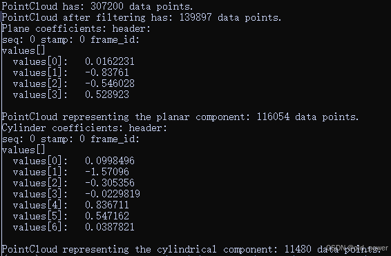
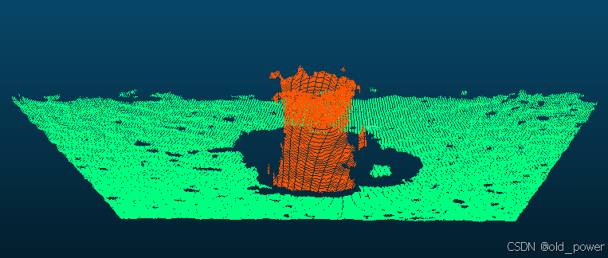
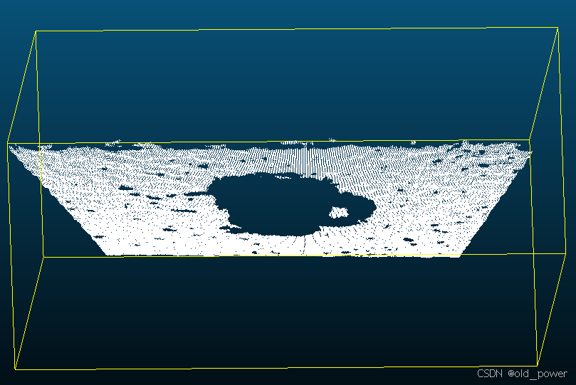
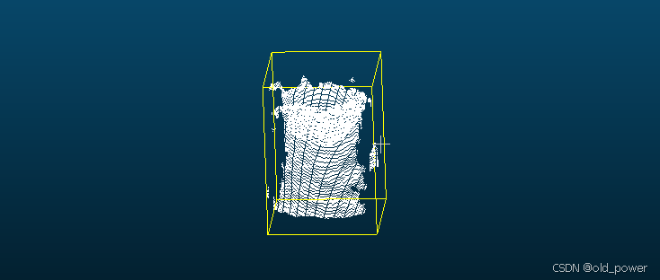

# 【PCL】Segmentation 模块—— 圆柱模型分割（Cylinder model segmentation）

## 1、简介
PCL（Point Cloud Library）中的圆柱模型分割**Cylinder Model Segmentation**是一种从点云数据中提取圆柱体模型的技术。它通过识别点云中符合圆柱体几何形状的部分，将圆柱体从其他几何形状中分离出来。

### 1.1 主要步骤
1. **预处理**：
   - 对点云进行去噪、下采样等操作，以减少数据量并提升处理效率。

2. **法线估计**：
   - 计算点云中每个点的法线，用于后续的模型拟合。

3. **模型拟合**：
   - 使用RANSAC（随机采样一致性）算法拟合圆柱体模型。RANSAC通过随机采样点来估计模型参数，并评估其与点云的拟合程度。

4. **分割**：
   - 根据拟合的圆柱体模型，将点云中符合该模型的内点（inliers）与不符合的外点（outliers）分离。

5. **后处理**：
   - 对分割结果进行优化，如去除噪声或进一步细化圆柱体参数。

### 1.2 应用场景
- **工业检测**：识别管道、圆柱形零件等。
- **机器人**：用于导航和物体抓取。
- **建筑建模**：提取建筑物中的圆柱形结构。

## 2、代码实现
代码为圆柱形模型运行一个样本共识分割，由于数据中存在噪声，圆柱模型并不完美。为了使示例更实际一些，将以下操作应用于输入数据集（按顺序）：

 - 距离大于1.5米的数据点被过滤

 - 估计每个点的表面法线

 - 一个平面模型（描述我们演示数据集中的表）被分割并保存到磁盘上

 - 一个圆柱形模型（在我们的演示数据集中描述杯子）被分割并保存到磁盘上
### 2.1 cylinder_segmentation.cpp

```cpp
#include <pcl/ModelCoefficients.h>
#include <pcl/io/pcd_io.h>
#include <pcl/point_types.h>
#include <pcl/filters/extract_indices.h>
#include <pcl/filters/passthrough.h>
#include <pcl/features/normal_3d.h>
#include <pcl/sample_consensus/method_types.h>
#include <pcl/sample_consensus/model_types.h>
#include <pcl/segmentation/sac_segmentation.h>

typedef pcl::PointXYZ PointT;

int
main ()
{
  // All the objects needed
  pcl::PCDReader reader;
  pcl::PassThrough<PointT> pass;
  pcl::NormalEstimation<PointT, pcl::Normal> ne;
  pcl::SACSegmentationFromNormals<PointT, pcl::Normal> seg; 
  pcl::PCDWriter writer;
  pcl::ExtractIndices<PointT> extract;
  pcl::ExtractIndices<pcl::Normal> extract_normals;
  pcl::search::KdTree<PointT>::Ptr tree (new pcl::search::KdTree<PointT> ());

  // Datasets
  pcl::PointCloud<PointT>::Ptr cloud (new pcl::PointCloud<PointT>);
  pcl::PointCloud<PointT>::Ptr cloud_filtered (new pcl::PointCloud<PointT>);
  pcl::PointCloud<pcl::Normal>::Ptr cloud_normals (new pcl::PointCloud<pcl::Normal>);
  pcl::PointCloud<PointT>::Ptr cloud_filtered2 (new pcl::PointCloud<PointT>);
  pcl::PointCloud<pcl::Normal>::Ptr cloud_normals2 (new pcl::PointCloud<pcl::Normal>);
  pcl::ModelCoefficients::Ptr coefficients_plane (new pcl::ModelCoefficients), coefficients_cylinder (new pcl::ModelCoefficients);
  pcl::PointIndices::Ptr inliers_plane (new pcl::PointIndices), inliers_cylinder (new pcl::PointIndices);

  // Read in the cloud data
  reader.read ("table_scene_mug_stereo_textured.pcd", *cloud);
  std::cerr << "PointCloud has: " << cloud->size () << " data points." << std::endl;

  // Build a passthrough filter to remove spurious NaNs and scene background
  //使用直通滤波器沿Z轴裁剪点云，保留Z值在`[0, 1.5]`范围内的点
  pass.setInputCloud (cloud);
  pass.setFilterFieldName ("z");
  pass.setFilterLimits (0, 1.5);
  pass.filter (*cloud_filtered);
  std::cerr << "PointCloud after filtering has: " << cloud_filtered->size () << " data points." << std::endl;

  // Estimate point normals 法线估计
  // 使用KdTree搜索方法，对滤波后的点云进行法线估计，每个点的法线基于其最近的50个邻居计算。
  ne.setSearchMethod (tree);
  ne.setInputCloud (cloud_filtered);
  ne.setKSearch (50);
  ne.compute (*cloud_normals);

  // Create the segmentation object for the planar model and set all the parameters
  // 平面分割
  seg.setOptimizeCoefficients (true);
  seg.setModelType (pcl::SACMODEL_NORMAL_PLANE);
  seg.setNormalDistanceWeight (0.1);
  seg.setMethodType (pcl::SAC_RANSAC);
  seg.setMaxIterations (100);
  seg.setDistanceThreshold (0.03);
  seg.setInputCloud (cloud_filtered);
  seg.setInputNormals (cloud_normals);
  // Obtain the plane inliers and coefficients
  // 使用RANSAC算法拟合平面模型，并输出平面方程的系数
  seg.segment (*inliers_plane, *coefficients_plane);
  std::cerr << "Plane coefficients: " << *coefficients_plane << std::endl;

  // Extract the planar inliers from the input cloud 提取平面点云
  extract.setInputCloud (cloud_filtered);
  extract.setIndices (inliers_plane);
  extract.setNegative (false);

  // Write the planar inliers to disk 
  // 提取平面点云并保存到PCD文件
  pcl::PointCloud<PointT>::Ptr cloud_plane (new pcl::PointCloud<PointT> ());
  extract.filter (*cloud_plane);
  std::cerr << "PointCloud representing the planar component: " << cloud_plane->size () << " data points." << std::endl;
  writer.write ("table_scene_mug_stereo_textured_plane.pcd", *cloud_plane, false);

  // Remove the planar inliers, extract the rest 去除平面点云
  extract.setNegative (true);
  extract.filter (*cloud_filtered2);
  extract_normals.setNegative (true);
  extract_normals.setInputCloud (cloud_normals);
  extract_normals.setIndices (inliers_plane);
  extract_normals.filter (*cloud_normals2);

  // Create the segmentation object for cylinder segmentation and set all the parameters
  // 圆柱体分割
  seg.setOptimizeCoefficients (true);
  seg.setModelType (pcl::SACMODEL_CYLINDER);
  seg.setMethodType (pcl::SAC_RANSAC);
  seg.setNormalDistanceWeight (0.1);
  seg.setMaxIterations (10000);
  seg.setDistanceThreshold (0.05);
  seg.setRadiusLimits (0, 0.1);
  seg.setInputCloud (cloud_filtered2);
  seg.setInputNormals (cloud_normals2);

  // Obtain the cylinder inliers and coefficients 
  // 使用RANSAC算法拟合圆柱体模型，并输出圆柱体的参数
  seg.segment (*inliers_cylinder, *coefficients_cylinder);
  std::cerr << "Cylinder coefficients: " << *coefficients_cylinder << std::endl;

  // Write the cylinder inliers to disk 
  // 提取圆柱体点云并保存到PCD文件
  extract.setInputCloud (cloud_filtered2);
  extract.setIndices (inliers_cylinder);
  extract.setNegative (false);
  pcl::PointCloud<PointT>::Ptr cloud_cylinder (new pcl::PointCloud<PointT> ());
  extract.filter (*cloud_cylinder);
  if (cloud_cylinder->points.empty ()) 
    std::cerr << "Can't find the cylindrical component." << std::endl;
  else
  {
	  std::cerr << "PointCloud representing the cylindrical component: " << cloud_cylinder->size () << " data points." << std::endl;
	  writer.write ("table_scene_mug_stereo_textured_cylinder.pcd", *cloud_cylinder, false);
  }
  return (0);
}
```

### 2.2 CMakeLists.txt

```
cmake_minimum_required(VERSION 3.5 FATAL_ERROR)

project(cylinder_segmentation)

find_package(PCL 1.2 REQUIRED)

include_directories(${PCL_INCLUDE_DIRS})
link_directories(${PCL_LIBRARY_DIRS})
add_definitions(${PCL_DEFINITIONS})

add_executable (${PROJECT_NAME} cylinder_segmentation.cpp)
target_link_libraries (${PROJECT_NAME} ${PCL_LIBRARIES})
```

## 3、运行结果

 - 编译运行

```bash
mkdir build && cd build
cmake ..
make
./cylinder_segmentation
```

 - 结果



 - 点云处理前`table_scene_mug_stereo_textured.pcd`



 - 保存的平面点云`table_scene_mug_stereo_textured_plane.pcd`



 - 保存提取的圆柱体点云`table_scene_mug_stereo_textured_cylinder.pcd`




## 4、代码解读


### 4.1 头文件引入
  - **ModelCoefficients**：用于存储模型参数（如平面、圆柱体的方程系数）。
  - **pcd_io**：用于读取和保存PCD格式的点云文件。
  - **point_types**：定义了点云中点的类型（如`pcl::PointXYZ`）。
  - **filters**：包含点云滤波工具（如`ExtractIndices`和`PassThrough`）。
  - **features**：包含点云特征计算工具（如法线估计`NormalEstimation`）。
  - **sample_consensus**：包含RANSAC算法及其相关模型（如平面、圆柱体）。
  - **segmentation**：包含点云分割工具。


### 4.2 类型定义
```cpp
typedef pcl::PointXYZ PointT;
```
- 定义`PointT`为`pcl::PointXYZ`，表示点云中的点类型为三维坐标点（x, y, z）。


### 4.3 初始化对象
- **reader**：用于读取PCD文件。
- **pass**：直通滤波器，用于裁剪点云。
- **ne**：法线估计器，用于计算点云中每个点的法线。
- **seg**：基于法线的分割器，用于分割平面和圆柱体。
- **writer**：用于保存点云数据到PCD文件。
- **extract**：用于从点云中提取特定索引的点。
- **extract_normals**：用于从法线点云中提取特定索引的法线。
- **tree**：KdTree对象，用于加速法线估计中的最近邻搜索。

### 4.4 数据集初始化
- **cloud**：存储原始点云数据。
- **cloud_filtered**：存储滤波后的点云数据。
- **cloud_normals**：存储点云的法线数据。
- **cloud_filtered2**：存储去除平面后的点云数据。
- **cloud_normals2**：存储去除平面后的法线数据。
- **coefficients_plane**和**coefficients_cylinder**：分别存储平面和圆柱体的模型系数。
- **inliers_plane**和**inliers_cylinder**：分别存储平面和圆柱体的内点索引。

### 4.5 平面分割代码
```cpp
seg.setOptimizeCoefficients(true);
seg.setModelType(pcl::SACMODEL_NORMAL_PLANE);
seg.setNormalDistanceWeight(0.1);
seg.setMethodType(pcl::SAC_RANSAC);
seg.setMaxIterations(100);
seg.setDistanceThreshold(0.03);
seg.setInputCloud(cloud_filtered);
seg.setInputNormals(cloud_normals);
seg.segment(*inliers_plane, *coefficients_plane);
std::cerr << "Plane coefficients: " << *coefficients_plane << std::endl;
```

- **`setOptimizeCoefficients(true)`**：
  - 启用模型系数优化。在拟合模型后，进一步优化模型参数以提高精度。

- **`setModelType(pcl::SACMODEL_NORMAL_PLANE)`**：
  - 设置分割模型类型为**带法线的平面模型**。该模型不仅使用点的坐标，还使用点的法线信息来拟合平面。

- **`setNormalDistanceWeight(0.1)`**：
  - 设置法线距离权重。该参数控制法线信息在模型拟合中的重要性。值越大，法线的影响越大。

- **`setMethodType(pcl::SAC_RANSAC)`**：
  - 使用**RANSAC算法**进行模型拟合。RANSAC是一种鲁棒的拟合算法，能够有效处理噪声和离群点。

- **`setMaxIterations(100)`**：
  - 设置RANSAC算法的最大迭代次数为100。迭代次数越多，拟合结果越精确，但计算时间越长。

- **`setDistanceThreshold(0.03)`**：
  - 设置距离阈值。点到模型的距离小于该阈值的点被视为内点（inliers）。该值越小，拟合的模型越精确。

- **`setInputCloud(cloud_filtered)`**：
  - 设置输入点云为滤波后的点云（`cloud_filtered`）。

- **`setInputNormals(cloud_normals)`**：
  - 设置输入点云的法线数据（`cloud_normals`）。
- **`seg.segment(*inliers_plane, *coefficients_plane)`**：
  - 执行平面分割，将内点索引存储在`inliers_plane`中，平面模型的系数存储在`coefficients_plane`中。

- **`std::cerr << "Plane coefficients: " << *coefficients_plane << std::endl;`**：
  - 输出平面模型的系数。平面方程的一般形式为：`Ax + By + Cz + D = 0`，其中`coefficients_plane`存储了`[A, B, C, D]`。
### 4.6 圆柱体分割代码
```cpp
seg.setOptimizeCoefficients(true);
seg.setModelType(pcl::SACMODEL_CYLINDER);
seg.setMethodType(pcl::SAC_RANSAC);
seg.setNormalDistanceWeight(0.1);
seg.setMaxIterations(10000);
seg.setDistanceThreshold(0.05);
seg.setRadiusLimits(0, 0.1);
seg.setInputCloud(cloud_filtered2);
seg.setInputNormals(cloud_normals2);
seg.segment(*inliers_cylinder, *coefficients_cylinder);
std::cerr << "Cylinder coefficients: " << *coefficients_cylinder << std::endl;
```

- **`setOptimizeCoefficients(true)`**：
  - 启用模型系数优化。

- **`setModelType(pcl::SACMODEL_CYLINDER)`**：
  - 设置分割模型类型为**圆柱体模型**。

- **`setMethodType(pcl::SAC_RANSAC)`**：
  - 使用RANSAC算法进行模型拟合。

- **`setNormalDistanceWeight(0.1)`**：
  - 设置法线距离权重。

- **`setMaxIterations(10000)`**：
  - 设置RANSAC算法的最大迭代次数为10000。圆柱体模型的拟合通常比平面模型更复杂，因此需要更多的迭代次数。

- **`setDistanceThreshold(0.05)`**：
  - 设置距离阈值。点到圆柱体模型的距离小于该阈值的点被视为内点。

- **`setRadiusLimits(0, 0.1)`**：
  - 设置圆柱体半径的范围。半径必须在该范围内才会被接受。

- **`setInputCloud(cloud_filtered2)`**：
  - 设置输入点云为去除平面后的点云（`cloud_filtered2`）。

- **`setInputNormals(cloud_normals2)`**：
  - 设置输入点云的法线数据（`cloud_normals2`）。

- **`seg.segment(*inliers_cylinder, *coefficients_cylinder)`**：
  - 执行圆柱体分割，将内点索引存储在`inliers_cylinder`中，圆柱体模型的系数存储在`coefficients_cylinder`中。

- **`std::cerr << "Cylinder coefficients: " << *coefficients_cylinder << std::endl;`**：
  - 输出圆柱体模型的系数。圆柱体模型的系数通常包括：
    - 圆柱体轴线的方向向量（3个值）。
    - 圆柱体轴线上某一点的坐标（3个值）。
    - 圆柱体的半径（1个值）。

### 4.7 平面和圆柱体分割的区别
| **参数**               | **平面分割**                          | **圆柱体分割**                        |
|------------------------|---------------------------------------|---------------------------------------|
| **模型类型**           | `pcl::SACMODEL_NORMAL_PLANE`          | `pcl::SACMODEL_CYLINDER`              |
| **法线权重**           | 0.1                                   | 0.1                                   |
| **最大迭代次数**       | 100                                   | 10000                                 |
| **距离阈值**           | 0.03                                  | 0.05                                  |
| **半径限制**           | 无                                    | `[0, 0.1]`                            |
| **输入点云**           | `cloud_filtered`                      | `cloud_filtered2`                     |
| **输入法线**           | `cloud_normals`                       | `cloud_normals2`                      |


