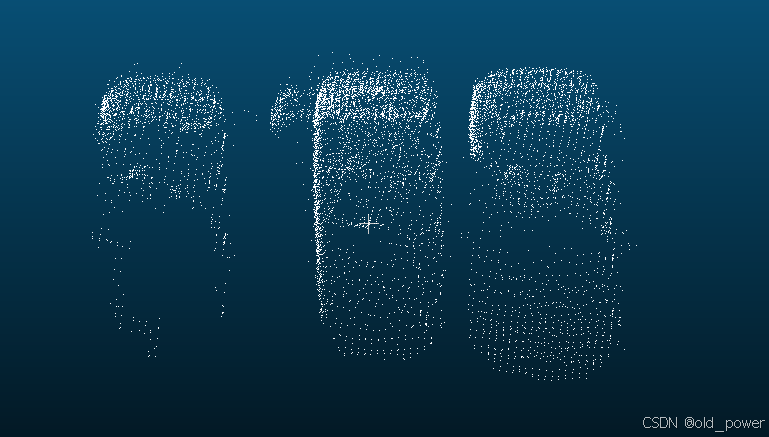
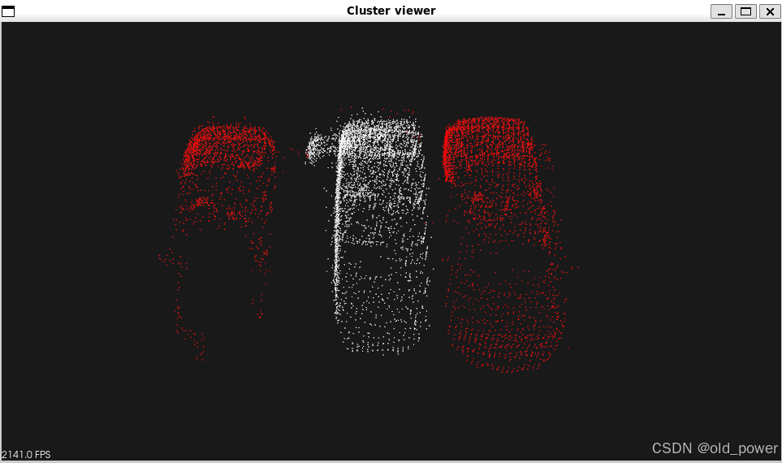
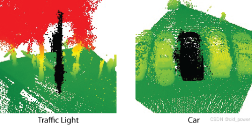

# 【PCL】Segmentation 模块—— 基于图割算法的点云分割（Min-Cut Based Segmentation）

## 1、简介
PCL（Point Cloud Library）中的 **Min-Cut Based Segmentation** 是一种基于图割（Graph Cut）算法的点云分割方法，用于将点云数据分割为前景和背景。该方法通过构建图模型，利用最小割（Min-Cut）算法找到最优分割边界。

### 1.1 核心思想
a. **图模型构建**：
   - 将点云中的每个点视为图中的一个节点。
   - 定义边的权重，包括：
     - **数据项（Data Term）**：表示点属于前景或背景的代价。
     - **平滑项（Smoothness Term）**：表示相邻点之间的一致性。

b. **最小割算法**：
   - 通过最小割算法将图分为前景和背景两部分，使得分割代价最小。

###  1.2 算法步骤
1). **输入点云**：输入待分割的点云数据。
2). **设置种子点**：手动或自动选择前景和背景的种子点。
3). **构建图**：根据点云构建图模型，定义数据项和平滑项。
4). **计算最小割**：使用最小割算法分割图。
5). **输出结果**：得到分割后的前景和背景点云。

### 1.3 参数设置
- **前景种子点**：标记为前景的点。
- **背景种子点**：标记为背景的点。
- **Sigma**：控制平滑项权重。
- **Radius**：定义邻域范围。
- **Foreground Penalty**：前景惩罚项。
- **Background Penalty**：背景惩罚项。

##  2、代码示例
### 2.1 `min_cut_segmentation.cpp`
通过`min_cut_segmentation.cpp`这段代码，可以实现基于Min-Cut算法的点云分割，并将分割结果可视化：
```cpp
#include <iostream>
#include <vector>
#include <pcl/io/pcd_io.h> // PCL的文件IO模块，用于读取和保存点云数据
#include <pcl/point_types.h> // PCL点云数据类型的定义
#include <pcl/visualization/cloud_viewer.h> // PCL点云可视化模块
#include <pcl/filters/filter_indices.h> // 用于去除点云中的NaN点
#include <pcl/segmentation/min_cut_segmentation.h> // PCL的Min-Cut分割算法模块

int main ()
{
  // 创建一个点云对象，用于存储从PCD文件加载的点云数据
  pcl::PointCloud <pcl::PointXYZ>::Ptr cloud (new pcl::PointCloud <pcl::PointXYZ>);
  
  // 从PCD文件加载点云数据
  if ( pcl::io::loadPCDFile <pcl::PointXYZ> ("min_cut_segmentation_tutorial.pcd", *cloud) == -1 )
  {
    std::cout << "Cloud reading failed." << std::endl; // 如果加载失败，输出错误信息
    return (-1); // 返回-1表示程序异常退出
  }

  // 创建一个索引容器，用于存储去除NaN点后的点云索引
  pcl::IndicesPtr indices (new std::vector <int>);
  
  // 去除点云中的NaN点，并将有效点的索引存储在indices中
  pcl::removeNaNFromPointCloud(*cloud, *indices);

  // 创建Min-Cut分割对象
  pcl::MinCutSegmentation<pcl::PointXYZ> seg;
  
  // 设置输入点云
  seg.setInputCloud (cloud);
  
  // 设置有效点的索引
  seg.setIndices (indices);

  // 创建一个点云对象，用于存储前景种子点
  pcl::PointCloud<pcl::PointXYZ>::Ptr foreground_points(new pcl::PointCloud<pcl::PointXYZ> ());
  
  // 定义一个前景种子点
  pcl::PointXYZ point;
  point.x = 68.97;
  point.y = -18.55;
  point.z = 0.57;
  
  // 将前景种子点添加到前景点云中
  foreground_points->points.push_back(point);
  
  // 设置前景种子点
  seg.setForegroundPoints (foreground_points);

  // 设置Min-Cut分割算法的参数
  seg.setSigma (0.25); // 设置高斯平滑参数
  seg.setRadius (3.0433856); // 设置点云邻域搜索半径
  seg.setNumberOfNeighbours (14); // 设置邻域点的数量
  seg.setSourceWeight (0.8); // 设置前景权重

  // 创建一个容器，用于存储分割后的聚类结果
  std::vector <pcl::PointIndices> clusters;
  
  // 执行分割，并将结果存储在clusters中
  seg.extract (clusters);

  // 输出最大流的值（Min-Cut算法的计算结果）
  std::cout << "Maximum flow is " << seg.getMaxFlow () << std::endl;

  // 获取分割后的彩色点云（前景和背景用不同颜色表示）
  pcl::PointCloud <pcl::PointXYZRGB>::Ptr colored_cloud = seg.getColoredCloud ();
  
  // 创建一个点云可视化对象
  pcl::visualization::CloudViewer viewer ("Cluster viewer");
  
  // 显示彩色点云
  viewer.showCloud(colored_cloud);
  
  // 保持可视化窗口打开，直到用户关闭窗口
  while (!viewer.wasStopped ())
  {
  }

  return (0); // 程序正常退出
}
```

### 2.2 `CMakeLists.txt`

```
cmake_minimum_required(VERSION 3.5 FATAL_ERROR)

project(min_cut_segmentation)

find_package(PCL 1.5 REQUIRED)

include_directories(${PCL_INCLUDE_DIRS})
link_directories(${PCL_LIBRARY_DIRS})
add_definitions(${PCL_DEFINITIONS})

add_executable (min_cut_segmentation min_cut_segmentation.cpp)
target_link_libraries (min_cut_segmentation ${PCL_LIBRARIES})
```
## 3、运行结果
### 3.1 编译运行

```bash
mkdir build && cd build
cmake ..
make
./min_cut_segmentation
```
### 3.2 结果
 - 处理前的点云文件`min_cut_segmentation_tutorial.pcd`
 



 - 处理后
 



## 4、总结
#### 应用场景
- **物体分割**：从背景中分离目标物体。
- **场景分析**：识别场景中的不同物体或区域。

#### 优缺点
- **优点**：能有效处理复杂场景，分割结果较准确。
- **缺点**：对种子点选择敏感，计算复杂度较高。

## 5、参考理论
该算法的思想如下：

对于给定的点云，算法构建一个图，该图包含点云中的每个点作为一组顶点，以及两个额外的顶点，称为源点和汇点。图中每个对应于点云的顶点都与源点和汇点通过边连接。除此之外，每个顶点（除了源点和汇点）还有边连接对应的点与其最近邻点。

算法为每条边分配权重。共有三种不同类型的权重，让我们逐一分析：

 首先，算法为点云之间的边分配权重。这个权重称为平滑代价（smooth cost），其计算公式为：
 $$
 \text{smoothCost} = e^{-\left(\frac{\text{dist}}{\sigma}\right)^2} 
 $$
其中，dist 是点之间的距离。点之间的距离越远，边被切割的概率就越大。

接下来，算法设置数据代价（data cost）。数据代价由前景惩罚和背景惩罚组成。前景惩罚是连接点云点与源点的边的权重，具有用户定义的常数值。背景惩罚是连接点与汇点的边的权重，其计算公式为：
 $$
 \text{backgroundPenalty} = \left(\frac{\text{distanceToCenter}}{\text{radius}}\right) 
 $$
其中，distanceToCenter 是点到预期对象中心在水平面上的距离：
$$
 \text{distanceToCenter} = \sqrt{(x - \text{centerX})^2 + (y - \text{centerY})^2} 
 $$

公式中的 radius 是该算法的输入参数，可以大致视为从对象中心向外的范围，超出该范围的点不属于前景（对象的水平半径）。

在所有准备工作完成后，算法进行最小割的搜索。基于对该割的分析，点云被分为前景点和背景点。



