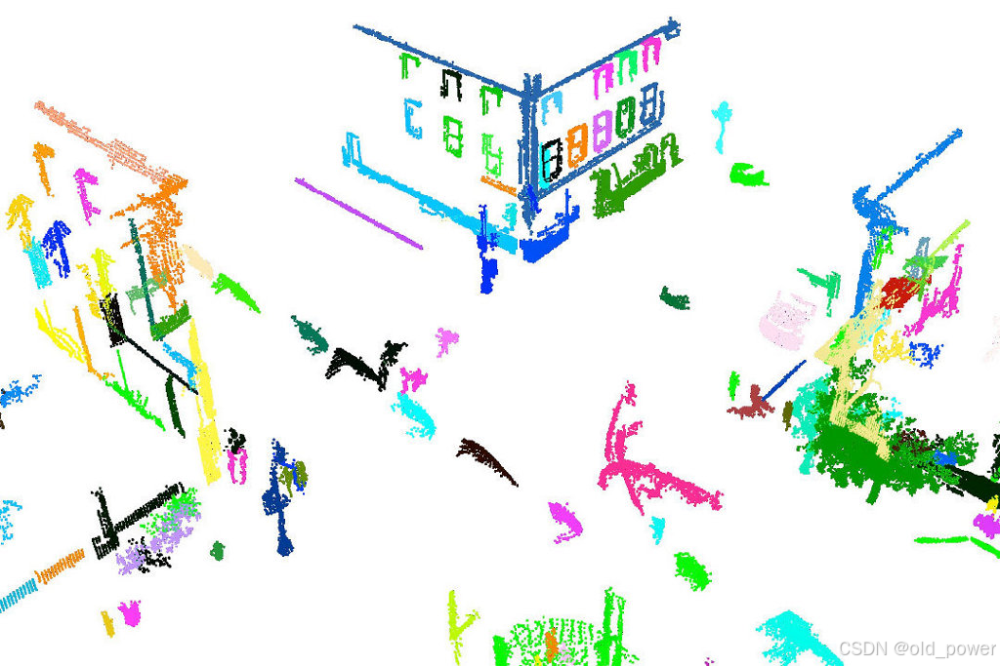

# 【PCL】Segmentation 模块—— 基于法线差异的分割（Difference of Normals Based Segmentation）

## 基于法线差异的分割
**基于法线差异的分割（Difference of Normals Segmentation）** 是一种使用法线差异特征对点云进行分割的方法。它通过计算点云中每个点的法线差异，提取出点云的局部几何特征，从而实现对不同区域或物体的分割。这种方法特别适用于处理复杂的三维点云数据，比如建筑物外立面、地形表面或者物体边界。

**应用场景：**
- **物体分割**：通过法线差异，可以分割点云中的不同物体或结构，特别是在复杂场景中（例如建筑物、道路、树木等）。
- **边缘提取**：法线差异在边缘和表面转折点的响应较强，因此可以用于边缘检测或细节提取。
- **场景理解**：通过分割不同区域，可以帮助进行场景分析和物体识别，尤其在机器人导航、自动驾驶等领域。

**优点：**
- **适应性强**：能够捕捉点云中的不同尺度和层次的几何特征，适应复杂和细节丰富的场景。
- **处理噪声能力**：通过合理的法线差异阈值设置，可以有效地过滤掉噪声和不重要的特征，保留重要的结构信息。
- **多尺度特性**：能够处理各种不同大小的几何特征，无论是细小的细节还是大的平面，都能得到很好的分割效果。

**示例：**
假设你有一个包含建筑物外立面的点云数据，基于法线差异的分割可以帮助你：
- 提取出建筑物的不同面（例如正面、侧面）。
- 区分建筑物的窗户、门和其他装饰元素。
- 区分表面平滑的区域和边缘或突起的区域。

在计算过程中，通过调整法线差异的阈值，可以控制分割的精度和细节程度，从而满足不同应用需求。
使用在 `pcl::DifferenceOfNormalsEstimation` 类中实现的法线差异特征，对无组织点云进行基于尺度的分割。该算法对给定的输入点云执行基于尺度的分割，找到符合给定尺度参数的点。

<center>DoN分割中的pipeline概述</center>

**内容**  
- 基于法线差异的分割
	- 理论介绍
	- 使用法线差异进行分割
	- 数据集
	- 代码
		- 编译和运行程序
	- 解释
		- 大/小半径法线估计
		- 法线差异特征计算
		- 基于法线差异的滤波
		- 结果聚类
- 参考文献/更多信息

## 1、理论介绍
**法线差异（Difference of Normals, DoN）** 提供了一种计算高效、多尺度的处理方法，适用于处理大规模无组织的 3D 点云。其核心思想非常简单，但在分割具有广泛尺度变化的场景时却出奇地有效。对于点云 $P$ 中的每个点 $p$，使用两个不同的半径 $r_l > r_s$ 估计两个单位点法线 $\hat{\mathbf{n}}(\mathbf{p}, r_l)$ 和 $\hat{\mathbf{n}}(\mathbf{p}, r_s)$。这些点法线的归一化（向量）差异定义了该算子。

形式上，法线差异算子定义为：

$$
\mathbf{\Delta}\mathbf{\hat{n}}(p, r_s, r_l) = \frac{\mathbf{\hat{n}}(p, r_s) - \mathbf{\hat{n}}(p, r_l)}{2}
$$

其中，$ r_s, r_l \in \mathbb{R} $，$ r_s < r_l $，$ \mathbf{\hat{n}}(p, r) $ 是在给定支持半径 $ r $ 下点 $ p $ 处的表面法线估计。需要注意的是，该算子的响应是一个归一化的向量场，因此具有方向性（结果方向是一个关键特征），但算子的范数通常更易于处理，并且其值始终在 (0,1) 范围内。


<center>点云的支持半径对估计表面法线的影响的说明</center>


**法线差异（DoN）的主要动机** 是观察到在任何给定半径下估计的表面法线反映了该支持半径尺度下的表面几何结构。尽管有许多不同的方法来估计表面法线，但法线总是通过一个支持半径（或固定数量的邻近点）来估计的。这个支持半径决定了法线所代表的表面结构的尺度。

上图以 1D 形式展示了这种效果。使用较小的支持半径 $r_s$ 估计的法线 $\mathbf{\hat{n}}$ 和切线 $T$ 会受到小尺度表面结构（以及噪声）的影响。另一方面，使用较大的支持半径 $r_l$ 估计的法线和切平面受小尺度结构的影响较小，更多地反映大尺度表面结构的几何特征。事实上，在 LiDAR 图像中，现实世界街道路缘的法线差异特征向量中也观察到了类似的特征，如下图所示。

<center>为街道边缘的激光雷达点云计算的DoN特征向量特写</center>

## 2、使用法线差异进行分割
对于分割任务，只需执行以下步骤：
1. **使用大支持半径 $r_l$ 估计每个点的法线**  
   计算每个点在大尺度下的表面法线，反映大尺度几何结构。

2. **使用小支持半径 $r_s$ 估计每个点的法线**  
   计算每个点在小尺度下的表面法线，捕捉小尺度细节。

3. **计算每个点的归一化法线差异**  
   按照上述定义，计算每个点的法线差异向量：  
   $$
   \mathbf{\Delta}\mathbf{\hat{n}}(p, r_s, r_l) = \frac{\mathbf{\hat{n}}(p, r_s) - \mathbf{\hat{n}}(p, r_l)}{2}
   $$

4. **过滤结果向量场以提取感兴趣尺度的点**  
   对法线差异向量场进行过滤，分离出属于目标尺度或区域的点。

通过这种方法，可以有效地分割出点云中具有特定尺度特征的区域。
## 3、数据集
在本案例中，使用来自 KITTI 项目的公开可用的城市 LiDAR 数据。该数据是通过安装在汽车上的 Velodyne LiDAR 扫描仪收集的，旨在用于自动驾驶汽车的评估。要将数据集转换为与 PCL 兼容的点云格式。
## 4、代码
### 4.1 `don_segmentation.cpp`
```cpp
#include <string>

#include <pcl/point_types.h>
#include <pcl/io/pcd_io.h>
#include <pcl/search/organized.h>
#include <pcl/search/kdtree.h>
#include <pcl/features/normal_3d_omp.h>
#include <pcl/filters/conditional_removal.h>
#include <pcl/segmentation/extract_clusters.h>

#include <pcl/features/don.h>

using namespace pcl;

int
main (int argc, char *argv[])
{
  ///The smallest scale to use in the DoN filter.
  double scale1;

  ///The largest scale to use in the DoN filter.
  double scale2;

  ///The minimum DoN magnitude to threshold by
  double threshold;

  ///segment scene into clusters with given distance tolerance using euclidean clustering
  double segradius;

  if (argc < 6)
  {
    std::cerr << "usage: " << argv[0] << " inputfile smallscale largescale threshold segradius" << std::endl;
    exit (EXIT_FAILURE);
  }

  /// the file to read from.
  std::string infile = argv[1];
  /// small scale
  std::istringstream (argv[2]) >> scale1;
  /// large scale
  std::istringstream (argv[3]) >> scale2;
  std::istringstream (argv[4]) >> threshold;   // threshold for DoN magnitude
  std::istringstream (argv[5]) >> segradius;   // threshold for radius segmentation

  // Load cloud in blob format
  pcl::PCLPointCloud2 blob;
  pcl::io::loadPCDFile (infile.c_str (), blob);
  pcl::PointCloud<PointXYZRGB>::Ptr cloud (new pcl::PointCloud<PointXYZRGB>);
  pcl::fromPCLPointCloud2 (blob, *cloud);

  // Create a search tree, use KDTreee for non-organized data.
  pcl::search::Search<PointXYZRGB>::Ptr tree;
  if (cloud->isOrganized ())
  {
    tree.reset (new pcl::search::OrganizedNeighbor<PointXYZRGB> ());
  }
  else
  {
    tree.reset (new pcl::search::KdTree<PointXYZRGB> (false));
  }

  // Set the input pointcloud for the search tree
  tree->setInputCloud (cloud);

  if (scale1 >= scale2)
  {
    std::cerr << "Error: Large scale must be > small scale!" << std::endl;
    exit (EXIT_FAILURE);
  }

  // Compute normals using both small and large scales at each point
  pcl::NormalEstimationOMP<PointXYZRGB, PointNormal> ne;
  ne.setInputCloud (cloud);
  ne.setSearchMethod (tree);

  /**
   * NOTE: setting viewpoint is very important, so that we can ensure
   * normals are all pointed in the same direction!
   */
  ne.setViewPoint (std::numeric_limits<float>::max (), std::numeric_limits<float>::max (), std::numeric_limits<float>::max ());

  // calculate normals with the small scale
  std::cout << "Calculating normals for scale..." << scale1 << std::endl;
  pcl::PointCloud<PointNormal>::Ptr normals_small_scale (new pcl::PointCloud<PointNormal>);

  ne.setRadiusSearch (scale1);
  ne.compute (*normals_small_scale);

  // calculate normals with the large scale
  std::cout << "Calculating normals for scale..." << scale2 << std::endl;
  pcl::PointCloud<PointNormal>::Ptr normals_large_scale (new pcl::PointCloud<PointNormal>);

  ne.setRadiusSearch (scale2);
  ne.compute (*normals_large_scale);

  // Create output cloud for DoN results
  PointCloud<PointNormal>::Ptr doncloud (new pcl::PointCloud<PointNormal>);
  copyPointCloud (*cloud, *doncloud);

  std::cout << "Calculating DoN... " << std::endl;
  // Create DoN operator
  pcl::DifferenceOfNormalsEstimation<PointXYZRGB, PointNormal, PointNormal> don;
  don.setInputCloud (cloud);
  don.setNormalScaleLarge (normals_large_scale);
  don.setNormalScaleSmall (normals_small_scale);

  if (!don.initCompute ())
  {
    std::cerr << "Error: Could not initialize DoN feature operator" << std::endl;
    exit (EXIT_FAILURE);
  }

  // Compute DoN
  don.computeFeature (*doncloud);

  // Save DoN features
  pcl::PCDWriter writer;
  writer.write<pcl::PointNormal> ("don.pcd", *doncloud, false); 

  // Filter by magnitude
  std::cout << "Filtering out DoN mag <= " << threshold << "..." << std::endl;

  // Build the condition for filtering
  pcl::ConditionOr<PointNormal>::Ptr range_cond (
    new pcl::ConditionOr<PointNormal> ()
    );
  range_cond->addComparison (pcl::FieldComparison<PointNormal>::ConstPtr (
                               new pcl::FieldComparison<PointNormal> ("curvature", pcl::ComparisonOps::GT, threshold))
                             );
  // Build the filter
  pcl::ConditionalRemoval<PointNormal> condrem;
  condrem.setCondition (range_cond);
  condrem.setInputCloud (doncloud);

  pcl::PointCloud<PointNormal>::Ptr doncloud_filtered (new pcl::PointCloud<PointNormal>);

  // Apply filter
  condrem.filter (*doncloud_filtered);

  doncloud = doncloud_filtered;

  // Save filtered output
  std::cout << "Filtered Pointcloud: " << doncloud->size () << " data points." << std::endl;

  writer.write<pcl::PointNormal> ("don_filtered.pcd", *doncloud, false); 

  // Filter by magnitude
  std::cout << "Clustering using EuclideanClusterExtraction with tolerance <= " << segradius << "..." << std::endl;

  pcl::search::KdTree<PointNormal>::Ptr segtree (new pcl::search::KdTree<PointNormal>);
  segtree->setInputCloud (doncloud);

  std::vector<pcl::PointIndices> cluster_indices;
  pcl::EuclideanClusterExtraction<PointNormal> ec;

  ec.setClusterTolerance (segradius);
  ec.setMinClusterSize (50);
  ec.setMaxClusterSize (100000);
  ec.setSearchMethod (segtree);
  ec.setInputCloud (doncloud);
  ec.extract (cluster_indices);

  int j = 0;
  for (const auto& cluster : cluster_indices)
  {
    pcl::PointCloud<PointNormal>::Ptr cloud_cluster_don (new pcl::PointCloud<PointNormal>);
    for (const auto& idx : cluster.indices)
    {
      cloud_cluster_don->points.push_back ((*doncloud)[idx]);
    }

    cloud_cluster_don->width = cloud_cluster_don->size ();
    cloud_cluster_don->height = 1;
    cloud_cluster_don->is_dense = true;

    //Save cluster
    std::cout << "PointCloud representing the Cluster: " << cloud_cluster_don->size () << " data points." << std::endl;
    std::stringstream ss;
    ss << "don_cluster_" << j << ".pcd";
    writer.write<pcl::PointNormal> (ss.str (), *cloud_cluster_don, false);
    ++j;
  }
}
```

### 4.2 `CMakeLists.txt`

```bash
cmake_minimum_required(VERSION 3.5 FATAL_ERROR)

project(don_segmentation)

find_package(PCL 1.7 REQUIRED)

include_directories(${PCL_INCLUDE_DIRS})
link_directories(${PCL_LIBRARY_DIRS})
add_definitions(${PCL_DEFINITIONS})

add_executable (don_segmentation don_segmentation.cpp)
target_link_libraries (don_segmentation ${PCL_LIBRARIES})
```

### 4.3 编译运行
#### 4.3.1 编译
```bash
mkdir build && cd build
cmake ..
make
```
#### 4.3.2 运行
`./don_segmentation <inputfile> <smallscale> <largescale> <threshold> <segradius>` 这五个参数的意义如下：

1. **`<inputfile>`**：输入文件的路径，通常是一个 `.pcd` 格式的点云文件，该文件包含了待处理的三维点云数据。

2. **`<smallscale>`**：小尺度参数，指定用于计算法线时的小半径。这个尺度会影响到法线估计的细节程度，通常用于捕捉局部特征或较小的几何形状。

3. **`<largescale>`**：大尺度参数，指定用于计算法线时的大半径。该尺度通常用于捕捉更大范围的表面特征，例如平滑的区域或者较大范围的几何形状。

4. **`<threshold>`**：法线差异的阈值，用于过滤 DoN 特征的幅度。只有 DoN 幅度大于该阈值的点才会被保留下来，这通常用于去除噪声或过滤不重要的特征。

5. **`<segradius>`**：欧几里得聚类的半径阈值。该值用于对过滤后的点云进行聚类，表示聚类中点之间的最大距离。该参数会影响到聚类结果，较小的值可能会产生更多的簇，而较大的值则可能将更多的点归为一个簇。

```bash
# ./don_segmentation <inputfile> <smallscale> <largescale> <threshold> <segradius>
./don_segmentation ../../../data/pairwise/capture0001.pcd 0.01 0.05 0.1 0.02
```
要设置这些参数，首先需要根据具体的点云数据来决定最佳值。不同的场景和数据可能需要不同的参数设置。以下是一个示例，假设我们使用的是室内或建筑物的点云数据，设置一些合理的默认值。我们假设点云数据存储在名为 `scene.pcd` 的文件中。
#### 4.3.3 参数解释
1. **`capture0001.pcd`**：输入点云文件，假设文件名为 `capture0001.pcd`，存储了我们要处理的点云数据。
2. **`0.01`**：小尺度 (`smallscale`) 参数，设置为 `0.01`，表示小尺度法线计算的邻域半径为 1cm。这适合捕捉小范围的细节特征（例如小物体、角落等）。
3. **`0.05`**：大尺度 (`largescale`) 参数，设置为 `0.05`，表示大尺度法线计算的邻域半径为 5cm。该尺度适合捕捉更大范围的特征（例如较大的平面或大物体的表面）。
4. **`0.1`**：阈值 (`threshold`) 参数，设置为 `0.1`，表示法线差异的幅度阈值，过滤掉法线差异幅度小于 0.1 的点。这个值控制了哪些点被认为是“显著”。
5. **`0.02`**：欧几里得聚类半径 (`segradius`) 参数，设置为 `0.02`，表示聚类的半径阈值为 2cm。这个参数决定了聚类时点之间的最大允许距离，较小的值会导致更多小的簇。

#### 4.3.4 注意事项：
- 上述参数是一个 **假设的示例**，实际应用中你需要根据你具体的点云数据来调整这些参数。例如，如果你的数据是来自室外的 LiDAR 扫描，可能需要增加大尺度的值来捕捉较远距离的表面特征。
- 在一些情况下，如果数据非常噪声或没有明确的边界，可能需要调整 `threshold` 和 `segradius` 参数以获得更好的分割结果。
- 你可以通过可视化工具（如 PCL Viewer 或 CloudCompare）来查看不同参数设置下的结果，从而帮助确定最佳参数，通过实验不同的参数，你可以调整这些值来达到最佳的分割和聚类效果。


## 5、代码解读
`don_segmentation.cpp`代码是用 C++ 编写的，利用 **点云库 (PCL)** 对三维点云数据进行处理。主要实现了以下几个功能：

1. **计算点云的法线特征**（使用小尺度和大尺度的法线）。
2. **计算法线差异 (DoN)**，用于提取点云中的边界或突变区域。
3. **根据 DoN 特征进行过滤**，去除 DoN 值较小的点。
4. **使用欧几里得聚类算法**对点云进行聚类，并将每个聚类保存为一个独立的文件。

以下是各部分的详细解释：

### 5.1 **输入参数解析**
```cpp
if (argc < 6)
{
  std::cerr << "usage: " << argv[0] << " inputfile smallscale largescale threshold segradius" << std::endl;
  exit (EXIT_FAILURE);
}

std::string infile = argv[1];
std::istringstream (argv[2]) >> scale1;
std::istringstream (argv[3]) >> scale2;
std::istringstream (argv[4]) >> threshold;
std::istringstream (argv[5]) >> segradius;
```
- 程序接受五个参数：
  1. 输入的 PCD 文件名；
  2. 小尺度（`scale1`）；
  3. 大尺度（`scale2`）；
  4. DoN 值的阈值（`threshold`）；
  5. 欧几里得聚类的半径（`segradius`）。
- 如果参数不足，程序会输出使用说明并退出。

### 5.2 **点云加载**
```cpp
pcl::PCLPointCloud2 blob;
pcl::io::loadPCDFile (infile.c_str (), blob);
pcl::PointCloud<PointXYZRGB>::Ptr cloud (new pcl::PointCloud<PointXYZRGB>);
pcl::fromPCLPointCloud2 (blob, *cloud);
```
- 使用 PCL 加载输入的 PCD 文件，将其转换为 `PointCloud<PointXYZRGB>` 类型的点云，包含点的坐标和颜色信息。

### 5.3 **构建搜索树**
```cpp
pcl::search::Search<PointXYZRGB>::Ptr tree;
if (cloud->isOrganized ())
{
  tree.reset (new pcl::search::OrganizedNeighbor<PointXYZRGB> ());
}
else
{
  tree.reset (new pcl::search::KdTree<PointXYZRGB> (false));
}
tree->setInputCloud (cloud);
```
- 根据点云是否是有组织的（即点云数据是否有规则的网格结构）选择不同的搜索树。
  - 如果点云是有组织的，使用 `OrganizedNeighbor`。
  - 否则，使用 `KdTree`，适用于非有组织的点云。

### 5.4 **法线估计（小尺度和大尺度）**
```cpp
pcl::NormalEstimationOMP<PointXYZRGB, PointNormal> ne;
ne.setInputCloud (cloud);
ne.setSearchMethod (tree);

ne.setViewPoint (std::numeric_limits<float>::max (), std::numeric_limits<float>::max (), std::numeric_limits<float>::max ());
```
这可能是代码中最重要的部分，估计法线。这也是计算上最具瓶颈的部分，因此我们将使用 `pcl::NormalEstimationOMP` 类，该类利用 OpenMP 来使用多线程计算法线，充分利用现代处理器中多个核心的优势。我们也可以使用标准的单线程类 `pcl::NormalEstimation`，甚至是 GPU 加速的类 `pcl::gpu::NormalEstimation`。无论我们使用哪个类，都需要设置一个任意的视点，并在所有法线计算中使用该视点——这样可以确保在不同尺度下估计的法线具有一致的方向。
- 使用 **法线估计 (Normal Estimation)** 计算点云的法线。
- 使用 OpenMP 实现并行化加速。
- 通过设置视点为极大值，确保计算出的法线方向一致。

```cpp
ne.setRadiusSearch (scale1);
ne.compute (*normals_small_scale);

ne.setRadiusSearch (scale2);
ne.compute (*normals_large_scale);
```
使用法线估计类分别计算大尺度和小尺度的法线。重要的是要使用 `NormalEstimation.setRadiusSearch()` 方法，而不是 `NormalEstimation.setMaximumNeighbours()` 方法或其等效方法。如果法线估计仅限制于一定数量的邻居，那么它可能无法基于给定半径的完整表面进行计算，从而不适合用于法线差异（Difference of Normals, DoN）特征。
- 使用 `scale1` 和 `scale2` 两个不同的半径分别计算小尺度和大尺度的法线。

### 5.5 **计算 DoN（法线差异）**
```cpp
pcl::DifferenceOfNormalsEstimation<PointXYZRGB, PointNormal, PointNormal> don;
don.setInputCloud (cloud);
don.setNormalScaleLarge (normals_large_scale);
don.setNormalScaleSmall (normals_small_scale);
if (!don.initCompute ())
{
  std::cerr << "Error: Could not initialize DoN feature operator" << std::endl;
  exit (EXIT_FAILURE);
}

// Compute DoN
don.computeFeature (*doncloud);
```
我们实例化一个新的 `pcl::DifferenceOfNormalsEstimation` 类来负责计算法线差异（Difference of Normals，DoN）向量场。

`pcl::DifferenceOfNormalsEstimation` 类有三个模板参数，第一个对应输入的点云类型，在本例中为 `pcl::PointXYZRGB`，第二个对应估计的法线类型，在本例中为 `pcl::PointNormal`，第三个对应输出的向量场类型，在本例中也为 `pcl::PointNormal`。接下来，我们设置输入的点云，并提供为该点云估计的两个法线，使用 `pcl::DifferenceOfNormalsEstimation::initCompute()` 方法检查计算特征的要求是否满足。最后，我们通过调用 `pcl::DifferenceOfNormalsEstimation::computeFeature()` 方法来计算特征。
- **DoN (Difference of Normals)** 计算是通过比较小尺度和大尺度的法线差异来提取点云中的边界或锐化区域。
- 创建 `DifferenceOfNormalsEstimation` 对象并设置小尺度和大尺度的法线。
- 执行 DoN 特征计算，结果存储在 `doncloud` 中。

### 5.6 **保存 DoN 特征**
```cpp
pcl::PCDWriter writer;
writer.write<pcl::PointNormal> ("don.pcd", *doncloud, false);
```
- 将计算得到的 DoN 特征保存到文件 `don.pcd` 中。

### 5.7 **根据 DoN 大小过滤**

**基于法线差异的过滤**

虽然我们现在已经得到了一个法线差异（Difference of Normals，DoN）向量场，但点集仍然是完整的。为了开始分割过程，我们必须根据法线差异向量的结果对点进行区分。你可以尝试根据多个常见量进行过滤：

| 量              | PointNormal 字段        | 描述                         | 使用场景                                              |
|-----------------|-------------------------|------------------------------|------------------------------------------------------|
| $$\mathbf{\Delta}\mathbf{\hat{n}}(p, r_s, r_l)$$ | `float normal[3]`          | DoN 向量                    | 通过相对 DoN 角度过滤点。                             |
| $$\|\mathbf{\Delta}\mathbf{\hat{n}}(p, r_s, r_l)\| \in (0,1)$$| `float curvature`           | DoN 的 $$l_2$$范数 | 通过尺度归属进行过滤，大幅度的 DoN 指示点在给定尺度参数下具有较强的响应。 |
| $$\mathbf{\Delta}\mathbf{\hat{n}}(p, r_s, r_l)_x \in (-1,1),$$ | `float normal[0]`          | DoN 向量的 x 分量            | 通过可定向尺度过滤点，例如建筑物立面，具有大 $$\|{\mathbf{\Delta}\mathbf{\hat{n}}}_x\|$$ 和/或$$\|{\mathbf{\Delta}\mathbf{\hat{n}}}_y\|$$ 且小$$\|{\mathbf{\Delta}\mathbf{\hat{n}}}_z\|$$的点。|
| $$\mathbf{\Delta}\mathbf{\hat{n}}(p, r_s, r_l)_y \in (-1,1),$$ | `float normal[1]`          | DoN 向量的 y 分量            |                   👆                                  |
| $$\mathbf{\Delta}\mathbf{\hat{n}}(p, r_s, r_l)_z \in (-1,1),$$ | `float normal[2]`          | DoN 向量的 z 分量            |                     👆                                 |

在这个示例中，我们将执行一个简单的幅度阈值过滤，不考虑它们在场景中的方向，目标是查找具有特定尺度的物体。为了实现这一点，我们必须创建一个条件过滤器：
```cpp
pcl::ConditionOr<PointNormal>::Ptr range_cond (new pcl::ConditionOr<PointNormal>());
range_cond->addComparison (pcl::FieldComparison<PointNormal>::ConstPtr (new pcl::FieldComparison<PointNormal> ("curvature", pcl::ComparisonOps::GT, threshold)));
pcl::ConditionalRemoval<PointNormal> condrem;
condrem.setCondition (range_cond);
condrem.setInputCloud (doncloud);
pcl::PointCloud<PointNormal>::Ptr doncloud_filtered (new pcl::PointCloud<PointNormal>);

// Apply filter
condrem.filter (*doncloud_filtered);
```
- 根据 DoN 大小过滤点云，去除 DoN 小于阈值的点。
- 使用 `ConditionOr` 创建条件，过滤出 "curvature"（即 DoN 特征）大于阈值的点。
- 过滤后的点云保存在 `doncloud_filtered` 中。

### 5.8 **使用欧几里得聚类提取点云**
```cpp
pcl::EuclideanClusterExtraction<PointNormal> ec;
ec.setClusterTolerance (segradius);
ec.setMinClusterSize (50);
ec.setMaxClusterSize (100000);
ec.setSearchMethod (segtree);
ec.setInputCloud (doncloud);
ec.extract (cluster_indices);
```
- **欧几里得聚类提取**用于根据点云的空间位置将点云分割成不同的簇。
- 设置了聚类容差 `segradius`，最小簇大小和最大簇大小。
- 聚类结果保存在 `cluster_indices` 中。

### 5.9 **保存聚类结果**
```cpp
for (const auto& cluster : cluster_indices)
{
  pcl::PointCloud<PointNormal>::Ptr cloud_cluster_don (new pcl::PointCloud<PointNormal>);
  for (const auto& idx : cluster.indices)
  {
    cloud_cluster_don->points.push_back ((*doncloud)[idx]);
  }

  cloud_cluster_don->width = cloud_cluster_don->size ();
  cloud_cluster_don->height = 1;
  cloud_cluster_don->is_dense = true;

  std::stringstream ss;
  ss << "don_cluster_" << j << ".pcd";
  writer.write<pcl::PointNormal> (ss.str (), *cloud_cluster_don, false);
  ++j;
}
```
- 遍历每个聚类，将每个聚类保存为一个独立的 PCD 文件，例如 `don_cluster_0.pcd`，`don_cluster_1.pcd` 等。

### 主要功能总结：
- **法线估计**：对点云计算法线，并根据不同尺度进行估计。
- **DoN 特征**：计算小尺度和大尺度法线的差异，用于提取边界或重要区域。
- **DoN 大小过滤**：根据阈值过滤掉 DoN 值小的点。
- **欧几里得聚类**：对过滤后的点云进行聚类，按空间位置分组。

### 输出：
- `don.pcd`：保存 DoN 特征的点云。
- `don_filtered.pcd`：保存过滤后的点云。
- `don_cluster_X.pcd`：每个聚类的点云（根据聚类结果保存为多个文件）。

这段代码是一个典型的点云处理流程，包括特征提取、过滤和聚类，适用于许多需要分析和处理三维点云数据的应用场景。


