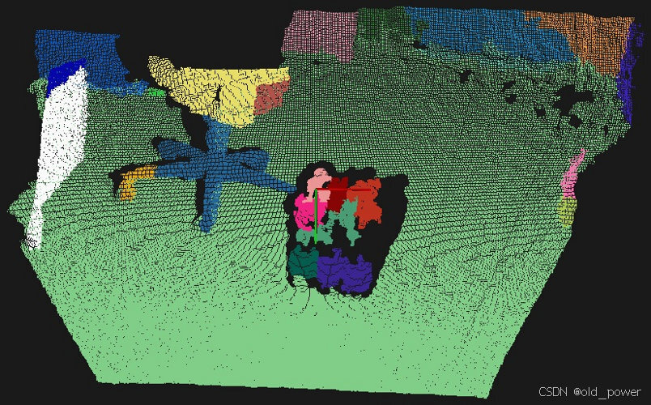

# 【PCL】Segmentation 模块—— 基于颜色的区域生长分割（Color-based region growing segmentation）

## 1、简介
### 1.1 基于颜色的区域生长分割
PCL的Color-based region growing segmentation（基于颜色的区域生长分割）是点云库（PCL）中一种基于颜色信息的点云分割算法，适用于处理带有RGB信息的点云数据。它通过区域生长和合并策略，能够有效地将点云分割成颜色一致的区域，广泛应用于物体识别、场景分析等领域。

使用 `pcl::RegionGrowingRGB` 类中实现的基于颜色的区域生长算法。该算法与在“区域生长分割教程”中描述的 `pcl::RegionGrowing` 算法基于相同的概念。

基于颜色的算法有两个主要区别。第一个区别是它使用颜色而不是法线。第二个区别是它使用合并算法来控制过分割和欠分割。让我们来看看它是如何实现的。在分割之后，算法会尝试合并颜色相近的聚类。如果两个相邻聚类的平均颜色差异较小，它们将被合并在一起。然后进行第二步合并。在这一步中，每个聚类都会根据其包含的点数进行验证。如果该点数小于用户定义的值，则当前聚类将与最接近的相邻聚类合并。

### 1.2 核心思想
1. **基于颜色的区域生长算法**：与基于法线的区域生长算法类似，但使用颜色信息进行分割。
2. **合并算法**：用于控制过分割和欠分割，通过合并颜色相近或点数过少的聚类来优化分割结果。
3. **两步合并**：
   - 第一步：合并颜色相近的相邻聚类。
   - 第二步：合并点数过少的聚类。

### 1.3 应用场景
1. **物体分割**：
   - 从场景中分割出颜色一致的物体（如红色椅子、绿色植物等）。
2. **场景分析**：
   - 分析室内外场景中的不同物体或区域。
3. **机器人视觉**：
   - 用于机器人抓取、导航等任务中的目标识别与分割。

## 2、代码示例

### 2.1 `region_growing_rgb_segment .cpp`
这段代码使用了 **Point Cloud Library (PCL)** 来处理和可视化点云数据。实现了一个基于颜色的区域生长算法（Region Growing RGB）来对点云进行分割，并将分割后的点云可视化，代码需要一个彩色点云数据：
```cpp
#include <iostream>  // 用于输入输出操作
#include <thread>    // 用于多线程操作，控制点云可视化的刷新频率
#include <vector>    // 用于存储点云索引和聚类结果

#include <pcl/point_types.h>  // 定义PCL中的点类型，如 pcl::PointXYZRGB
#include <pcl/io/pcd_io.h>    // 提供点云文件的读写功能
#include <pcl/search/search.h>  // 定义搜索方法的基类
#include <pcl/search/kdtree.h>  // 提供KD树的实现，用于点云的最近邻搜索
#include <pcl/visualization/cloud_viewer.h>  // 提供点云可视化的功能
#include <pcl/filters/filter_indices.h>  // 提供点云滤波功能，用于去除点云中的NaN点
#include <pcl/segmentation/region_growing_rgb.h>  // 提供基于颜色的区域生长分割算法

using namespace std::chrono_literals;  // 使用时间字面量（如 100us）

int main ()
{
    // 创建一个KD树对象，用于在点云中进行最近邻搜索
    pcl::search::Search <pcl::PointXYZRGB>::Ptr tree (new pcl::search::KdTree<pcl::PointXYZRGB>);

    // 创建一个 pcl::PointXYZRGB 类型的点云对象
    pcl::PointCloud <pcl::PointXYZRGB>::Ptr cloud (new pcl::PointCloud <pcl::PointXYZRGB>);

    // 从文件 region_growing_rgb_tutorial.pcd 中加载点云数据
    if ( pcl::io::loadPCDFile <pcl::PointXYZRGB> ("region_growing_rgb_tutorial.pcd", *cloud) == -1 )
    {
        std::cout << "Cloud reading failed." << std::endl;  // 如果加载失败，输出错误信息
        return (-1);  // 返回 -1 表示程序异常退出
    }

    // 创建一个索引向量，用于存储有效点的索引
    pcl::IndicesPtr indices (new std::vector <int>);

    // 去除点云中的NaN点，并将有效点的索引存储在 indices 中
    pcl::removeNaNFromPointCloud (*cloud, *indices);

    // 创建一个 RegionGrowingRGB 对象，用于执行基于颜色的区域生长分割
    pcl::RegionGrowingRGB<pcl::PointXYZRGB> reg;

    // 设置输入点云
    reg.setInputCloud (cloud);

    // 设置有效点索引
    reg.setIndices (indices);

    // 设置搜索方法为之前创建的KD树
    reg.setSearchMethod (tree);

    // 设置距离阈值为10，表示两个点之间的最大距离
    reg.setDistanceThreshold (10);

    // 设置点颜色阈值为6，表示两个点之间的颜色差异
    reg.setPointColorThreshold (6);

    // 设置区域颜色阈值为5，表示两个区域之间的颜色差异
    reg.setRegionColorThreshold (5);

    // 设置最小聚类大小为600，表示一个聚类中至少需要600个点
    reg.setMinClusterSize (600);

    // 创建一个向量，用于存储聚类结果
    std::vector <pcl::PointIndices> clusters;

    // 提取聚类，并将结果存储在 clusters 中
    reg.extract (clusters);

    // 获取分割后的彩色点云
    pcl::PointCloud <pcl::PointXYZRGB>::Ptr colored_cloud = reg.getColoredCloud ();

    // 创建一个 CloudViewer 对象，用于可视化点云
    pcl::visualization::CloudViewer viewer ("Cluster viewer");

    // 显示彩色点云
    viewer.showCloud (colored_cloud);

    // 保持可视化窗口打开，直到用户关闭窗口
    while (!viewer.wasStopped ())
    {
        std::this_thread::sleep_for(100us);  // 每100微秒刷新一次
    }

    return (0);  // 程序正常结束，返回 0
}
```

### 2.2 `CMakeLists.txt`

```
cmake_minimum_required(VERSION 3.5 FATAL_ERROR)

project(region_growing_rgb_segmentation)

find_package(PCL 1.5 REQUIRED)

include_directories(${PCL_INCLUDE_DIRS})
link_directories(${PCL_LIBRARY_DIRS})
add_definitions(${PCL_DEFINITIONS})

add_executable (${PROJECT_NAME} region_growing_rgb_segmentation.cpp)
target_link_libraries (${PROJECT_NAME} ${PCL_LIBRARIES})
```


## 3、运行结果

### 3.1 编译运行

```bash
mkdir build && cd build
cmake ..
make
./region_growing_rgb_segmentation
```

### 3.2 结果
 - 处理前


 - 处理后(处理过程较慢)




