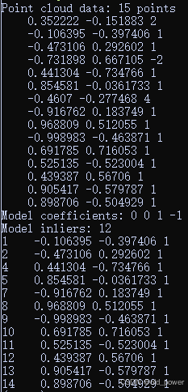
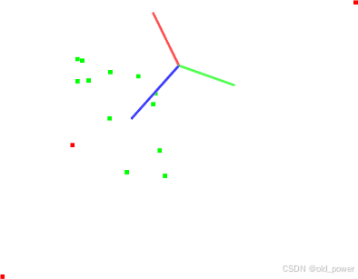

# 【PCL】Segmentation 模块—— 平面模型分割（Plane model segmentation）


## 1、简介
PCL（Point Cloud Library）中的平面模型分割（Plane Model Segmentation）是一种从点云数据中提取平面结构的方法。它通过识别点云中符合平面模型的点集，将场景中的平面区域分割出来。

### 1.1 主要步骤
1. **选择模型**：选择平面模型作为分割目标。
2. **采样点**：随机选取点云中的点用于模型拟合。
3. **模型拟合**：使用采样点拟合平面模型，通常通过最小二乘法或RANSAC算法。
4. **内点检测**：计算所有点到拟合平面的距离，距离小于阈值的点被视为内点。
5. **分割**：将内点标记为属于该平面，并从点云中移除，以便后续处理。

### 1.2 常用算法
- **RANSAC**：鲁棒的拟合算法，能有效处理噪声和离群点。
- **最小二乘法**：适用于噪声较少的点云数据。

### 1.3 应用场景
- **室内场景**：提取地面、墙面等平面。
- **机器人导航**：识别可通行区域。
- **三维重建**：简化场景几何结构。


## 2、代码
从给定的点云数据集分割任意平面模型。
兼容性：> PCL 1.3
### 2.1 planar_segmentation.cpp

```cpp
#include <iostream>
#include <pcl/ModelCoefficients.h>
#include <pcl/io/pcd_io.h>
#include <pcl/point_types.h>
#include <pcl/sample_consensus/method_types.h>
#include <pcl/sample_consensus/model_types.h>
#include <pcl/segmentation/sac_segmentation.h>

int main ()
{
  // 读取点云数据
  // pcl::PointCloud<pcl::PointXYZ>::Ptr cloud(new pcl::PointCloud<pcl::PointXYZ>);
  // pcl::io::loadPCDFile<pcl::PointXYZ>("table_scene_lms400.pcd", *cloud);
  //----------------------------------
  pcl::PointCloud<pcl::PointXYZ>::Ptr cloud(new pcl::PointCloud<pcl::PointXYZ>);

  // Fill in the cloud data
  cloud->width  = 15;
  cloud->height = 1;
  cloud->points.resize (cloud->width * cloud->height);

  // Generate the data
  for (auto& point: *cloud)
  {
    point.x = 1024 * rand () / (RAND_MAX + 1.0f);
    point.y = 1024 * rand () / (RAND_MAX + 1.0f);
    point.z = 1.0;
  }

  // Set a few outliers
  (*cloud)[0].z = 2.0;
  (*cloud)[3].z = -2.0;
  (*cloud)[6].z = 4.0;
  //----------------------------------
  std::cerr << "Point cloud data: " << cloud->size () << " points" << std::endl;
  for (const auto& point: *cloud)
    std::cerr << "    " << point.x << " "
                        << point.y << " "
                        << point.z << std::endl;

  pcl::ModelCoefficients::Ptr coefficients (new pcl::ModelCoefficients);
  pcl::PointIndices::Ptr inliers (new pcl::PointIndices);
  // Create the segmentation object
  pcl::SACSegmentation<pcl::PointXYZ> seg;
  // Optional
  seg.setOptimizeCoefficients (true);
  // Mandatory
  seg.setModelType (pcl::SACMODEL_PLANE);
  seg.setMethodType (pcl::SAC_RANSAC);
  seg.setDistanceThreshold (0.01);

  seg.setInputCloud (cloud);
  seg.segment (*inliers, *coefficients);

  if (inliers->indices.size () == 0)
  {
    PCL_ERROR ("Could not estimate a planar model for the given dataset.\n");
    return (-1);
  }

  std::cerr << "Model coefficients: " << coefficients->values[0] << " " 
                                      << coefficients->values[1] << " "
                                      << coefficients->values[2] << " " 
                                      << coefficients->values[3] << std::endl;

  std::cerr << "Model inliers: " << inliers->indices.size () << std::endl;
  for (const auto& idx: inliers->indices)
    std::cerr << idx << "    " << cloud->points[idx].x << " "
                               << cloud->points[idx].y << " "
                               << cloud->points[idx].z << std::endl;

  return (0);
}
```

### 2.2 CMakeLists.txt

```
cmake_minimum_required(VERSION 3.5 FATAL_ERROR)

project(planar_segmentation)

find_package(PCL 1.2 REQUIRED)

include_directories(${PCL_INCLUDE_DIRS})
link_directories(${PCL_LIBRARY_DIRS})
add_definitions(${PCL_DEFINITIONS})

add_executable (${PROJECT_NAME} planar_segmentation.cpp)
target_link_libraries (${PROJECT_NAME} ${PCL_LIBRARIES})
```

## 3、运行结果
 - 编译运行
```bash
mkdir build && cd build
cmake ..
make
./planar_segmentation
```
 -  运行结果



 - 分割过程的图形显示如下（代码中未写可视化，这个只是补充说明）



## 4、核心代码解读
这段代码使用PCL库进行平面模型分割，核心是通过RANSAC算法从点云数据中提取平面：

---

#### 1. **创建分割对象**
```cpp
pcl::SACSegmentation<pcl::PointXYZ> seg;
```
- 创建了一个`SACSegmentation`对象`seg`，用于执行基于采样一致性（Sample Consensus, SAC）的分割。
- 模板参数`pcl::PointXYZ`表示点云中的点类型为三维点（包含x, y, z坐标）。

---

#### 2. **设置优化系数（可选）**
```cpp
seg.setOptimizeCoefficients(true);
```
- 这是一个可选设置，用于优化模型系数。
- 如果设置为`true`，分割算法会在找到初始模型后进一步优化平面模型的系数（如平面的法向量和截距），以提高精度。

---

#### 3. **设置模型类型（必选）**
```cpp
seg.setModelType(pcl::SACMODEL_PLANE);
```
- 设置分割的模型类型为平面模型（`SACMODEL_PLANE`）。
- 这意味着算法将尝试从点云中拟合一个平面。

---

#### 4. **设置方法类型（必选）**
```cpp
seg.setMethodType(pcl::SAC_RANSAC);
```
- 设置分割方法为RANSAC（Random Sample Consensus）。
- RANSAC是一种鲁棒的拟合算法，能够有效处理噪声和离群点。它通过随机采样点来拟合模型，并选择内点（符合模型的点）最多的模型。

---

#### 5. **设置距离阈值（必选）**
```cpp
seg.setDistanceThreshold(0.01);
```
- 设置点到模型的最大距离阈值，用于判断点是否为内点。
- 如果一个点到拟合平面的距离小于`0.01`（单位与点云数据一致），则该点被视为内点。
- 这个值需要根据点云的尺度调整，值越小，拟合的平面越精确，但可能遗漏一些点；值越大，拟合的平面可能不够精确。

---

#### 6. **设置输入点云**
```cpp
seg.setInputCloud(cloud);
```
- 将待分割的点云数据`cloud`设置为分割对象的输入。
- `cloud`是一个`pcl::PointCloud<pcl::PointXYZ>::Ptr`类型的指针，指向点云数据。

---

#### 7. **执行分割**
```cpp
seg.segment(*inliers, *coefficients);
```
- 执行分割操作。
- `inliers`是一个`pcl::PointIndices::Ptr`类型的指针，用于存储分割结果中的内点（即属于平面的点）的索引。
- `coefficients`是一个`pcl::ModelCoefficients::Ptr`类型的指针，用于存储拟合平面的模型系数（平面方程`ax + by + cz + d = 0`的系数`a, b, c, d`）。

---

#### 总结
这段代码的核心是通过RANSAC算法从点云中提取平面：
1. 创建一个分割对象。
2. 设置平面模型和RANSAC方法。
3. 设置距离阈值以判断内点。
4. 输入点云数据并执行分割。
5. 输出内点索引和平面模型系数。

#### 输出结果
- **`inliers`**：包含所有属于平面的点的索引。
- **`coefficients`**：包含平面方程的系数（`a, b, c, d`），表示平面方程`ax + by + cz + d = 0`。


如果点云中没有找到平面，`inliers->indices`将为空。


