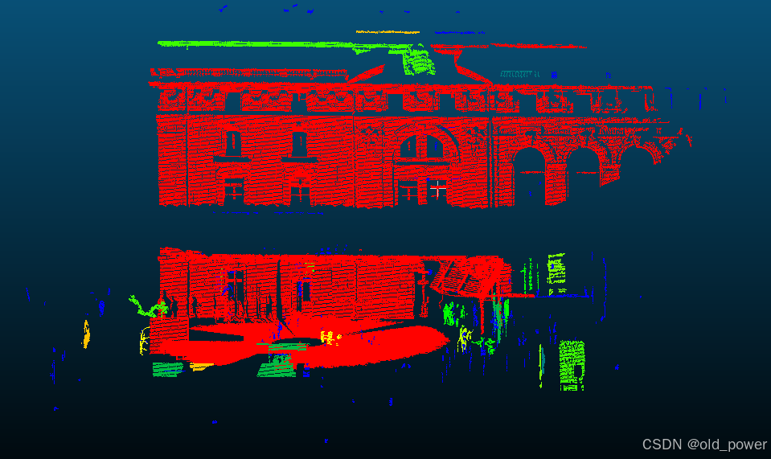

# 【PCL】Segmentation 模块—— 条件欧几里得聚类（Conditional Euclidean Clustering）

## 1、简介
### 1.1 条件欧几里得聚类（Conditional Euclidean Clustering）

本文介绍了如何使用 `pcl::ConditionalEuclideanClustering` 类：这是一种基于欧几里得距离和用户自定义条件的点云聚类分割算法。

该类使用了与**欧几里得聚类提取(Euclidean Cluster Extraction)**、**区域生长分割(Region growing segmentation)**和**基于颜色的区域生长分割(Color-based region growing segmentation)**中相同的贪婪式(greedy-like)/区域生长(region-growing)/洪水填充(flood-filling)方法。与其他类相比，使用该类的优势在于，聚类的约束条件（纯欧几里得距离、平滑度、RGB等）现在可以由用户自定义。然而，它也有一些缺点，例如：没有初始种子系统、无法控制过分割和欠分割，以及在主计算循环中调用条件函数会降低时间效率。

### 1.2 理论基础

在**欧几里得聚类提取**和**区域生长分割**的教程中，已经非常准确地解释了区域生长算法。本教程的补充说明是，现在可以完全自定义用于判断是否将邻近点合并到当前聚类的条件。

随着聚类的增长，算法会评估用户定义的条件，该条件用于判断已经在聚类中的点与附近的候选点之间的关系。候选点（最近邻点）是通过在聚类中每个点周围进行欧几里得半径搜索找到的。对于每个聚类中的点，条件需要至少与其中一个邻近点满足，而不是与所有邻近点都满足。

`Conditional Euclidean Clustering` 类还可以根据大小约束自动过滤聚类。被分类为过小或过大的聚类仍然可以在之后被检索出来。

---

 -  **算法核心**：基于欧几里得距离和用户自定义条件进行点云聚类。
 - **优势**：聚类条件可自定义，灵活性高。
 - **缺点**：无初始种子系统，无法控制过分割和欠分割，时间效率较低。
 - **工作原理**：通过区域生长算法，结合欧几里得半径搜索和用户定义的条件来判断点是否属于同一聚类。
 - **额外功能**：支持根据聚类大小自动过滤，并保留过小或过大的聚类。

## 2、代码示例
数据集[Statues_4.pcd](https://sourceforge.net/projects/pointclouds/files/PCD%20datasets/Trimble/Outdoor1/Statues_4.pcd.zip/download)是一个非常大的户外环境数据集，我们的目标是对其中的独立物体进行聚类，并且希望将建筑物与地面分离，尽管它们在欧几里得意义上是相连的。创建`conditional_euclidean_clustering.cpp`。

### 2.1 `conditional_euclidean_clustering.cpp`

```cpp
#include <pcl/point_types.h>          // PCL点云数据类型
#include <pcl/io/pcd_io.h>            // PCL的PCD文件读写
#include <pcl/console/time.h>         // 用于计时

#include <pcl/filters/voxel_grid.h>   // 体素网格滤波器
#include <pcl/features/normal_3d.h>   // 法线估计
#include <pcl/segmentation/conditional_euclidean_clustering.h>  // 条件欧几里得聚类

// 定义点类型
typedef pcl::PointXYZI PointTypeIO;          // 输入输出点类型，包含XYZ坐标和强度信息
typedef pcl::PointXYZINormal PointTypeFull;  // 包含XYZ坐标、强度和法线的点类型

// 自定义条件函数 1：强度相似性
bool enforceIntensitySimilarity (const PointTypeFull& point_a, const PointTypeFull& point_b, float /*squared_distance*/)
{
  if (std::abs (point_a.intensity - point_b.intensity) < 5.0f)
    return (true);  // 如果两点强度差小于5，返回true
  else
    return (false); // 否则返回false
}

// 自定义条件函数 2：法线或强度相似性
bool enforceNormalOrIntensitySimilarity (const PointTypeFull& point_a, const PointTypeFull& point_b, float /*squared_distance*/)
{
  Eigen::Map<const Eigen::Vector3f> point_a_normal = point_a.getNormalVector3fMap (), point_b_normal = point_b.getNormalVector3fMap ();
  if (std::abs (point_a.intensity - point_b.intensity) < 5.0f)
    return (true);  // 如果强度差小于5，返回true
  if (std::abs (point_a_normal.dot (point_b_normal)) > std::cos (30.0f / 180.0f * static_cast<float> (M_PI)))
    return (true);  // 如果法线夹角小于30度，返回true
  return (false);   // 否则返回false
}

// 自定义条件函数 3：区域生长条件
bool customRegionGrowing (const PointTypeFull& point_a, const PointTypeFull& point_b, float squared_distance)
{
  Eigen::Map<const Eigen::Vector3f> point_a_normal = point_a.getNormalVector3fMap (), point_b_normal = point_b.getNormalVector3fMap ();
  if (squared_distance < 10000)  // 如果两点距离平方小于10000
  {
    if (std::abs (point_a.intensity - point_b.intensity) < 8.0f)
      return (true);  // 强度差小于8，返回true
    if (std::abs (point_a_normal.dot (point_b_normal)) > std::cos (30.0f / 180.0f * static_cast<float> (M_PI)))
      return (true);  // 法线夹角小于30度，返回true
  }
  else
  {
    if (std::abs (point_a.intensity - point_b.intensity) < 3.0f)
      return (true);  // 强度差小于3，返回true
  }
  return (false);  // 否则返回false
}

int main ()
{
  // 数据容器
  pcl::PointCloud<PointTypeIO>::Ptr cloud_in (new pcl::PointCloud<PointTypeIO>), cloud_out (new pcl::PointCloud<PointTypeIO>);
  pcl::PointCloud<PointTypeFull>::Ptr cloud_with_normals (new pcl::PointCloud<PointTypeFull>);
  pcl::IndicesClustersPtr clusters (new pcl::IndicesClusters), small_clusters (new pcl::IndicesClusters), large_clusters (new pcl::IndicesClusters);
  pcl::search::KdTree<PointTypeIO>::Ptr search_tree (new pcl::search::KdTree<PointTypeIO>);
  pcl::console::TicToc tt;  // 计时器

  // 加载点云数据
  std::cerr << "Loading...\n", tt.tic ();
  pcl::io::loadPCDFile ("Statues_4.pcd", *cloud_in);  // 加载PCD文件
  std::cerr << ">> Done: " << tt.toc () << " ms, " << cloud_in->size () << " points\n";

  // 点云下采样
  std::cerr << "Downsampling...\n", tt.tic ();
  pcl::VoxelGrid<PointTypeIO> vg;
  vg.setInputCloud (cloud_in);
  vg.setLeafSize (80.0, 80.0, 80.0);  // 设置体素大小
  vg.setDownsampleAllData (true);
  vg.filter (*cloud_out);  // 执行下采样
  std::cerr << ">> Done: " << tt.toc () << " ms, " << cloud_out->size () << " points\n";

  // 计算法线
  std::cerr << "Computing normals...\n", tt.tic ();
  pcl::copyPointCloud (*cloud_out, *cloud_with_normals);  // 复制点云
  pcl::NormalEstimation<PointTypeIO, PointTypeFull> ne;
  ne.setInputCloud (cloud_out);
  ne.setSearchMethod (search_tree);
  ne.setRadiusSearch (300.0);  // 设置法线估计搜索半径
  ne.compute (*cloud_with_normals);  // 计算法线
  std::cerr << ">> Done: " << tt.toc () << " ms\n";

  // 条件欧几里得聚类
  std::cerr << "Segmenting to clusters...\n", tt.tic ();
  pcl::ConditionalEuclideanClustering<PointTypeFull> cec (true);
  cec.setInputCloud (cloud_with_normals);  // 设置输入点云
  cec.setConditionFunction (&customRegionGrowing);  // 设置自定义条件函数
  cec.setClusterTolerance (500.0);  // 设置聚类距离阈值
  cec.setMinClusterSize (cloud_with_normals->size () / 1000);  // 设置最小聚类点数
  cec.setMaxClusterSize (cloud_with_normals->size () / 5);  // 设置最大聚类点数
  cec.segment (*clusters);  // 执行聚类
  cec.getRemovedClusters (small_clusters, large_clusters);  // 获取被移除的聚类
  std::cerr << ">> Done: " << tt.toc () << " ms\n";

  // 使用强度通道进行简单的可视化
  for (const auto& small_cluster : (*small_clusters))
    for (const auto& j : small_cluster.indices)
      (*cloud_out)[j].intensity = -2.0;  // 小聚类标记为-2.0
  for (const auto& large_cluster : (*large_clusters))
    for (const auto& j : large_cluster.indices)
      (*cloud_out)[j].intensity = +10.0;  // 大聚类标记为+10.0
  for (const auto& cluster : (*clusters))
  {
    int label = rand () % 8;  // 随机生成标签
    for (const auto& j : cluster.indices)
      (*cloud_out)[j].intensity = label;  // 为每个聚类分配标签
  }

  // 保存结果
  std::cerr << "Saving...\n", tt.tic ();
  pcl::io::savePCDFile ("output.pcd", *cloud_out);  // 保存结果点云
  std::cerr << ">> Done: " << tt.toc () << " ms\n";

  return (0);
}
```

### 2.2 `CMakeLists.txt`

```
cmake_minimum_required(VERSION 3.5 FATAL_ERROR)

project(conditional_euclidean_clustering)

find_package(PCL 1.7 REQUIRED)

include_directories(${PCL_INCLUDE_DIRS})
link_directories(${PCL_LIBRARY_DIRS})
add_definitions(${PCL_DEFINITIONS})

add_executable (conditional_euclidean_clustering conditional_euclidean_clustering.cpp)
target_link_libraries (conditional_euclidean_clustering ${PCL_LIBRARIES})
```
## 3、运行结果

### 3.1 编译运行

```bash
$ mkdir build && cd build
$ cmake ..
$ make
$ ./conditional_euclidean_clustering 
Loading...
>> Done: 4569.38 ms, 19553780 points
Downsampling...
>> Done: 372.295 ms, 202529 points
Computing normals...
>> Done: 743.092 ms
Segmenting to clusters...
>> Done: 1084.22 ms
Saving...
>> Done: 477.991 ms
```

### 3.2 运行结果
 - 处理前的点云Statues_4.pcd
 


 - 处理后




