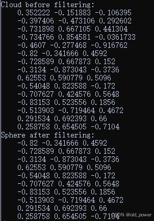

# 【PCL】Segmentation 模块—— 模型离群值去除（ModelOutlierRemoval）

模型离群值去除`ModelOutlierRemoval` 是 PCL（Point Cloud Library）中的一个过滤器，用于从点云中移除“异常值”（outliers）。这些异常值通常指的是离群点，它们通常是由于噪声、误差或者其他不相关因素引入的。

### 1、`ModelOutlierRemoval`的工作原理

该滤波器的核心思想是，通过与一个模型（比如平面、球体、圆柱等）对比，判断哪些点是“异常的”或“离群的”。如果一个点距离该模型的拟合程度较差（即该点偏离模型的预测值较远），则被认为是异常点，可以将其移除。

### 2、常用的模型
- **平面模型**：点云中的点可以拟合为一个平面，若点远离该平面则被视为异常。
- **球体模型**：点云可以拟合为一个球体，远离球体表面的点被认为是异常。
- **圆柱模型**：点云拟合为一个圆柱体，远离圆柱体表面的点被视为异常。
- **线性模型**：点云拟合为一条直线，远离直线的点被认为是异常。

### 3、代码示例

以下是一个简单的示例代码，展示了如何使用 `ModelOutlierRemoval` 来移除异常点：

**创建`model_outlier_removal.cpp`**
```cpp
#include <iostream>
#include <pcl/point_types.h>          // 包含点云数据类型定义
#include <pcl/filters/model_outlier_removal.h>  // 包含模型异常值移除滤波器

int main() 
{
  // 创建点云对象，用于存储原始点云数据和过滤后的点云数据
  pcl::PointCloud<pcl::PointXYZ>::Ptr cloud(new pcl::PointCloud<pcl::PointXYZ>);
  pcl::PointCloud<pcl::PointXYZ>::Ptr cloud_sphere_filtered(new pcl::PointCloud<pcl::PointXYZ>);

  // 1. 生成点云数据
  std::size_t noise_size = 5;         // 定义噪声点的数量
  std::size_t sphere_data_size = 10;  // 定义球面点的数量
  cloud->width = noise_size + sphere_data_size;  // 设置点云的总宽度
  cloud->height = 1;                  // 点云高度为1（表示一个单行点云）
  cloud->points.resize(cloud->width * cloud->height);  // 根据宽度和高度调整点云的大小

  // 1.1 添加噪声点
  for (std::size_t i = 0; i < noise_size; ++i)
  {
    // 为噪声点生成随机坐标，范围在0到1024之间
    (*cloud)[i].x = 1024 * rand() / (RAND_MAX + 1.0f);
    (*cloud)[i].y = 1024 * rand() / (RAND_MAX + 1.0f);
    (*cloud)[i].z = 1024 * rand() / (RAND_MAX + 1.0f);
  }

  // 1.2 添加球面上的点
  double rand_x1 = 1;
  double rand_x2 = 1;
  for (std::size_t i = noise_size; i < (noise_size + sphere_data_size); ++i)
  {
    // 使用均匀分布的球面采样公式生成球面上的点
    while (pow(rand_x1, 2) + pow(rand_x2, 2) >= 1)
    {
      rand_x1 = (rand() % 100) / (50.0f) - 1;  // 随机生成-1到1之间的值
      rand_x2 = (rand() % 100) / (50.0f) - 1;  // 随机生成-1到1之间的值
    }
    double pre_calc = sqrt(1 - pow(rand_x1, 2) - pow(rand_x2, 2));  // 计算球面上的z坐标
    (*cloud)[i].x = 2 * rand_x1 * pre_calc;  // 计算球面上的x坐标
    (*cloud)[i].y = 2 * rand_x2 * pre_calc;  // 计算球面上的y坐标
    (*cloud)[i].z = 1 - 2 * (pow(rand_x1, 2) + pow(rand_x2, 2));  // 计算球面上的z坐标
    rand_x1 = 1;
    rand_x2 = 1;
  }

  // 输出原始点云数据
  std::cerr << "Cloud before filtering: " << std::endl;
  for (const auto& point : *cloud)
    std::cout << "    " << point.x << " " << point.y << " " << point.z << std::endl;

  // 2. 进行球面滤波
  // 2.1 生成模型：定义球体模型的参数
  pcl::ModelCoefficients sphere_coeff;
  sphere_coeff.values.resize(4);  // 球面模型有4个参数：x, y, z（球心坐标）和半径
  sphere_coeff.values[0] = 0;    // 设置球心的x坐标
  sphere_coeff.values[1] = 0;    // 设置球心的y坐标
  sphere_coeff.values[2] = 0;    // 设置球心的z坐标
  sphere_coeff.values[3] = 1;    // 设置球的半径为1

  // 创建ModelOutlierRemoval滤波器对象
  pcl::ModelOutlierRemoval<pcl::PointXYZ> sphere_filter;
  sphere_filter.setModelCoefficients(sphere_coeff);  // 设置球体模型参数
  sphere_filter.setThreshold(0.05);  // 设置阈值，点距离模型大于0.05被视为异常值
  sphere_filter.setModelType(pcl::SACMODEL_SPHERE);  // 设置使用的模型类型为球面模型
  sphere_filter.setInputCloud(cloud);  // 设置输入点云
  sphere_filter.filter(*cloud_sphere_filtered);  // 过滤点云，去除与球面模型不匹配的点

  // 输出过滤后的点云数据
  std::cerr << "Sphere after filtering: " << std::endl;
  for (const auto& point : *cloud_sphere_filtered)
    std::cout << "    " << point.x << " " << point.y << " " << point.z << std::endl;

  return 0;
}
```
**创建`CMakeLists.txt`**

```bash
cmake_minimum_required(VERSION 3.5 FATAL_ERROR)

project(model_outlier_removal)

find_package(PCL 1.7 REQUIRED)

include_directories(${PCL_INCLUDE_DIRS})
link_directories(${PCL_LIBRARY_DIRS})
add_definitions(${PCL_DEFINITIONS})

add_executable (model_outlier_removal model_outlier_removal.cpp)
target_link_libraries (model_outlier_removal ${PCL_LIBRARIES})
```
**编译运行**

```bash
mkdir build && cd build
cmake ..
make
./model_outlier_removal
```
**运行结果**
```bash
Cloud before filtering: 
    0.352222 -0.151883 -0.106395
    -0.397406 -0.473106 0.292602
    -0.731898 0.667105 0.441304
    -0.734766 0.854581 -0.0361733
    -0.4607 -0.277468 -0.916762
    -0.82 -0.341666 0.4592
    -0.728589 0.667873 0.152
    -0.3134 -0.873043 -0.3736
    0.62553 0.590779 0.5096
    -0.54048 0.823588 -0.172
    -0.707627 0.424576 0.5648
    -0.83153 0.523556 0.1856
    -0.513903 -0.719464 0.4672
    0.291534 0.692393 0.66
    0.258758 0.654505 -0.7104
Sphere after filtering: 
    -0.82 -0.341666 0.4592
    -0.728589 0.667873 0.152
    -0.3134 -0.873043 -0.3736
    0.62553 0.590779 0.5096
    -0.54048 0.823588 -0.172
    -0.707627 0.424576 0.5648
    -0.83153 0.523556 0.1856
    -0.513903 -0.719464 0.4672
    0.291534 0.692393 0.66
    0.258758 0.654505 -0.7104
```


### 4、主要步骤

1. **生成点云数据：**  
   - 添加了噪声点，这些点在随机的空间中生成，模拟真实环境中的噪声。
   - 添加了球面上的点，球面上的点是均匀分布的。

2. **模型异常值移除：**
   - 创建了一个球面模型，指定了球心坐标和半径，作为参考模型。
   - 使用 `ModelOutlierRemoval` 滤波器对点云进行处理，移除那些与该球面模型不符合的异常点。

3. **输出：**
   - 输出原始点云数据和过滤后的点云数据，帮助我们对比滤波效果。
### 总结

`ModelOutlierRemoval` 这个滤波器通过拟合一个特定的模型（例如球面、平面等）来识别哪些点与模型不符，从而将这些不符合模型的点移除。在这段代码中，`setModelType(pcl::SACMODEL_SPHERE)` 表示我们正在使用一个球体模型，`setThreshold(0.05)` 表示距离模型大于0.05的点将被认为是异常点。