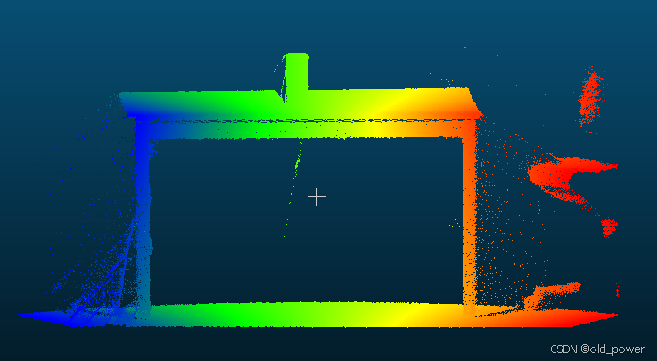

# 【PCL】Segmentation 模块—— 欧几里得聚类提取（Euclidean Cluster Extraction）

## 1、简介
**PCL 的 Euclidean Cluster Extraction（欧几里得聚类提取）** 是一种基于欧几里得距离的点云聚类算法。它的目标是将点云数据分割成多个独立的簇（clusters），每个簇代表一个独立的物体或结构。该算法通过计算点与点之间的欧几里得距离，将距离小于给定阈值的点归为同一个簇。

---

### **1.1 欧几里得聚类提取的原理**
1. **基于距离的聚类**：
   - 算法通过计算点云中每个点与其邻近点之间的欧几里得距离来判断它们是否属于同一个簇。
   - 如果两个点之间的距离小于设定的阈值（`ClusterTolerance`），则认为它们属于同一个簇。

2. **使用 KdTree 加速搜索**：
   - 为了高效地查找每个点的邻近点，算法使用 KdTree 数据结构来组织点云数据。
   - KdTree 是一种空间划分数据结构，可以快速找到某个点附近的点。

3. **聚类条件**：
   - 每个簇需要满足一定的点数范围：
     - 最小点数（`MinClusterSize`）：少于该点数的簇会被丢弃。
     - 最大点数（`MaxClusterSize`）：超过该点数的簇会被分割或丢弃。

---

### **1.2 PCL 中 EuclideanClusterExtraction 的关键参数**
在 PCL 中，`pcl::EuclideanClusterExtraction` 类用于实现欧几里得聚类提取。以下是其关键参数：

1. **`setClusterTolerance`**：
   - 设置聚类的距离阈值。
   - 例如，`setClusterTolerance(0.02)` 表示两点之间的距离小于 2cm 时，它们属于同一个簇。

2. **`setMinClusterSize`**：
   - 设置每个簇的最小点数。
   - 例如，`setMinClusterSize(100)` 表示点数少于 100 的簇会被丢弃。

3. **`setMaxClusterSize`**：
   - 设置每个簇的最大点数。
   - 例如，`setMaxClusterSize(25000)` 表示点数超过 25000 的簇会被分割或丢弃。

4. **`setSearchMethod`**：
   - 设置用于搜索邻近点的数据结构，通常是 KdTree。
   - 例如，`setSearchMethod(tree)`，其中 `tree` 是一个 KdTree 对象。

5. **`setInputCloud`**：
   - 设置输入的点云数据。

6. **`extract`**：
   - 执行聚类提取，结果存储在 `std::vector<pcl::PointIndices>` 中，每个 `pcl::PointIndices` 表示一个簇。

---

### **1.3 欧几里得聚类提取的步骤**
1. **构建 KdTree**：
   - 使用点云数据构建 KdTree，以便快速查找邻近点。

2. **遍历点云**：
   - 遍历点云中的每个点，找到其邻近点。
   - 如果邻近点与当前点的距离小于阈值，则将它们归为同一个簇。

3. **递归扩展簇**：
   - 对于每个邻近点，继续查找其邻近点，直到没有新的点可以加入当前簇。

4. **过滤簇**：
   - 根据设定的最小点数和最大点数，过滤掉不符合条件的簇。

5. **输出结果**：
   - 将每个簇的点云索引存储在 `std::vector<pcl::PointIndices>` 中。

---
## 2、代码示例
### 2.1 `cluster_extraction.cpp`

这段代码适用于处理3D点云数据，特别是在场景中分割平面和物体的应用中，代码主要包括点云的读取、滤波、平面分割、聚类以及保存聚类结果等步骤：

```cpp
#include <pcl/ModelCoefficients.h>
#include <pcl/point_types.h>
#include <pcl/io/pcd_io.h>
#include <pcl/filters/extract_indices.h>
#include <pcl/filters/voxel_grid.h>
#include <pcl/features/normal_3d.h>
#include <pcl/search/kdtree.h>
#include <pcl/sample_consensus/method_types.h>
#include <pcl/sample_consensus/model_types.h>
#include <pcl/segmentation/sac_segmentation.h>
#include <pcl/segmentation/extract_clusters.h>
#include <iomanip> // for setw, setfill

int 
main ()
{
  // 读取点云数据
  pcl::PCDReader reader;
  pcl::PointCloud<pcl::PointXYZ>::Ptr cloud (new pcl::PointCloud<pcl::PointXYZ>), cloud_f (new pcl::PointCloud<pcl::PointXYZ>);
  reader.read ("table_scene_lms400.pcd", *cloud);
  std::cout << "PointCloud before filtering has: " << cloud->size () << " data points." << std::endl; // 输出滤波前的点云数量

  // 创建滤波对象：使用1cm的叶子大小对数据集进行下采样
  pcl::VoxelGrid<pcl::PointXYZ> vg;
  pcl::PointCloud<pcl::PointXYZ>::Ptr cloud_filtered (new pcl::PointCloud<pcl::PointXYZ>);
  vg.setInputCloud (cloud);
  vg.setLeafSize (0.01f, 0.01f, 0.01f);
  vg.filter (*cloud_filtered);
  std::cout << "PointCloud after filtering has: " << cloud_filtered->size ()  << " data points." << std::endl; // 输出滤波后的点云数量

  // 创建平面模型的分割对象并设置所有参数
  pcl::SACSegmentation<pcl::PointXYZ> seg;
  pcl::PointIndices::Ptr inliers (new pcl::PointIndices);
  pcl::ModelCoefficients::Ptr coefficients (new pcl::ModelCoefficients);
  pcl::PointCloud<pcl::PointXYZ>::Ptr cloud_plane (new pcl::PointCloud<pcl::PointXYZ> ());
  pcl::PCDWriter writer;
  seg.setOptimizeCoefficients (true);
  seg.setModelType (pcl::SACMODEL_PLANE);
  seg.setMethodType (pcl::SAC_RANSAC);
  seg.setMaxIterations (100);
  seg.setDistanceThreshold (0.02);

  int nr_points = (int) cloud_filtered->size ();
  while (cloud_filtered->size () > 0.3 * nr_points)
  {
    // 从剩余的点云中分割出最大的平面组件
    seg.setInputCloud (cloud_filtered);
    seg.segment (*inliers, *coefficients);
    if (inliers->indices.size () == 0)
    {
      std::cout << "Could not estimate a planar model for the given dataset." << std::endl;
      break;
    }

    // 从输入点云中提取平面内点
    pcl::ExtractIndices<pcl::PointXYZ> extract;
    extract.setInputCloud (cloud_filtered);
    extract.setIndices (inliers);
    extract.setNegative (false);

    // 获取与平面表面相关的点
    extract.filter (*cloud_plane);
    std::cout << "PointCloud representing the planar component: " << cloud_plane->size () << " data points." << std::endl;

    // 移除平面内点，提取剩余点
    extract.setNegative (true);
    extract.filter (*cloud_f);
    *cloud_filtered = *cloud_f;
  }

  // 为提取方法创建KdTree对象
  pcl::search::KdTree<pcl::PointXYZ>::Ptr tree (new pcl::search::KdTree<pcl::PointXYZ>);
  tree->setInputCloud (cloud_filtered);

  std::vector<pcl::PointIndices> cluster_indices;
  pcl::EuclideanClusterExtraction<pcl::PointXYZ> ec;
  ec.setClusterTolerance (0.02); // 2cm
  ec.setMinClusterSize (100);
  ec.setMaxClusterSize (25000);
  ec.setSearchMethod (tree);
  ec.setInputCloud (cloud_filtered);
  ec.extract (cluster_indices);

  int j = 0;
  for (const auto& cluster : cluster_indices)
  {
    pcl::PointCloud<pcl::PointXYZ>::Ptr cloud_cluster (new pcl::PointCloud<pcl::PointXYZ>);
    for (const auto& idx : cluster.indices) {
      cloud_cluster->push_back((*cloud_filtered)[idx]);
    } // 将聚类中的点添加到新的点云中
    cloud_cluster->width = cloud_cluster->size ();
    cloud_cluster->height = 1;
    cloud_cluster->is_dense = true;

    std::cout << "PointCloud representing the Cluster: " << cloud_cluster->size () << " data points." << std::endl;
    std::stringstream ss;
    ss << std::setw(4) << std::setfill('0') << j;
    writer.write<pcl::PointXYZ> ("cloud_cluster_" + ss.str () + ".pcd", *cloud_cluster, false); // 保存聚类结果到PCD文件
    j++;
  }

  return (0);
}
```

### 2.2 主要步骤：
1. **读取点云数据**：从PCD文件中读取点云数据，并输出点云的数量。
2. **滤波**：使用VoxelGrid滤波器对点云进行下采样，减少点云的数量，同时保持点云的形状。
3. **平面分割**：使用RANSAC算法从点云中分割出最大的平面组件，并提取出平面内点。
4. **移除平面内点**：将平面内点从点云中移除，保留剩余的点云。
5. **聚类**：使用欧几里得聚类算法对剩余的点云进行聚类，将点云分割成多个簇。
6. **保存聚类结果**：将每个聚类结果保存为单独的PCD文件。

### 2.3 关键点：
- **VoxelGrid滤波**：通过设置叶子大小（`setLeafSize`）来控制下采样的精度。
- **RANSAC平面分割**：通过设置最大迭代次数（`setMaxIterations`）和距离阈值（`setDistanceThreshold`）来控制平面分割的精度。
- **欧几里得聚类**：通过设置聚类容差（`setClusterTolerance`）、最小聚类大小（`setMinClusterSize`）和最大聚类大小（`setMaxClusterSize`）来控制聚类的效果。
### 2.4 `CMakeLists.txt`

```
cmake_minimum_required(VERSION 3.5 FATAL_ERROR)

project(cluster_extraction)

find_package(PCL 1.2 REQUIRED)

include_directories(${PCL_INCLUDE_DIRS})
link_directories(${PCL_LIBRARY_DIRS})
add_definitions(${PCL_DEFINITIONS})

add_executable (${PROJECT_NAME} cluster_extraction.cpp)
target_link_libraries (${PROJECT_NAME} ${PCL_LIBRARIES})
```


## 3、运行结果
 - 编译

```bash
mkdir build && cd build
cmake ..
make
```
 - 运行`./cluster_extraction `

```bash
./cluster_extraction 
PointCloud before filtering has: 460400 data points.
PointCloud after filtering has: 41049 data points.
PointCloud representing the planar component: 20536 data points.
PointCloud representing the planar component: 12442 data points.
PointCloud representing the Cluster: 4857 data points.
PointCloud representing the Cluster: 1386 data points.
PointCloud representing the Cluster: 321 data points.
PointCloud representing the Cluster: 291 data points.
PointCloud representing the Cluster: 123 data points.
```
 - 保存提取到的点云文件


 - 点云源文件`table_scene_lms400.pcd`



 - 点云提取后


