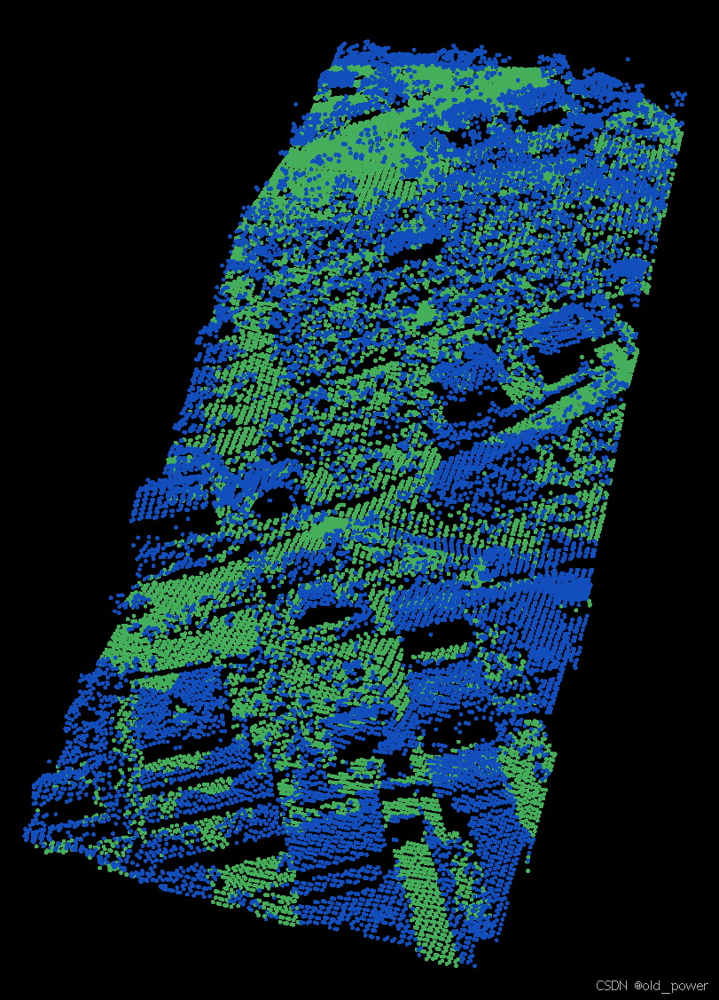

# 【PCL】Segmentation 模块—— 渐进式形态学滤波（Progressive Morphological Filtering）

**Progressive Morphological Filtering（渐进式形态学滤波）** 是一种用于从机载LiDAR（激光雷达）数据中分离地面点与非地面点的滤波算法。该算法通过逐步增大滤波窗口尺寸，并结合高程差阈值，能够有效去除建筑物、车辆、植被等非地面点，同时保留地形特征，生成高精度的数字地形模型（DTM）或数字高程模型（DEM）。

---

### 1. **算法背景**
机载LiDAR技术能够快速、低成本地获取大范围的高精度地形数据。然而，LiDAR点云中不仅包含地面点，还包含建筑物、车辆、植被等非地面点。为了生成高精度的DTM/DEM，需要将这些非地面点从点云中分离出来。Progressive Morphological Filtering 正是为解决这一问题而设计的。

---

### 2. **核心原理**
#### 2.1 **形态学滤波基础**
形态学滤波基于数学形态学中的**膨胀（Dilation）**和**腐蚀（Erosion）**操作：
- **膨胀**：在窗口内选择最大高程值，用于扩大地物特征。
- **腐蚀**：在窗口内选择最小高程值，用于缩小地物特征。
- **开操作**：先腐蚀后膨胀，用于去除细小地物（如树木）并保留大型地物（如建筑物）。

#### 2.2 **渐进式滤波**
传统形态学滤波使用固定窗口尺寸，难以同时处理不同尺寸的地物（如小汽车和大型建筑物）。渐进式形态学滤波通过**逐步增大窗口尺寸**来解决这一问题：
1. **初始窗口**：使用较小的窗口去除细小地物（如树木、汽车）。
2. **逐步增大窗口**：随着窗口尺寸增大，逐步去除更大的地物（如建筑物）。
3. **高程差阈值**：引入高程差阈值，区分地面点与非地面点。地面点的高程变化是渐变的，而非地面点（如建筑物屋顶）的高程变化是突变的。

---

### 3. **算法流程**
1. **点云划分**：将不规则点云划分为规则网格，每个网格中选择高程最低点作为初始地面点。
2. **迭代滤波**：
   - 使用初始窗口尺寸进行形态学开操作，去除细小地物。
   - 逐步增大窗口尺寸，重复开操作，去除更大尺寸的地物。
   - 根据高程差阈值判断地面点与非地面点。
3. **参数调整**：
   - **窗口尺寸**：可通过线性或指数增长方式调整。
   - **高程差阈值**：根据地形坡度和地物高度动态调整。
4. **输出结果**：生成地面点云和非地面点云，用于后续的DTM/DEM生成。

---

### 4. **参数设置**
- **窗口尺寸**：决定滤波的粒度，过小会保留过多非地面点，过大会丢失地形细节。
- **高程差阈值**：用于区分地面点与非地面点，通常根据地形坡度和地物高度设置。
- **坡度**：影响高程差阈值的计算，坡度越大，阈值越高。

---

### 5. **应用与优化**
- **应用场景**：广泛应用于地形建模、洪水模拟、滑坡预测等领域。
- **优化方法**：
  - **多线程加速**：如PCL库中的`ApproximateProgressiveMorphologicalFilter`，通过多线程提高计算效率。
  - **参数调优**：根据具体场景调整窗口尺寸和高程差阈值，以获得最佳滤波效果。

---

### 6. **代码示例**
以下是PCL库中Progressive Morphological Filtering的简单实现，代码读取点云数据，应用渐进式形态学滤波，并输出地面点云。
 - **读取PCD文件**：使用 `pcl::PCDReader` 读取点云数据。
 -  **应用渐进形态滤波器**：使用 `pcl::ProgressiveMorphologicalFilter` 提取地面点。
 -  **提取地面点并保存**：通过 `pcl::ExtractIndices` 从原始点云中提取地面点并保存到一个新的 PCD 文件。
 -  **提取非地面点并保存**：通过设置 `setNegative(true)`，提取非地面点并保存到另一个新的 PCD 文件。
 
**创建`bare_earth.cpp`**
```cpp
#include <iostream>
#include <pcl/io/pcd_io.h>  // 用于读取和写入PCD文件
#include <pcl/point_types.h> // 用于点云数据类型
#include <pcl/filters/extract_indices.h> // 用于从点云中提取指定的点
#include <pcl/segmentation/progressive_morphological_filter.h> // 用于地面提取的渐进形态滤波器

int main ()
{
  // 创建一个新的点云对象和一个用于存储过滤结果的点云对象
  pcl::PointCloud<pcl::PointXYZ>::Ptr cloud (new pcl::PointCloud<pcl::PointXYZ>);
  pcl::PointCloud<pcl::PointXYZ>::Ptr cloud_filtered (new pcl::PointCloud<pcl::PointXYZ>);
  pcl::PointIndicesPtr ground (new pcl::PointIndices);  // 存储地面点索引

  // 从PCD文件中读取点云数据
  pcl::PCDReader reader;
  // 读取存储在指定路径下的PCD文件
  reader.read<pcl::PointXYZ> ("samp11-utm.pcd", *cloud);

  // 输出原始点云数据的大小
  std::cerr << "Cloud before filtering: " << std::endl;
  std::cerr << *cloud << std::endl;

  // 创建渐进形态滤波器对象
  pcl::ProgressiveMorphologicalFilter<pcl::PointXYZ> pmf;
  pmf.setInputCloud (cloud);  // 设置输入点云
  pmf.setMaxWindowSize (20);  // 设置滤波窗口的最大大小
  pmf.setSlope (1.0f);  // 设置坡度阈值，用于区分地面与非地面
  pmf.setInitialDistance (0.5f);  // 设置初始距离，用于逐步提高阈值
  pmf.setMaxDistance (3.0f);  // 设置最大距离，限制最大可接受距离
  pmf.extract (ground->indices);  // 提取地面点的索引

  // 创建提取索引的对象，使用提取器从原始点云中提取出地面点
  pcl::ExtractIndices<pcl::PointXYZ> extract;
  extract.setInputCloud (cloud);  // 设置输入点云
  extract.setIndices (ground);  // 设置要提取的索引（地面点）
  extract.filter (*cloud_filtered);  // 提取地面点到cloud_filtered

  // 输出地面点云数据的大小
  std::cerr << "Ground cloud after filtering: " << std::endl;
  std::cerr << *cloud_filtered << std::endl;

  // 创建PCD写入器对象，将过滤后的地面点云保存为新的PCD文件
  pcl::PCDWriter writer;
  writer.write<pcl::PointXYZ> ("samp11-utm_ground.pcd", *cloud_filtered, false);

  // 提取非地面点（即物体点）
  extract.setNegative (true);  // 设置提取非地面点
  extract.filter (*cloud_filtered);  // 提取非地面点到cloud_filtered

  // 输出物体点云数据的大小
  std::cerr << "Object cloud after filtering: " << std::endl;
  std::cerr << *cloud_filtered << std::endl;

  // 保存非地面点云数据到PCD文件
  writer.write<pcl::PointXYZ> ("samp11-utm_object.pcd", *cloud_filtered, false);

  return (0);  // 返回0，表示程序正常结束
}

```
**创建`CMakeLists.txt`**

```bash
cmake_minimum_required(VERSION 3.5 FATAL_ERROR)

project(bare_earth)

find_package(PCL 1.7.2 REQUIRED)

include_directories(${PCL_INCLUDE_DIRS})
link_directories(${PCL_LIBRARY_DIRS})
add_definitions(${PCL_DEFINITIONS})

add_executable (bare_earth bare_earth.cpp)
target_link_libraries (bare_earth ${PCL_LIBRARIES})
```
**编译运行**
```bash
mkdir build && cd build
cmake ..
make
./bare_earth
```
**结果**

```bash
Cloud before filtering:
points[]: 38010
width: 38010
height: 1
is_dense: 1
sensor origin (xyz): [0, 0, 0] / orientation (xyzw): [0, 0, 0, 1]

Ground cloud after filtering:
points[]: 18667
width: 18667
height: 1
is_dense: 1
sensor origin (xyz): [0, 0, 0] / orientation (xyzw): [0, 0, 0, 1]

Object cloud after filtering:
points[]: 19343
width: 19343
height: 1
is_dense: 1
sensor origin (xyz): [0, 0, 0] / orientation (xyzw): [0, 0, 0, 1]
```
通过可视化查看输出samp11-utm_inliers.PCD和samp11-utm_outliers.pcd：


---

### 7. **总结**
Progressive Morphological Filtering 是一种高效的点云滤波算法，能够有效分离地面点与非地面点。其核心思想是通过逐步增大窗口尺寸和高程差阈值，适应不同尺寸的地物，适用于多种地形和场景。