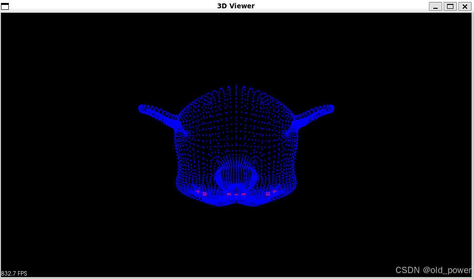
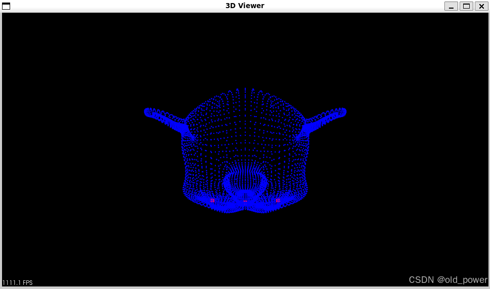
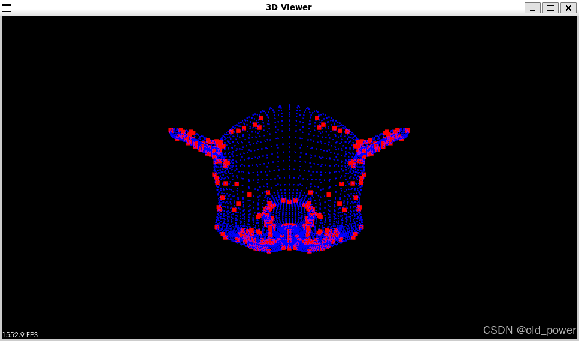
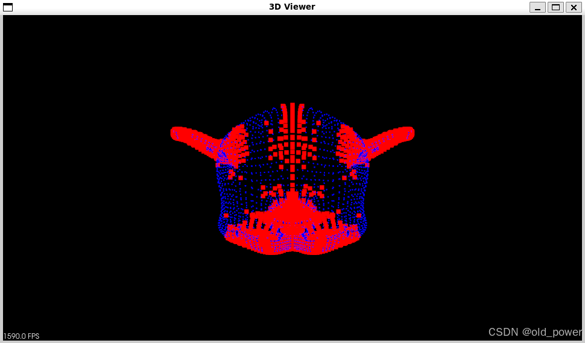

# 【PCL】点云特征提取Harris、ISS、SIFT、Boundary

## 一、概要
点云特征提取是3D计算机视觉中的关键步骤，用于识别和描述点云中的显著特征。以下是几种常见的点云特征提取方法：
### 1.1 Harris
- **Harris角点检测**：最初用于2D图像，通过计算像素灰度变化来检测角点。在3D点云中，Harris通过分析点云曲率或法向量变化来检测角点。
- **应用**：适用于需要高重复性和稳定性的场景，如物体识别和配准。

### 1.2 ISS (Intrinsic Shape Signatures)
- **ISS特征点检测**：基于点云的局部几何特性，通过计算每个点的邻域协方差矩阵，选择具有显著几何变化的点作为特征点。
- **应用**：常用于3D物体识别和场景理解。

### 1.3 SIFT (Scale-Invariant Feature Transform)
- **SIFT特征提取**：最初用于2D图像，通过检测尺度空间中的极值点并生成描述符。在3D点云中，SIFT通过分析点云的多尺度表示来提取特征。
- **应用**：适用于需要尺度不变性和旋转不变性的场景，如3D物体识别和配准。

### 1.4 Boundary
- **边界特征提取**：通过检测点云中的边界点来提取特征，通常基于点云的法向量或曲率变化。
- **应用**：适用于需要识别物体边界的场景，如场景分割和物体识别。

### 1.5 总结
- **Harris**：基于曲率或法向量变化检测角点。
- **ISS**：基于局部几何特性检测特征点。
- **SIFT**：基于多尺度表示提取特征。
- **Boundary**：基于法向量或曲率变化检测边界点。

## 2、代码和结果
### 2.1 `PCL`代码:

```cpp
#include <pcl/point_types.h>
#include<pcl/common/common.h>
#include <pcl/io/ply_io.h>
#include<pcl/keypoints/harris_3d.h>
#include<pcl/keypoints/iss_3d.h>
#include<pcl/keypoints/sift_keypoint.h>
#include<pcl/features/pfh.h>
#include<pcl/features/fpfh.h>
#include<pcl/features/vfh.h>
#include<pcl/features/ppf.h>
#include <pcl/features/shot.h>
#include <pcl/features/normal_3d.h>
#include <pcl/visualization/pcl_visualizer.h>
#include <boost/thread/thread.hpp>  // Include the Boost.Thread header
#include <boost/date_time/posix_time/posix_time.hpp>  // Include for boost::posix_time
                                    
namespace pcl
{
  template<>
  struct SIFTKeypointFieldSelector<PointXYZ>
  {
    inline float
      operator () (const PointXYZ &p) const
{
      return p.z;
    }
  };
}


void computeNormal(pcl::PointCloud<pcl::PointXYZ>::Ptr cloud_in, pcl::PointCloud<pcl::Normal>::Ptr cloud_normals) {

  pcl::NormalEstimation<pcl::PointXYZ, pcl::Normal> nores;
  pcl::search::KdTree< pcl::PointXYZ>::Ptr tree(new pcl::search::KdTree< pcl::PointXYZ>());
  nores.setInputCloud(cloud_in);
  nores.setSearchMethod(tree);
  //nores.setKSearch(20);
  nores.setRadiusSearch(0.02);
  nores.compute(*cloud_normals);

}

void visualize(pcl::PointCloud<pcl::PointXYZ>::Ptr cloud, pcl::PointCloud<pcl::PointXYZ>::Ptr keypoint){
  
  pcl::visualization::PCLVisualizer viewer("3D Viewer");
  
  pcl::visualization::PointCloudColorHandlerCustom<pcl::PointXYZ> cloud_h(cloud, 0, 0, 255);
  pcl::visualization::PointCloudColorHandlerCustom<pcl::PointXYZ> keypoint_h(keypoint, 255, 0, 0);
  
  viewer.addPointCloud(cloud, cloud_h, "cloud");
  viewer.setPointCloudRenderingProperties(pcl::visualization::PCL_VISUALIZER_POINT_SIZE, 2, "cloud");
  viewer.setPointCloudRenderingProperties(pcl::visualization::PCL_VISUALIZER_COLOR, 0, 0, 255, "cloud");

  viewer.addPointCloud(keypoint, keypoint_h, "keypoints");
  viewer.setPointCloudRenderingProperties(pcl::visualization::PCL_VISUALIZER_POINT_SIZE, 7, "keypoints");
  viewer.setPointCloudRenderingProperties(pcl::visualization::PCL_VISUALIZER_COLOR, 255, 0, 0, "keypoints");
  /*viewer.addCoordinateSystem(1.0);*/
  while (!viewer.wasStopped())
  {
    viewer.spinOnce(100);
    boost::this_thread::sleep(boost::posix_time::microseconds(100000));
  }
}

void harris3d(pcl::PointCloud<pcl::PointXYZ>::Ptr cloud, pcl::PointCloud<pcl::PointXYZ>::Ptr keypoints) {

  pcl::HarrisKeypoint3D<pcl::PointXYZ, pcl::PointXYZI, pcl::Normal> harris;
  pcl::PointCloud<pcl::PointXYZI>::Ptr keypoints_(new pcl::PointCloud<pcl::PointXYZI>());

  harris.setInputCloud(cloud);
  harris.setNonMaxSupression(true);
  harris.setRadius(0.005f);
  harris.setThreshold(0.005f);

  harris.compute(*keypoints_);

  pcl::PointXYZ temp;
  for (int i = 0; i < keypoints_->points.size(); i++) {
    temp.x = keypoints_->points[i].x;
    temp.y = keypoints_->points[i].y;
    temp.z = keypoints_->points[i].z;
    keypoints->points.push_back(temp);
  }


}

void iss3d(pcl::PointCloud<pcl::PointXYZ>::Ptr cloud, pcl::PointCloud<pcl::PointXYZ>::Ptr keypoints) {

  pcl::search::KdTree<pcl::PointXYZ>::Ptr tree(new pcl::search::KdTree<pcl::PointXYZ>());
  pcl::ISSKeypoint3D<pcl::PointXYZ, pcl::PointXYZ> iss_detector;
  iss_detector.setSearchMethod(tree);
  iss_detector.setSalientRadius(0.005);
  iss_detector.setNonMaxRadius(0.005);
  iss_detector.setThreshold21(0.975);
  iss_detector.setThreshold32(0.975);
  iss_detector.setMinNeighbors(5);
  iss_detector.setNumberOfThreads(64);
  iss_detector.setInputCloud(cloud);
  iss_detector.compute(*keypoints);

}

void sift3d(pcl::PointCloud<pcl::PointXYZ>::Ptr cloud, pcl::PointCloud<pcl::PointXYZ>::Ptr keypoints) {

  const float min_scale = 0.0005f; 
  const int n_octaves = 6;
  const int n_scales_per_octave = 4;
  const float min_contrast = 0.0005f;
  pcl::SIFTKeypoint<pcl::PointXYZ, pcl::PointWithScale> sift;
  pcl::PointCloud<pcl::PointWithScale> result;
  pcl::search::KdTree<pcl::PointXYZ>::Ptr tree(new pcl::search::KdTree<pcl::PointXYZ>());
  sift.setSearchMethod(tree);
  sift.setScales(min_scale, n_octaves, n_scales_per_octave);
  sift.setMinimumContrast(min_contrast);
  sift.setInputCloud(cloud);
  sift.compute(result);

  pcl::copyPointCloud(result, *keypoints);


}

void acBoundary(pcl::PointCloud<pcl::PointXYZ>::Ptr cloud, pcl::PointCloud<pcl::PointXYZ>::Ptr boundarys) {

  pcl::PointCloud<pcl::Normal>::Ptr normal(new pcl::PointCloud<pcl::Normal>);
  computeNormal(cloud, normal);
  pcl::PointCloud<pcl::Boundary>::Ptr boundaries(new pcl::PointCloud<pcl::Boundary>); //声明一个boundary类指针，作为返回值
  boundaries->resize(cloud->size()); //初始化大小
  pcl::BoundaryEstimation<pcl::PointXYZ, pcl::Normal, pcl::Boundary> boundary_estimation; //声明一个BoundaryEstimation类
  boundary_estimation.setInputCloud(cloud); //设置输入点云
  boundary_estimation.setInputNormals(normal); //设置输入法线
  pcl::search::KdTree<pcl::PointXYZ>::Ptr kdtree_ptr(new pcl::search::KdTree<pcl::PointXYZ>);
  boundary_estimation.setSearchMethod(kdtree_ptr); //设置搜寻k近邻的方式
  boundary_estimation.setKSearch(30); //设置k近邻数量
  boundary_estimation.setAngleThreshold(M_PI * 0.6); //设置角度阈值，大于阈值为边界
  boundary_estimation.compute(*boundaries); //计算点云边界，结果保存在boundaries中

  for (int i = 0; i < cloud->size(); i++)
  {
    if (boundaries->points[i].boundary_point != 0)
    {
      boundarys->points.emplace_back(cloud->points[i]);
    }
  }
}

int main() {

  pcl::PointCloud<pcl::PointXYZ>::Ptr cloud(new pcl::PointCloud<pcl::PointXYZ>());

  pcl::PointCloud<pcl::PointXYZ>::Ptr keypoint(new pcl::PointCloud<pcl::PointXYZ>());

  pcl::io::loadPLYFile("../../../data/monkey.ply", *cloud);

  sift3d(cloud, keypoint);
  visualize(cloud, keypoint);

  iss3d(cloud, keypoint);
  visualize(cloud, keypoint);

  harris3d(cloud, keypoint);
  visualize(cloud, keypoint);

  acBoundary(cloud, keypoint);
  visualize(cloud, keypoint);

  return 0;

}
```
### 2.3 CMakeList.txt:

```
cmake_minimum_required(VERSION 3.10 FATAL_ERROR)
project(cloud_viewer)

find_package(PCL 1.14 REQUIRED)
find_package(Boost REQUIRED COMPONENTS thread)  # 查找 Boost 并指定需要链接的组件（thread）
# 添加头文件路径
include_directories(${PCL_INCLUDE_DIRS} ${Boost_INCLUDE_DIRS})
link_directories(${PCL_LIBRARY_DIRS})
add_definitions(${PCL_DEFINITIONS})

add_executable (demo demo .cpp)
target_link_libraries(demo ${PCL_LIBRARIES})
target_link_libraries(demo Boost::thread)  # 链接 Boost.Thread 库
```

### 2.3 代码运行结果

 - Harris



 - ISS




 - SIFT



 - Boundary



