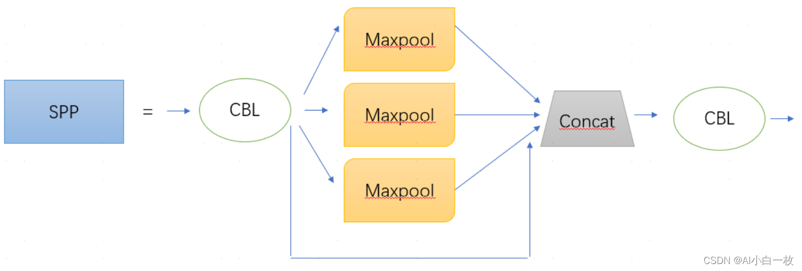
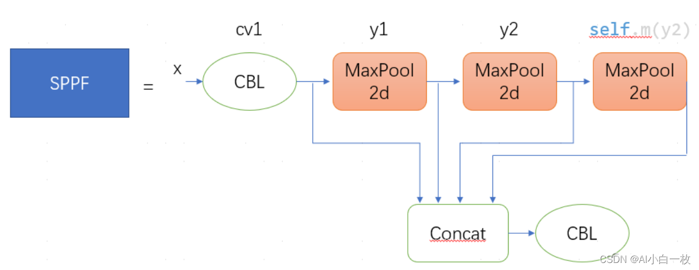

## 1、YOLOv8模型结构

### Model structure of YOLOv8 detection models(P5) - yolov8n/s/m/l/x:


与YOLOv5相比的变化:

 - 将C3模块替换为C2f模块
 - 在Backbone中将第一个6x6 Conv替换为3x3 Conv
 - 删除两个Conv（YOLOv5配置中的第10和第14个）
 - 在Bottleneck中将第一个1x1 Conv替换为3x3 Conv
 - 使用解耦头并删除objectness分支

---


### 2、C2f
C2f（Cross Stage Partial Fusion，跨阶段部分融合）是 YOLOv8 中引入的一种改进的网络结构设计，它结合了 **CSP（Cross Stage Partial）** 和 **多分支融合** 的思想，旨在进一步提升特征提取的效率和模型的性能。C2f 结构在 YOLOv8 中被用于骨干网络（Backbone）和颈部网络（Neck），以增强特征的多尺度表达能力和信息流动。

下面我将详细讲解 **C2f 结构的设计思想、具体实现及其优势**。


### **2.1 C2f 的核心思想**

C2f 的核心思想是 **通过多分支结构和部分特征融合，增强特征的多样性和信息流动**。它结合了 CSP 的思想（特征图分割和部分连接）以及多分支融合的设计，能够更高效地提取和融合特征。

#### **C2f 的设计目标**
1. **减少计算量**：通过部分连接和多分支设计，降低模型的计算复杂度。
2. **增强特征复用**：通过多分支融合，增强特征的多样性和表达能力。
3. **提升信息流动**：通过跨阶段连接，缓解梯度消失问题，使模型更容易训练。


### **2.2 C2f 的结构设计**

C2f 的结构设计可以分为以下几个关键步骤：

#### **1. 特征图分割**
- 将输入特征图 $X$ 沿着通道维度分割为两部分：
  $$
  X = [X_1, X_2]
  $$
  其中，$X_1$ 和 $X_2$ 分别占输入特征图的一半通道数。

#### **2. 多分支处理**
- 对 $X_1$ 进行多分支的卷积操作（如多个卷积层或残差块），生成多个中间特征图。
- 每个分支可以有不同的感受野或特征提取能力，从而增强特征的多样性。

#### **3. 部分连接**
- 对 $X_2$ 直接跳过密集的卷积操作，保持不变。

#### **4. 特征融合**
- 将多分支处理后的特征图与 $X_2$ 进行融合（如拼接或逐元素相加），生成最终的特征图 $X'$。

#### **5. 跨阶段连接**
- 将融合后的特征图传递到下一阶段，并通过跨阶段连接进一步增强信息流动。


### **2.3 C2f 在 YOLOv8 中的应用**

在 YOLOv8 中，C2f 结构被用于骨干网络（Backbone）和颈部网络（Neck），以提升特征提取和融合的效率。具体实现如下：

#### **骨干网络中的 C2f**
- 在骨干网络中，C2f 模块用于替代传统的 CSP 模块，通过多分支设计和部分融合，增强特征的多样性和表达能力。
- 例如，在 YOLOv8 的 CSPDarknet 中，C2f 模块被用于提取多尺度特征。

#### **颈部网络中的 C2f**
- 在颈部网络中，C2f 模块用于多尺度特征融合，结合自顶向下和自底向上的路径，增强模型对不同尺度目标的检测能力。


### **2.4 C2f 的优势**

C2f 的设计带来了以下优势：

#### **1. 减少计算量**
- 通过部分连接和多分支设计，显著降低了模型的计算复杂度。
- 在保持性能的同时，提升了模型的推理速度。

#### **2. 增强特征复用**
- 通过多分支融合，增强了特征的多样性和表达能力。
- 能够更好地捕捉目标的细节和语义信息。

#### **3. 提升信息流动**
- 通过跨阶段连接，缓解了梯度消失问题，使模型更容易训练。
- 特别适合深层网络的设计。

#### **4. 提高模型性能**
- 在目标检测任务中，C2f 结构能够显著提升模型的检测精度，特别是在小目标和复杂场景中。


### **2.5 C2f 的具体实现示例**

以下是一个简化的 C2f 模块的实现示例（伪代码）：

```python
class C2f(nn.Module):
    def __init__(self, in_channels, out_channels, num_branches):
        super(C2f, self).__init__()
        self.split_channels = in_channels // 2
        self.branches = nn.ModuleList([
            nn.Sequential(
                nn.Conv2d(self.split_channels, self.split_channels, kernel_size=3, padding=1),
                nn.BatchNorm2d(self.split_channels),
                nn.ReLU()
            ) for _ in range(num_branches)
        ])
        self.fusion = nn.Conv2d(in_channels, out_channels, kernel_size=1)

    def forward(self, x):
        # 特征图分割
        x1, x2 = torch.split(x, self.split_channels, dim=1)
        
        # 多分支处理
        branch_outputs = [branch(x1) for branch in self.branches]
        x1 = torch.cat(branch_outputs, dim=1)
        
        # 特征融合
        x = torch.cat([x1, x2], dim=1)
        x = self.fusion(x)
        
        return x
```

YOLOv8中C2f的Pytorch实际实现:
```python
class BottleneckC2f(nn.Module):
    # Standard bottleneck
    def __init__(self, c1, c2, shortcut=True, g=1, k=(3, 3), e=0.5):  # ch_in, ch_out, shortcut, kernels, groups, expand
        super().__init__()
        c_ = int(c2 * e)  # hidden channels
        self.cv1 = Conv(c1, c_, k[0], 1)
        self.cv2 = Conv(c_, c2, k[1], 1, g=g)
        self.add = shortcut and c1 == c2
 
    def forward(self, x):
        return x + self.cv2(self.cv1(x)) if self.add else self.cv2(self.cv1(x))

class C2f(nn.Module):
    # CSP Bottleneck with 2 convolutions
    def __init__(self, c1, c2, n=1, shortcut=False, g=1, e=0.5):  # ch_in, ch_out, number, shortcut, groups, expansion
        super().__init__()
        self.c = int(c2 * e)  # hidden channels
        self.cv1 = Conv(c1, 2 * self.c, 1, 1)
        self.cv2 = Conv((2 + n) * self.c, c2, 1)  # optional act=FReLU(c2)
        self.m = nn.ModuleList(Bottleneck(self.c, self.c, shortcut, g, k=((3, 3), (3, 3)), e=1.0) for _ in range(n))
 
    def forward(self, x):
        y = list(self.cv1(x).split((self.c, self.c), 1))
        y.extend(m(y[-1]) for m in self.m)
        return self.cv2(torch.cat(y, 1))
```
### **2.6 总结**

C2f 是 YOLOv8 中引入的一种改进的网络结构设计，它结合了 CSP 和多分支融合的思想，通过 **特征图分割、多分支处理和部分融合**，显著提升了特征提取的效率和模型的性能。C2f 结构在骨干网络和颈部网络中的应用，使得 YOLOv8 在目标检测任务中表现出色，特别是在小目标检测和复杂场景中。


---

## 3、SPPF
SPPF（Spatial Pyramid Pooling - Fast）是 YOLOv5 和 YOLOv8 中引入的一种改进的空间金字塔池化结构，用于增强模型对多尺度目标的检测能力。SPPF 是对 SPP（Spatial Pyramid Pooling）的优化版本，旨在保持 SPP 的多尺度特征提取能力的同时，显著减少计算量并提升推理速度。




 - SPPF替换SPP，二者效果一致，但前者较后者的执行时间减少至1/2

### **3.1 SPPF 的核心思想**

SPPF 的核心思想是通过 **多尺度池化操作** 提取不同尺度的特征，并将这些特征融合起来，从而增强模型对多尺度目标的检测能力。与传统的 SPP 相比，SPPF 通过 **重复使用池化层** 来减少计算量，同时保持多尺度特征提取的效果。

#### **SPPF 的设计目标**
1. **多尺度特征提取**：通过不同大小的池化核提取不同尺度的特征。
2. **减少计算量**：通过重复使用池化层，减少参数量和计算量。
3. **提升推理速度**：优化结构设计，使模型在保持性能的同时更快地推理。


### **3.2 SPPF 的结构设计**

SPPF 的结构设计可以分为以下几个关键步骤：

#### **1. 输入特征图**
- 假设输入特征图的尺寸为 $C \times H \times W$ ，其中 $C$ 是通道数，$H$ 和 $W$ 分别是高度和宽度。

#### **2. 多尺度池化**
- SPPF 使用多个不同大小的池化核（如 $5 \times 5$ 、$9 \times 9$ 、$13 \times 13$ ）对输入特征图进行池化操作。
- 与传统的 SPP 不同，SPPF 通过 **重复使用池化层** 来实现多尺度池化。例如：
  - 首先使用 $5 \times 5$ 的池化核进行池化。
  - 然后对池化结果再次使用 $5 \times 5$ 的池化核，等效于 $9 \times 9$ 的池化效果。
  - 最后对第二次池化结果再次使用 $5 \times 5$ 的池化核，等效于 $13 \times 13$ 的池化效果。

#### **3. 特征拼接**
- 将原始输入特征图与多尺度池化后的特征图在通道维度上拼接起来，生成最终的特征图。

#### **4. 卷积操作**
- 对拼接后的特征图进行卷积操作，进一步融合多尺度特征。


### **3.3 SPPF 的具体实现**

以下是一个简化的 SPPF 模块的实现示例（伪代码）：

```python
import torch
import torch.nn as nn

class SPPF(nn.Module):
    def __init__(self, in_channels, out_channels, pool_sizes=[5, 9, 13]):
        super(SPPF, self).__init__()
        self.pool_layers = nn.ModuleList([
            nn.MaxPool2d(kernel_size=pool_size, stride=1, padding=pool_size // 2)
            for pool_size in pool_sizes
        ])
        self.conv = nn.Conv2d(in_channels * (len(pool_sizes) + 1), out_channels, kernel_size=1)

    def forward(self, x):
        # 多尺度池化
        pool_outputs = [x]
        for pool_layer in self.pool_layers:
            x_pool = pool_layer(x)
            pool_outputs.append(x_pool)
        
        # 特征拼接
        x = torch.cat(pool_outputs, dim=1)
        
        # 卷积操作
        x = self.conv(x)
        
        return x
```


### **3.4 SPPF 的作用**

SPPF 的主要作用是通过多尺度池化操作提取不同尺度的特征，并将这些特征融合起来，从而增强模型对多尺度目标的检测能力。具体作用包括：

#### **1. 多尺度特征提取**
- 通过不同大小的池化核提取不同尺度的特征，使模型能够更好地适应不同大小的目标。

#### **2. 增强特征表达能力**
- 将多尺度特征拼接起来，增强了特征的多样性和表达能力。

#### **3. 提升检测精度**
- 在多尺度目标的检测任务中，SPPF 能够显著提升模型的检测精度，特别是在小目标和大目标的检测中表现优异。

#### **4. 减少计算量**
- 通过重复使用池化层，减少了参数量和计算量，提升了模型的推理速度。


### **3.5 SPPF 的优势**

与传统的 SPP 相比，SPPF 具有以下优势：

#### **1. 计算效率更高**
- SPPF 通过重复使用池化层，减少了计算量，同时保持了多尺度特征提取的效果。

#### **2. 推理速度更快**
- SPPF 的结构设计更加高效，适合实时目标检测任务。

#### **3. 性能更优**
- 在目标检测任务中，SPPF 能够显著提升模型的检测精度，特别是在小目标和复杂场景中。


### **3.6 SPPF 在 YOLO 中的应用**

在 YOLOv5 和 YOLOv8 中，SPPF 被用于骨干网络（Backbone）和颈部网络（Neck），以增强多尺度特征的提取和融合能力。具体应用包括：

#### **骨干网络中的 SPPF**
- 在骨干网络的最后一层，使用 SPPF 模块提取多尺度特征，增强模型对不同大小目标的检测能力。

#### **颈部网络中的 SPPF**
- 在颈部网络中，使用 SPPF 模块融合多尺度特征，进一步提升模型的检测精度。


### **3.7 总结**

SPPF 是 YOLOv5 和 YOLOv8 中引入的一种改进的空间金字塔池化结构，通过 **多尺度池化和特征融合**，显著提升了模型对多尺度目标的检测能力。与传统的 SPP 相比，SPPF 具有更高的计算效率和推理速度，同时保持了优异的性能。


---

## 4、BottleNeck
在 YOLOv8 中，**BottleNeck** 结构被广泛应用于骨干网络（Backbone）和颈部网络（Neck）中，用于 **减少计算量** 和 **提升特征表达能力**。YOLOv8 中的 BottleNeck 结构通常与 **CSP（Cross Stage Partial）** 和 **C2f（Cross Stage Partial Fusion）** 模块结合使用，以进一步优化模型的性能。


### **4.1 BottleNeck 在 YOLOv8 中的使用场景**

在 YOLOv8 中，BottleNeck 结构主要用于以下两个部分：

#### **1. 骨干网络（Backbone）**
- 在骨干网络中，BottleNeck 被用于提取多层次特征。通过减少计算量和参数量，BottleNeck 能够在不损失性能的情况下，提升特征提取的效率。
- 例如，在 CSPDarknet 中，BottleNeck 被嵌入到 CSP 模块中，用于构建高效的残差块。

#### **2. 颈部网络（Neck）**
- 在颈部网络中，BottleNeck 被用于多尺度特征融合。通过减少特征图的通道数，BottleNeck 能够降低计算量，同时保持特征的表达能力。
- 例如，在 PANet（Path Aggregation Network）中，BottleNeck 被用于连接不同尺度的特征图。


### **4.2 BottleNeck 在 YOLOv8 中的具体实现**

YOLOv8 中的 BottleNeck 结构通常与 **CSP** 和 **C2f** 模块结合使用。以下是具体的实现方式：

#### **1. CSP 中的 BottleNeck**
在 CSP 模块中，BottleNeck 被用于处理部分特征图。具体步骤如下：
1. **特征图分割**：
   - 将输入特征图 $X$ 沿着通道维度分割为两部分：$X_1$ 和 $X_2$。
2. **BottleNeck 处理**：
   - 对 $X_1$ 进行 BottleNeck 操作，包括：
     - $1 \times 1$ 卷积降维。
     - $3 \times 3$ 卷积特征提取。
     - $1 \times 1$ 卷积升维。
3. **特征融合**：
   - 将 BottleNeck 处理后的 $X_1$ 与未处理的 $X_2$ 拼接起来，生成最终的特征图。

#### **2. C2f 中的 BottleNeck**
在 C2f 模块中，BottleNeck 被用于多分支特征提取。具体步骤如下：
1. **特征图分割**：
   - 将输入特征图 $X$ 沿着通道维度分割为两部分：$X_1$ 和 $X_2$。
2. **多分支 BottleNeck**：
   - 对 $X_1$ 进行多个 BottleNeck 操作，生成多个中间特征图。
   - 每个分支可以有不同的感受野或特征提取能力，从而增强特征的多样性。
3. **特征融合**：
   - 将多分支 BottleNeck 处理后的特征图与 $X_2$ 拼接起来，生成最终的特征图。

---

### **4.3 BottleNeck 在 YOLOv8 中的作用**

BottleNeck 在 YOLOv8 中的作用主要包括：

#### **1. 减少计算量**
- 通过 $1 \times 1$ 卷积降维，显著减少了 $3 \times 3$ 卷积的计算量。
- 在深层网络中，这种设计能够大幅降低模型的计算复杂度。

#### **2. 提升特征表达能力**
- 在低维空间中进行特征提取，能够更高效地捕捉重要的特征信息。
- 通过多分支设计和特征融合，进一步增强了特征的表达能力。

#### **3. 优化多尺度特征融合**
- 在颈部网络中，BottleNeck 被用于多尺度特征融合，增强了模型对不同尺度目标的检测能力。

#### **4. 缓解梯度消失问题**
- 在深层网络中，BottleNeck 通常与残差连接结合使用，能够缓解梯度消失问题，使模型更容易训练。


### **4.4 BottleNeck 在 YOLOv8 中的优势**

与传统的卷积层相比，BottleNeck 在 YOLOv8 中具有以下优势：

#### **1. 计算效率更高**
- 通过降维和升维的设计，显著减少了计算量，提升了模型的推理速度。

#### **2. 参数量更少**
- 减少了模型的参数量，降低了过拟合的风险。

#### **3. 性能更优**
- 在目标检测任务中，BottleNeck 能够显著提升模型的检测精度，特别是在小目标和复杂场景中。


### **4.5 具体实现示例**

以下是一个简化的 BottleNeck 模块在 YOLOv8 中的实现示例（伪代码）：

```python
import torch
import torch.nn as nn

class BottleNeck(nn.Module):
    def __init__(self, in_channels, out_channels, reduction=4):
        super(BottleNeck, self).__init__()
        mid_channels = out_channels // reduction
        
        # 1x1 卷积（降维）
        self.conv1 = nn.Conv2d(in_channels, mid_channels, kernel_size=1, stride=1, padding=0)
        self.bn1 = nn.BatchNorm2d(mid_channels)
        self.relu = nn.ReLU(inplace=True)
        
        # 3x3 卷积（特征提取）
        self.conv2 = nn.Conv2d(mid_channels, mid_channels, kernel_size=3, stride=1, padding=1)
        self.bn2 = nn.BatchNorm2d(mid_channels)
        
        # 1x1 卷积（升维）
        self.conv3 = nn.Conv2d(mid_channels, out_channels, kernel_size=1, stride=1, padding=0)
        self.bn3 = nn.BatchNorm2d(out_channels)
        
        # 残差连接
        self.downsample = None
        if in_channels != out_channels:
            self.downsample = nn.Sequential(
                nn.Conv2d(in_channels, out_channels, kernel_size=1, stride=1, padding=0),
                nn.BatchNorm2d(out_channels)
            )

    def forward(self, x):
        identity = x
        
        # 1x1 卷积（降维）
        out = self.conv1(x)
        out = self.bn1(out)
        out = self.relu(out)
        
        # 3x3 卷积（特征提取）
        out = self.conv2(out)
        out = self.bn2(out)
        out = self.relu(out)
        
        # 1x1 卷积（升维）
        out = self.conv3(out)
        out = self.bn3(out)
        
        # 残差连接
        if self.downsample is not None:
            identity = self.downsample(x)
        out += identity
        out = self.relu(out)
        
        return out
```


### **4.6 总结**

在 YOLOv8 中，BottleNeck 结构通过与 **CSP** 和 **C2f** 模块结合使用，显著提升了模型的效率和性能。它在骨干网络和颈部网络中的应用，使得 YOLOv8 在目标检测任务中表现出色，特别是在小目标检测和复杂场景中。


## 5、YOLOv8自定义的Conv类


### **5.1 代码举例**
`self.cv2 = Conv(c_, c2, k[1], 1, g=g)` 是 YOLOv8 中定义卷积层的一行代码。为了更好地理解这行代码的含义，我们需要分解它的各个参数及其作用。以下是对这行代码的详细解析：

```python
self.cv2 = Conv(c_, c2, k[1], 1, g=g)
```

这行代码定义了一个卷积层 `self.cv2`，使用了 `Conv` 类（通常是 YOLOv8 中自定义的卷积模块）。以下是各个参数的含义：

#### **1. `c_`**
- **含义**：输入特征图的通道数（`in_channels`）。
- **作用**：指定卷积层输入特征图的通道数。

#### **2. `c2`**
- **含义**：输出特征图的通道数（`out_channels`）。
- **作用**：指定卷积层输出特征图的通道数。

#### **3. `k[1]`**
- **含义**：卷积核的大小（`kernel_size`）。
- **作用**：指定卷积核的尺寸。`k[1]` 表示从列表或元组 `k` 中取第二个元素（索引为 1）作为卷积核大小。
- **示例**：如果 `k = [3, 5, 7]`，那么 `k[1]` 的值是 `5`，表示使用 `5x5` 的卷积核。

#### **4. `1`**
- **含义**：卷积的步幅（`stride`）。
- **作用**：指定卷积操作的步幅。这里步幅为 `1`，表示卷积核每次移动 1 个像素。

#### **5. `g=g`**
- **含义**：分组卷积的组数（`groups`）。
- **作用**：指定分组卷积的组数。`g` 是一个变量，表示将输入特征图和输出特征图分成 `g` 组，每组独立进行卷积操作。
  - 如果 `g=1`，表示普通卷积。
  - 如果 `g>1`，表示分组卷积（Group Convolution），可以减少参数量和计算量。
  - 如果 `g=c_` 且 `c_=c2`，表示深度可分离卷积（Depthwise Convolution）。


### **5.2 `Conv` 类的实现**

在 YOLOv8 中，`Conv` 类通常是一个自定义的卷积模块，可能包含卷积层、批归一化（Batch Normalization）和激活函数（如 SiLU 或 ReLU）。以下是一个典型的 `Conv` 类的实现示例：

```python
import torch
import torch.nn as nn

class Conv(nn.Module):
    def __init__(self, in_channels, out_channels, kernel_size, stride=1, groups=1):
        super(Conv, self).__init__()
        padding = kernel_size // 2  # 自动计算 padding，保持输出尺寸不变
        self.conv = nn.Conv2d(
            in_channels,
            out_channels,
            kernel_size=kernel_size,
            stride=stride,
            padding=padding,
            groups=groups,
            bias=False  # 通常与 BatchNorm 一起使用，bias 设置为 False
        )
        self.bn = nn.BatchNorm2d(out_channels)
        self.act = nn.SiLU()  # YOLOv8 中常用的激活函数

    def forward(self, x):
        x = self.conv(x)
        x = self.bn(x)
        x = self.act(x)
        return x
```

#### **`Conv` 类的作用**
- **卷积操作**：使用指定大小的卷积核提取特征。
- **批归一化**：加速训练并提高模型的稳定性。
- **激活函数**：引入非线性，增强模型的表达能力。


### **5.3 代码的作用**

`self.cv2 = Conv(c_, c2, k[1], 1, g=g)` 的作用是定义一个卷积层，用于对输入特征图进行特征提取。具体来说：
1. **输入特征图**：通道数为 `c_`。
2. **输出特征图**：通道数为 `c2`。
3. **卷积核大小**：由 `k[1]` 决定（例如 `5x5`）。
4. **步幅**：为 `1`，表示输出特征图的空间尺寸与输入相同（假设 `padding` 设置为 `kernel_size // 2`）。
5. **分组卷积**：组数为 `g`，用于减少参数量和计算量。


### **5.4 示例**

假设有以下参数：
- `c_ = 64`（输入通道数）。
- `c2 = 128`（输出通道数）。
- `k = [3, 5, 7]`（卷积核大小列表）。
- `g = 4`（分组卷积的组数）。

那么 `self.cv2 = Conv(c_, c2, k[1], 1, g=g)` 的具体含义是：
- 定义一个卷积层，输入通道数为 `64`，输出通道数为 `128`。
- 使用 `5x5` 的卷积核（因为 `k[1] = 5`）。
- 步幅为 `1`，输出特征图的空间尺寸与输入相同。
- 使用分组卷积，组数为 `4`。


### **5.5 总结**

`self.cv2 = Conv(c_, c2, k[1], 1, g=g)` 是 YOLOv8 中定义卷积层的一行代码，其作用是：
1. 对输入特征图进行卷积操作。
2. 使用指定大小的卷积核和分组卷积，提取特征并减少计算量。
3. 输出特征图的通道数为 `c2`，空间尺寸与输入相同。

如果你对这行代码的具体实现或参数选择有更多问题，欢迎继续提问！


