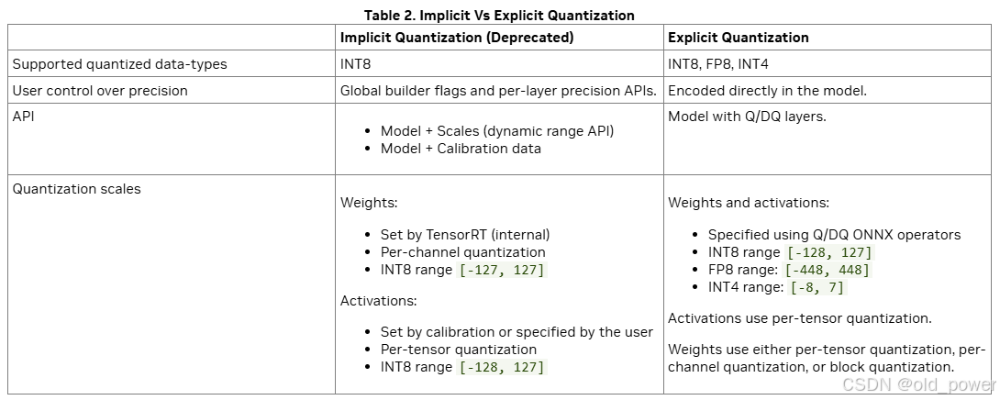

# TensorRT 显示量化和隐式量化的区别（Explicit vs Implicit Quantization）

 - 注意：隐式量化已被弃用。建议使用 TensorRT 的量化工具包来创建具有显式量化的模型。

量化网络可以通过两种（互斥的）方式进行处理：使用隐式量化或显式量化。这两种处理模式的主要区别在于是否需要显式控制量化，或者让 TensorRT 构建器选择哪些操作和张量进行量化（隐式）。以下部分提供了更多详细信息。隐式量化仅在量化到 INT8 时受支持。它不能与强类型一起使用（因为类型不会自动调整，唯一将激活值转换为 INT8 或从 INT8 转换回的方法是通过量化（Q）和反量化（DQ）操作符）。

当网络包含 QuantizeLayer 和 DequantizeLayer 层时，TensorRT 使用显式量化模式。当网络中没有 QuantizeLayer 或 DequantizeLayer 层，并且在构建器配置中启用了 INT8 时，TensorRT 使用隐式量化模式。隐式量化模式仅支持 INT8。

在隐式量化的网络中，每个候选量化的激活张量都有一个通过校准过程推导出的或通过 API 函数 `setDynamicRange` 分配的关联比例因子。如果 TensorRT 决定量化该张量，它将使用此比例因子。

在处理隐式量化的网络时，TensorRT 在应用图优化时将模型视为浮点模型，并在优化层执行时间时机会性地使用 INT8。如果一个层在 INT8 下运行得更快，并且其数据输入和输出已分配量化比例因子，则该层将分配一个 INT8 精度的内核。否则，将分配一个高精度浮点（FP32、FP16 或 BF16）内核。在需要高精度浮点以确保精度而牺牲性能的情况下，可以使用 API `Layer::setOutputType` 和 `Layer::setPrecision` 来指定。

在显式量化的网络中，量化和反量化操作由图中的 IQuantizeLayer（C++，Python）和 IDequantizeLayer（C++，Python）节点显式表示——这些节点将被称为 Q/DQ 节点。与隐式量化相比，显式量化明确指定了在何处执行到量化类型的转换以及从量化类型转换回的操作，优化器将仅执行由模型语义决定的到量化类型和从量化类型转换的操作，即使：
- 添加额外的转换可能会增加层的精度（例如，选择 FP16 内核实现而不是量化类型实现）。
- 添加或删除转换会生成更快的引擎（例如，选择量化类型内核实现来执行指定为高精度的层，反之亦然）。

ONNX 使用显式量化表示：当 PyTorch 或 TensorFlow 中的模型导出到 ONNX 时，框架图中的每个伪量化操作都会导出为 Q，后跟 DQ。由于 TensorRT 保留了这些层的语义，用户可以期望精度与框架中看到的非常接近。虽然优化保留了量化和反量化操作符的算术语义，但它们可能会改变模型中浮点操作的顺序，因此结果不会在比特级别上完全相同。

TensorRT 的 PTQ 功能生成带有隐式量化的校准缓存。相比之下，在深度学习框架中执行 QAT 或 PTQ 然后导出到 ONNX 将生成显式量化的模型。

相比之下，在深度学习框架中执行 QAT 或 PTQ 然后导出到 ONNX 将生成显式量化的模型。

