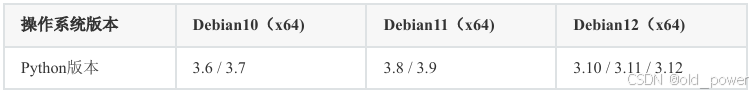
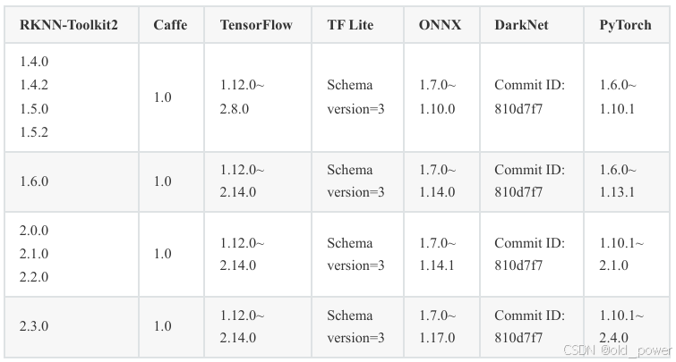
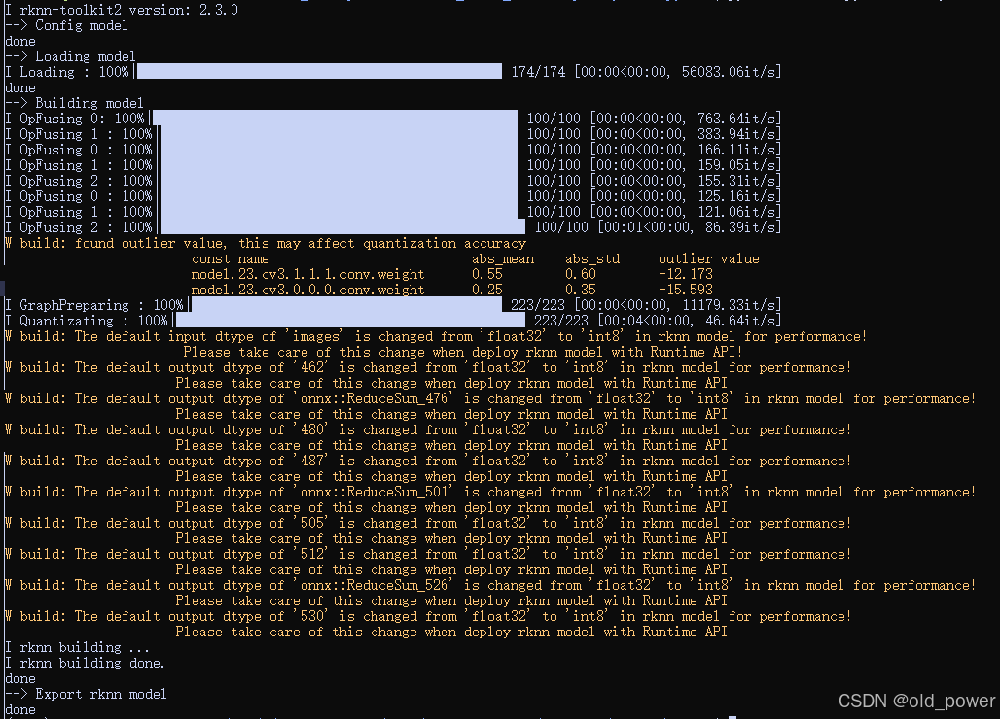
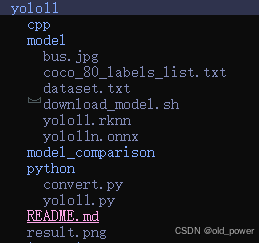
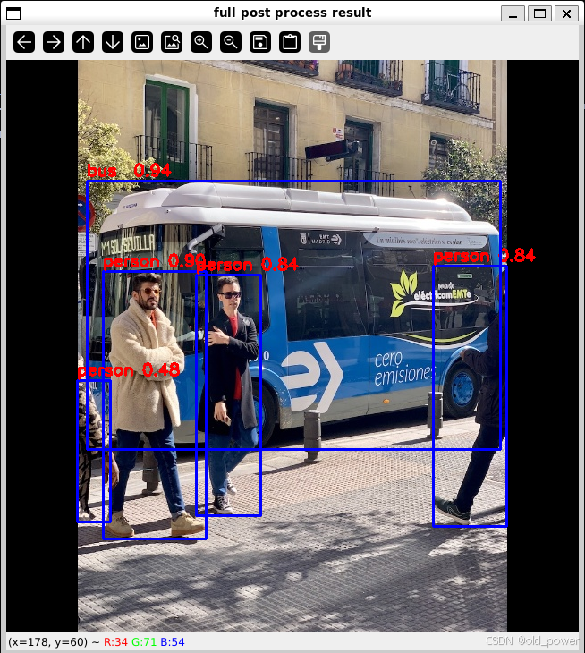
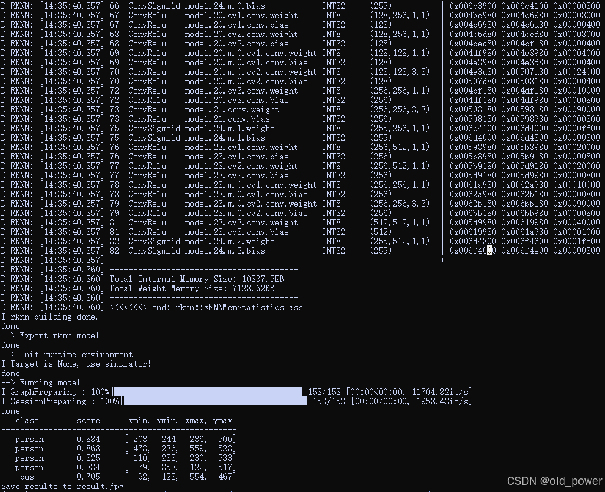
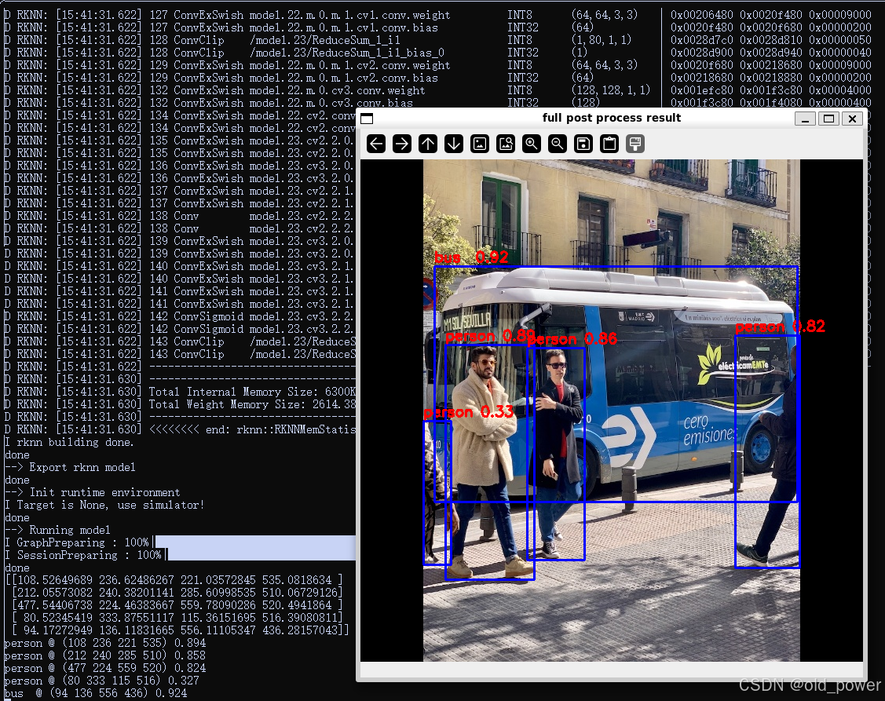

# 使用瑞芯微RK3588的NPU进行模型转换和推理

**使用边缘设备进行算法落地时，通常要考虑模型推理速度，NVIDA系列平台可以使用TensorRT和CUDA加速，瑞芯微RK3588的板子上都是Arm的手机GPU，虽然没有类似CUDA的加速计算方式，但是提供了NPU进行加速推理，本文说明了如何使用瑞芯微RK3588的NPU进行模型转换和推理**
## 一、简介
`RK3588`内置`NPU`模块, 处理性能最高可达`6TOPS`。使用该NPU需要下载RKNN SDK，RKNN SDK为带有 NPU 的RK3588S/RK3588 芯片平台提供编程接口，能够帮助用户部署使用 RKNN-Toolkit2导出RKNN模型，加速AI应用的落地。


`RKNN-Toolkit2`是为用户提供在 PC、 Rockchip NPU 平台上进行模型转换、推理和性能评估的开发套件,用户通过该工具提供的Python接口可以便捷地完成以下功能:

🏆**模型转换**：支持 Caffe、TensorFlow、TensorFlow Lite、ONNX、DarkNet、PyTorch 等模型转为 RKNN 模型，并支持 RKNN 模型导入导出，RKNN 模型能够在Rockchip NPU 平台上加载使用。
🎽**量化功能**：支持将浮点模型量化为定点模型，目前支持的量化方法为非对称量化，并支持 混合量化功能 。
🎯**模型推理**：能够在 PC上模拟Rockchip NPU运行RKNN模型并获取推理结果；或将RKNN模型分发到指定的NPU设备上进行推理并获取推理结果。
🏋**性能和内存评估**：将 RKNN 模型分发到指定NPU设备上运行，以评估模型在实际设备上运行时的性能和内存占用情况。
🎼**量化精度分析**：该功能将给出模型量化前后每一层推理结果与浮点模型推理结果的余弦距离，以便于分析量化误差是如何出现的，为提高量化模型的精度提供思路。

## 二、准备工作
### 2.1 适用芯片
RKNN-Toolkit2当前版本所支持芯片的型号如下：
 - RV1103
 - RV1103B
 - RV1106
 - RV1106B
 - RK2118
 - RK3562
 - RK3566系列
 - RK3568系列
 - RK3576系列
 - `RK3588系列`
### 2.2 系统依赖说明
**使用RKNN-Toolkit2时需要满足以下运行环境要求：**


**ARM64版本运行环境要求，ARM64版本仅支持PyTorch和ONNX框架，其他框架暂时不支持：**



**RKNN-Toolkit2和各深度学习框架的版本对应关系如下：**



## 三、创建环境
因为尝试将`yolo11`的`onnx`模型转成`RKNN-Toolkit2`的`rknn`模型，根据版本对应关系，ONNX版本越高支持的算子种类越多，所以选择`onnx==1.17.0`对应的`RKNN-Tollkit2==2.3.0`版本。
### 3.1 下载RKNN相关库
建议新建一个目录用来存放RKNN仓库，例如新建一个名称为rknn的文件夹，并将`RKNN-Toolkit2`和`RKNN Model Zoo`仓库存放至该目录下，参考命令如下：
```bash
# 新建 Projects 文件夹 
mkdir rknn
 # 进入该目录
cd rknn
 # 下载 RKNN-Toolkit2 仓库
git clone https://github.com/airockchip/rknn-toolkit2.git --depth 1
 # 下载 RKNN Model Zoo 仓库
git clone https://github.com/airockchip/rknn_model_zoo.git --depth 1
# 注意：
# 1.参数 --depth 1 表示只克隆最近一次 commit 
# 2.如果遇到 git clone 失败的情况，也可以直接在 github 中下载压缩包到本地，然后解压至该目录
```
整体目录结构如下：

```bash
Projects
 ├── rknn-toolkit2
 │   ├── doc
 │   ├── rknn-toolkit2
 │   │   ├── packages
 │   │   ├── docker
 │   │   └── ...
 │   ├── rknpu2
 │   │   ├── runtime
 │   │   └── ...
 │   └── ...
 └── rknn_model_zoo
 ├── datasets
 ├── examples
 └── ...
```
### 3.2 安装`RKNN-Toolkit2`环境
使用conda创建虚拟python环境，通过pip源安装：

```bash
# 创建名称为rknn的python环境
conda create -n rknn python=3.10
# 激活环境
conda activate rknn

pip install rknn-toolkit2 -i https://pypi.org/simple
# 如果已安装 RKNN-Toolkit2，可通过以下命令升级 RKNN-Toolkit2
pip install rknn-toolkit2 -i https://pypi.org/simple --upgrade

# 验证是否安装成功，若没有报错，则代表 RKNN-Toolkit2 环境安装成功
# 进入 Python 交互模式
python
# 导入 RKNN 类 
from rknn.api import RKNN 
```
---
### 注：WSL中使用RKNN-ToolKit2注意事项
1. 推荐安装 WSL2，Ubuntu版本号为22.04 已验证可行(其余版本未验证，理论可行)
2. 在WSL使用RKNN-ToolKit2中若出现 "ImportError: libGL.so.1: cannot open shared object file: No such file or directory"，请执行以下代码解决
```
1. 安装对应库
sudo apt update
sudo apt install libgl1-mesa-glx

2. 设置环境变量
echo 'export LD_LIBRARY_PATH=/usr/lib/x86_64-linux-gnu/mesa' >> ~/.bashrc
source ~/.bashrc
```
---

## 四、模型转换
### 4.1. 准备模型

下载链接: 

[./yolo11n.onnx](https://ftrg.zbox.filez.com/v2/delivery/data/95f00b0fc900458ba134f8b180b3f7a1/examples/yolo11/yolo11n.onnx)<br />[./yolo11s.onnx](https://ftrg.zbox.filez.com/v2/delivery/data/95f00b0fc900458ba134f8b180b3f7a1/examples/yolo11/yolo11s.onnx)<br />[./yolo11m.onnx](https://ftrg.zbox.filez.com/v2/delivery/data/95f00b0fc900458ba134f8b180b3f7a1/examples/yolo11/yolo11m.onnx)

或者从bash脚本下载:
```
cd cd rknn/rknn_model_zoo/examples/yolo11/model
./download_model.sh
```

### 4.2 转换到RKNN

```bash
cd rknn/rknn_model_zoo/examples/yolo11/python
# python convert.py <onnx_model> <TARGET_PLATFORM> <dtype(optional)> <output_rknn_path(optional)>
# such as: 
python convert.py ../model/yolo11n.onnx rk3588
# output model will be saved as ../model/yolo11.rknn
```
*参数说明:*

- `<onnx_model>`: 指定ONNX模型路径。
- `<TARGET_PLATFORM>`: 指定NPU平台名称。如“rk3588”。
- `<dtype>(optional)`: 指定为`i8 `，` u8 `或`fp`。`i8` / `u8`表示进行量化，`fp`表示不进行量化。默认为`i8` / `u8`。
- `<output_rknn_path>(optional)`: 指定RKNN模型的保存路径，默认保存在与ONNX模型相同的目录中，名称为`yolo11.rknn`。






## 五、模型推理
### 5.1 使用ONNX模型推理
```bash
cd rknn/rknn_model_zoo/examples/yolo11/python
python yolo11.py --model_path ../model/yolo11n.onnx --img_show
# 输出：
Model-../model/yolo11n.onnx is onnx model, starting val
infer 1/1

IMG: bus.jpg
person @ (108 236 223 535) 0.896
person @ (212 240 284 509) 0.844
person @ (477 230 559 521) 0.838
person @ (79 358 116 516) 0.485
bus  @ (90 135 552 435) 0.939


# 使用 PyTorch or ONNX 推理
# python yolo11.py --model_path <pt_model/onnx_model> --img_show
# 使用 RKNN model 推理
# python yolo11.py --model_path <rknn_model> --target <TARGET_PLATFORM> --img_show
```



*参数说明:*

- `<TARGET_PLATFORM>`: 指定NPU平台名称。如“rk3588”。

- `<pt_model / onnx_model / rknn_model>`: 指定模型路径。

### 5.2 使用RKNN模型推理（yolo5、模拟仿真）

RKNN-Toolkit2自带了一个模拟器，可以用来仿真模型在NPU上运行时的行为。就相当于Android Studio自带模拟器一样。那么真机就相当于开发板。RK3588目前只支持模拟仿真，还不支持连板调试，在真机上会报错显示rknn server版本过低，等后面官方更新好就可以连板推理了。

在路径`rknn/rknn-toolkit2/rknn-toolkit2/examples/onnx/yolov5`下，有yolov5的完整案例：创建RKNN对象、模型配置、加载onnx模型、构建RKNN模型、导出RKNN模型、加载图片并推理、得到推理结果、释放 RKNN 对象。

```bash
cd rknn/rknn-toolkit2/rknn-toolkit2/examples/onnx/yolov5
python test.py

# 模型转换推理结果在当前路径下: yolov5s_relu.rknn、result.jpg
ls
README.md  check0_base_optimize.onnx  dataset.txt       onnx_yolov5_0.npy  onnx_yolov5_2.npy  result_truth.jpg  yolov5s_relu.onnx
bus.jpg    check2_correct_ops.onnx    model_config.yml  onnx_yolov5_1.npy  result.jpg         test.py           yolov5s_relu.rknn
```


### 5.3 使用RKNN模型推理（yolo11、模拟仿真）
参考yolo5的RKNN模型推理实现`rknn/rknn-toolkit2/rknn-toolkit2/examples/onnx/yolov5/test.py`，将该python文件复制到`rknn/rknn_model_zoo/examples/yolo11/python/test.py`，并结合`rknn/rknn_model_zoo/examples/yolo11/python/yolo11.py`文件，经过修改代码中超参数、模型加载、后处理等部分的代码，实现RKNN-Toolkit2模拟仿真环境下的`yolo11`的RKNN模型推理。

```bash
cd rknn/rknn_model_zoo/examples/yolo11/python
python test.py
```



需要注意的是，如果不做前后处理，只需用修改模型加载的参数即可，RKNN模型可以推理成功，只不过会提示后处理部分报错等，参考代码：

```python
#...超参数
ONNX_MODEL = '../model/yolo11n.onnx'
RKNN_MODEL = '../model/yolo11n.rknn'
IMG_PATH = '../model/bus.jpg'
DATASET = '../model/dataset.txt'
#...
IMG_SIZE_YOLO11 = (640, 640)  # (width, height), such as (1280, 736)
#...


#... 
#前处理
import yolo11
co_helper = yolo11.COCO_test_helper(enable_letter_box=True)
pad_color = (0,0,0)
img = co_helper.letter_box(im= img.copy(), new_shape=(IMG_SIZE_YOLO11[1], IMG_SIZE_YOLO11[0]), pad_color=(0,0,0))
# img = cv2.cvtColor(img, cv2.COLOR_BGR2RGB)


#...
#后处理
boxes, classes, scores = yolo11.post_process(outputs)
img_p = img.copy()
if boxes is not None:
    yolo11.draw(img_p, co_helper.get_real_box(boxes), scores, classes)
cv2.imshow("full post process result", img_p)
cv2.waitKeyEx(0)
```


