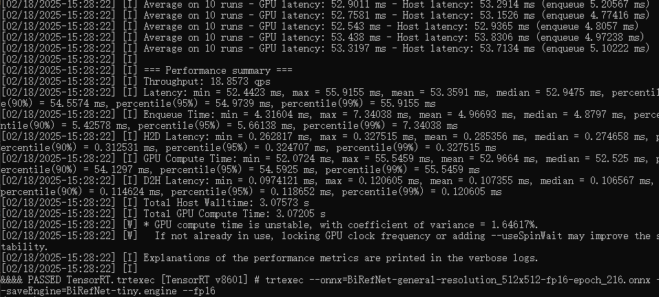

# BiRefNet C++ TensorRT （二分类图像分割）

利用`TensorRT`和`CUDA`的双边参考网络（`BiRefNet`）的高性能`c++`实现，针对实时高分辨率二分类图像分割进行了优化。


---

**BiRefNet c++ TENSORRT**旨在有效地在GPU上运行双边参考分割任务。通过利用TensorRT的优化和CUDA内核，它旨在以最小的延迟提供最先进的性能。


### 主要特性

- **TensorRT 加速**：使用序列化的 TRT 引擎加速分割任务的推理过程。  
- **CUDA 集成**：全面基于 GPU 的预处理、后处理及内存管理。  
- **高分辨率支持**：开箱即用，能够处理高分辨率图像（例如 1024x1024）。  
- **易于集成**：采用 C++17 编码，便于集成到现有的流程中。

---

## 📢 最新动态

- **增强的双边参考**：通过利用双重参考指导，提升二分法分割输出的质量。  
- **改进的内存占用**：针对大批次或高分辨率工作负载优化了 GPU 分配。  
- **可配置精度**：支持 **FP16** 或 **FP32** 模式（需要支持半精度的 GPU）。  


## 📂 项目结构
	BiRefNet/ 
 	├── include 
  	│ └── birefnet.h # Main BiRefNet class definition
   	├── src 
    │ └── birefnet.cpp # Implementation of the BiRefNet class
    ├── CMakeLists.txt # CMake configuration 
    └── main.cpp #

- **include/birefnet.h**  
  头文件，定义了 `BiRefNet` 类，该类负责 TensorRT 引擎的创建、执行和内存缓冲区管理。

- **src/birefnet.cpp**  
  源代码实现，包括加载序列化引擎、运行推理及处理输出后处理。

- **CMakeLists.txt**  
  使用 CMake 构建项目的配置文件。根据需要调整 TensorRT、CUDA 和 OpenCV 的路径。

- **main.cpp**  
  一个最小示例，演示了如何加载模型、对图像或视频进行推理并将结果保存。

## 🚀 安装步骤

1. **克隆仓库**

	```bash
	git clone https://github.com/hamdiboukamcha/BiRefNet-Cpp-TensorRT.git
	cd BiRefNet-Cpp-TensorRT
	mkdir build && cd build
	cmake ..
	make -j$(nproc)
	```

## 📦 依赖项

- **CUDA**  
  用于 GPU 加速和内核启动（例如，CUDA 11.x 或更新版本）。

- **TensorRT**  
  高性能深度学习推理库（推荐使用 v8.x 或更新版本）。

- **OpenCV**  
  用于图像加载、预处理和基本可视化。

- **C++17**  
  本项目使用现代 C++ 特性。请确保您的编译器支持 C++17 或更高版本。

## 🔍 代码概览

### 主要组件

- **BiRefNet 类**

  - 从给定的引擎/模型路径初始化 TensorRT 引擎。
  - 处理预处理（图像大小调整、均值/标准差归一化等）。
  - 运行推理并将输出后处理为分割图。
  - 管理 CUDA 资源和流。

- **Logger 类（在 main.cpp 中）**

  - 实现 TensorRT 的 ILogger 接口以进行自定义日志记录。

### 主要函数

- **BiRefNet::BiRefNet(...)**  
  构造函数，将 .trt（序列化的 TensorRT）引擎加载到内存中。

- **BiRefNet::predict(cv::Mat& image)**  
  主要推理函数：接受一个 OpenCV cv::Mat 作为输入，返回分割结果作为 cv::Mat。

- **BiRefNet::preprocess(...)**  
  将图像转换为归一化的浮点数（均值减法、除以标准差等）。

- **BiRefNet::postprocess(...)**  
  将原始输出重塑为有意义的图像数据，通常是一个 8 位或 32 位矩阵用于分割。

## 🎬 使用方法

准备TensorRT推理引擎：

1. 将模型转换为 ONNX 格式，然后构建一个 TensorRT 引擎（例如，使用 trtexec 或自定义构建工具）。[选择使用BiRefNet的预训练模型](https://github.com/ZhengPeng7/BiRefNet)。

    ```bash
	trtexec --onnx=BiRefNet-general-resolution_512x512-fp16-epoch_216.onnx --saveEngine=BiRefNet-tiny.engine --fp16
	```

    

2. 推理结果。

    ```bash
	./BiRefNetTRT
    Loading model from BiRefNet-tiny.engine...
    The model has been successfully loaded!
    Folder already exists!
    [Info] Processing time: 2452 ms for 1693479941020.jpg
    [Info] Saving result to: results/1693479941020.jpg
    [Info] Processing finished.
	```
    <p>
    
    
    </p>


