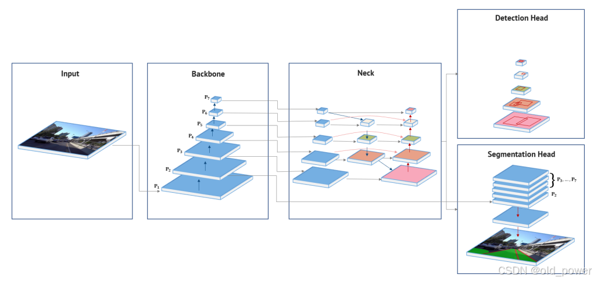

# 自动驾驶视觉感知—— 多任务学习（HybridNets）

## 1、目标检测和分割的多任务模型
通过编码学习概念，探索深度学习和计算机视觉如何用于自动驾驶中的不同视觉任务。
一般来说，目标检测和分割都可以使用相同的数据。那么，为这两个具有挑战性的问题创建一个多任务模型：`HybridNets`，一个端到端感知网络，可以实现车俩检测和车道线分割。


## 2、HybridNets: End-to-End Perception Network
HybridNets多任务模型主要针对目标检测、可行驶区域分割和车道检测。在Berkeley DeepDrive Dataset （BDD100K）数据集上进行训练，达到SOTA的目标和车道检测。



该模型包含一个共享编码器和两个不同的解码器，分别用于检测和分割任务。
### 2.1 编码器`Encoder`
主干部分作为全局特征提取，帮助各种头网络在任务中实现卓越性能。作者选择了在ImageNet上预训练的EfficientNet-B3模型，通过寻找深度、宽度和分辨率参数来解决网络优化问题。EfficientNet能够在提供稳定网络的同时最小化计算成本。它也是在ImageNet挑战中表现出最高准确率的模型之一。
为了进一步优化编码器，BiFPN被应用于颈部网络管道，以生成多尺度特征图，从而获得更好的信息。它通过自上而下和自下而上的方向流动信息，简单地融合不同分辨率的特征。有关BiFPN的更多信息，请参考原始论文。

### 2.2 解码器`Decoder`
如前所述，有两个解码器：分别用于检测和分割。
对于检测，主要思想是使用类似于YOLO概念中的锚框。它使用kmeans聚类来确定锚框，预定义了9个聚类和每个网格单元的3个不同尺度。它为我们提供了边界框和每个类别的概率以及置信度。


在分割任务中，输出被划分为三个类别：背景、可行驶区域和车道线。从颈部网络提取的五个特征层级{P3, …, P7}将按照以下步骤进行处理：

1. 对每个层级进行上采样，以确保输出特征图尺寸一致。
2. P2层级通过卷积层处理，以获得相同数量的特征图通道。
3. 将所有层级的特征图相加，实现更优的特征融合。
4. 恢复输出特征，并计算每个像素所属类别的概率。
最后，为了提高输出精度，来自主干网络的P2特征图被输入到最终的特征融合过程中。


## 3、代码实现
解了HybirdNets模型的结构，使用预训练模型并在自定义数据集上进行推理。

### 3.1 创建新环境并安装依赖
创建一个新的conda环境HybridNets，拉取代码，安装依赖
```bash
# Create new conda environment
conda create -n HybridNets python=3.9
# activate the conda environment
conda activate HybridNets
git clone https://github.com/datvuthanh/HybridNets.git
cd HybridNets
pip install -r requirements.txt
pip install opencv-python
```
 - 注意：**requirements.txt**中的`timm>=0.5.4`，如果后续运行代码报错提示timm的问题，则有可能是安装的timm版本过高或者过低，实测timm>0.6可以运行：`pip install timm=0.6.12`

### 3.2 自定义图像和视频推理
如果想使用预训练的权重进行推理，首先必须下载权重文件。

```bash
# Download end-to-end weights
curl --create-dirs -L -o weights/hybridnets.pth https://github.com/datvuthanh/HybridNets/releases/download/v1.0/hybridnets.pth
```
#### 使用图像推理

```bash
# Image inference
python hybridnets_test.py -w weights/hybridnets.pth ---source pathForImage --output results --imshow False --imwrite True
```

#### 使用视频推理

```bash
# Video inference
python hybridnets_test_videos.py -w weights/hybridnets.pth --source demo/video --output demo_result
```
#### 结果


